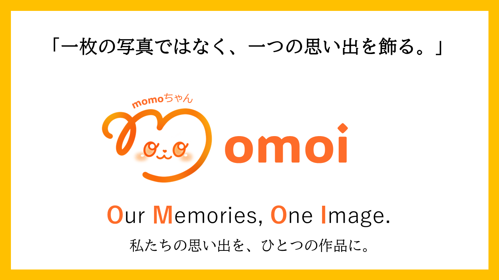
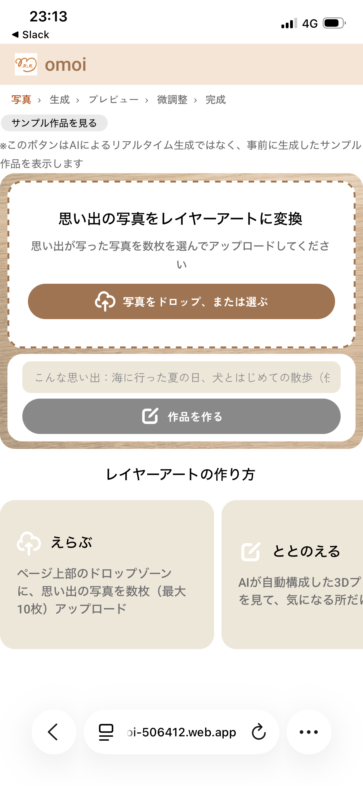
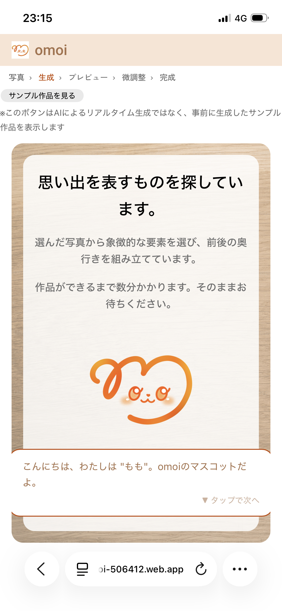
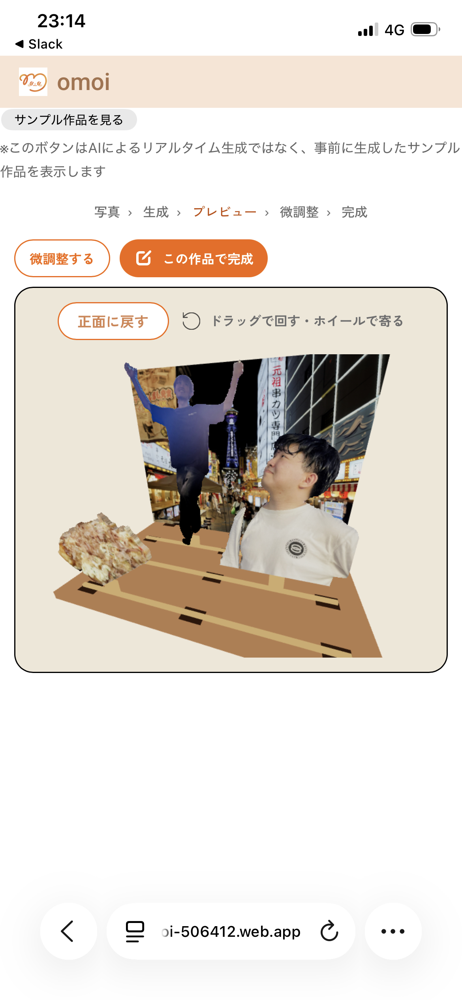
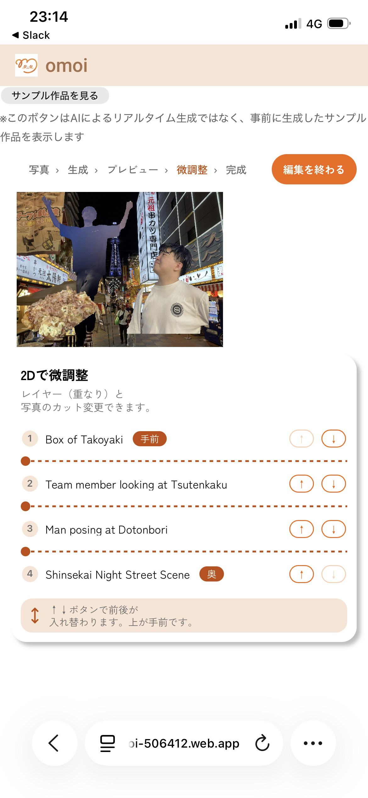
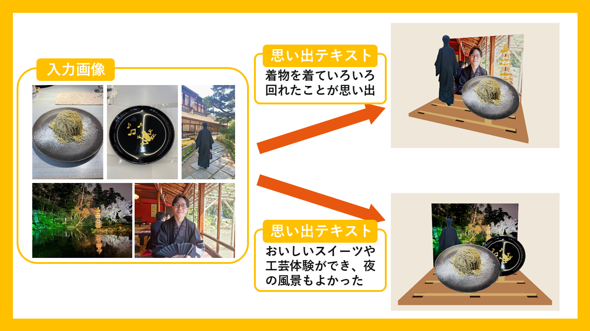

> Tornado 2026 発表作品

# omoi - 一枚の写真ではなく、一つの思い出を飾る。

  
  
  
  

  **複数の写真に残った一つの出来事を、AIで多層の立体作品へ再構成し、日常に飾れる形で残すプロダクト**

  

  ---

  

  ## 🎉 Tornado 2026 🎉
  ### **🏆 NTTレゾナントテクノロジー賞 受賞**
  **チーム「ミリオンがえし」**

  ---

  ### クイックリンク

  
  
  

---

## 目次

- [Live Demo](#live-demo)
- [🎉 Tornado 2026 🎉](#-tornado-2026-)
- [Contributors](#contributors)
- [製品概要](#製品概要)
  - [背景（製品開発のきっかけ・課題など）](#背景製品開発のきっかけ課題など)
  - [製品説明（具体的な製品の説明）](#製品説明具体的な製品の説明)
  - [作品づくりの流れ](#作品づくりの流れ)
  - [システム構成](#システム構成)
  - [完成した立体レイヤーアート](#完成した立体レイヤーアート)
  - [特長](#特長)
  - [解決できること](#解決できること)
  - [想定する利用シーン](#想定する利用シーン)
  - [注力したこと（こだわり等）](#注力したことこだわり等)
- [技術仕様書](#技術仕様書)
- [ギャラリー](#-ギャラリー)
- [開発技術](#開発技術)
  - [活用した技術](#活用した技術)
  - [独自の設計](#独自の設計)
- [UI・デザイン](#uiデザイン)

---

## Live Demo

**Webアプリ**: https://omoi-506412.web.app/

## Contributors

  
  
  
  
  
  

---

## 製品概要

### 背景（製品開発のきっかけ・課題など）

大切な出来事ほど、写真は一枚では収まりません。

家族旅行、子どもの成長、誕生日などの思い出は、人物、場所、物、景色といった複数の要素が、それぞれ別の写真に残っています。

けれども、日常に飾る一枚を選ぼうとすると、その出来事らしさの一部を取りこぼしてしまいます。

写真は残っていても、見返すには自分から探しに行く必要があり、記録はスマートフォンの中に埋もれがちです。

omoiが向き合うのは、**一番良い一枚を選ぶのではなく、複数の写真に残った一つの出来事そのものを、日常の中で触れられる形に残すこと**です。

### 製品説明（具体的な製品の説明）

> **一枚の写真ではなく、一つの思い出を飾る。**

**omoi**は、残したい出来事の複数の写真と任意の思い出テキストをもとに、AIがその出来事を象徴する人物・場所・物を選び、一つの立体レイヤーアートへ再構成するサービスです。

写真をそのまま並べるのではなく、写真に分散した要素を取り出し、前後関係を持たせて一つの作品に構成します。 
完成案は3Dで確認でき、気になる場合だけ位置・大きさ・前後関係を調整できます。 
確認した作品は、最終的に日常に置ける2.5Dの物理作品へつながります。

AIは新しい思い出を描き足すためではなく、「**この出来事を一つの作品で表すなら何を残すか**」を考え、最初の完成案をつくるために使います。

### 作品づくりの流れ

写真と思い出テキストを入力すると、AIが写真群から象徴的な要素を選び、多層の完成案を組み立てます。 
まず3Dで立体感を確認し、必要な場合だけ2Dで配置や前後関係を整えます。

<table>
  <tr>
    <td width="25%" align="center" valign="top">
      <strong>01. 写真を選ぶ</strong> 
      写真と思い出を入力  
      
    </td>
    <td width="25%" align="center" valign="top">
      <strong>02. AIが生成</strong> 
      象徴要素と奥行きを構成  
      
    </td>
    <td width="25%" align="center" valign="top">
      <strong>03. 3Dで確認</strong> 
      立体感と前後関係を見る  
      
    </td>
    <td width="25%" align="center" valign="top">
      <strong>04. 2Dで微調整</strong> 
      必要な部分だけ整える  
      
    </td>
  </tr>
</table>

### システム構成

| コンポーネント | 技術スタック | 役割 |
| :--- | :--- | :--- |
| **Frontend** | React / TypeScript / Vite | 写真入力、生成結果、3D Preview、2D Edit |
| **Backend API** | Python / FastAPI / Pydantic | 生成の受け付け、作品データと素材の提供 |
| **AI・画像処理** | Gemini / EfficientSAM-Ti / ONNX Runtime | 意味理解、要素選定、構成情報・透明Layer生成 |
| **Physical Output** | 3Dプリント・写真プリント | 確定した作品構成を立体作品へつなぐ |

### 完成した立体レイヤーアート

omoiでは、画面上の作品構成と物理出力を別のものにしません。 
Artwork Dataの `x` / `y` / `scale` / `layerIndex` を3Dプレビュー、編集、STL生成で共有し、実際に完成した立体レイヤーアートまで一つの作品として扱います。

### 特長

#### 1. **一番良い写真ではなく、一つの出来事を残す**

家族、場所、食べ物、景色など、複数の写真に分散した要素を一つの作品に再構成します。 
「あの旅行」「あの頃」といった出来事全体を、特別な形として残せます。

#### 2. **AIがまず完成案をつくり、必要なときだけ整えられる**

ユーザーが最初から切り抜きや配置を細かく操作する必要はありません。 
AIがまず完成案を示し、気になる部分がある場合だけ自分の思いを反映できます。 
AI任せでも、手作業だけでもない体験を目指しています。

#### 3. **思い出を壊さない**

omoiは、元の記録にないものをAIが新たに描き加えるのではなく、実際に撮影した写真に残る人物や物、景色から作品を構成します。 
思い出を扱うプロダクトだからこそ、記録に根ざした作品づくりを大切にします。

#### 4. **画面の中で終わらせず、日常へ戻す**

完成画像を保存するだけでなく、棚やデスクに置ける物理作品へつなげます。 
作品がふと目に入ることで、スマートフォンの中に眠っていた出来事を日常の中で振り返る入口をつくります。

### 解決できること

- 複数の写真に残った一つの出来事を、写真の集合ではなく一つの思い出の作品として残せる
- 写真を探しに行かなくても、日常に置いた作品を通じて思い出に触れるきっかけをつくれる
- 専門的な画像編集の知識がなくても、AIの完成案から作品づくりを始められる
- 自分たちの写真に残る要素から、その出来事だけの記念オブジェクトをつくれる

### 想定する利用シーン

最初に、子どもの成長や家族イベントの写真を日常的に残す子育て世代を想定しています。 
家族旅行、誕生日、入学・卒業、運動会など、多くの写真が残る大切な出来事を、家族で振り返るための作品として扱います。

- 自分用に飾る記念作品
- 家族で思い出を共有するための作品
- 大切な出来事を贈るギフト

### 注力したこと（こだわり等）

- **複数写真を横断した理解**: 一枚ずつを独立に加工するのではなく、写真群と任意の思い出テキストから「何を残すか」を考える
- **完成案から始めるUX**: 最初から制作作業を求めず、AIによる最初の提案を確認してから必要な部分だけ調整できる
- **デジタルと実物の一貫性**: AI生成、プレビュー、編集、物理出力を別々の作品にせず、同じArtwork Dataでつなぐ
- **End-to-Endの体験**: 写真入力から物理作品までを一つの流れとして成立させる

---

## 技術仕様書

詳細な仕様は、領域ごとの専門資料としてまとめています。

### Tornado 2026版

- **[プロダクト仕様書](./docs/README.md)** - omoiの全体像と作品づくりの流れ
- **[Artwork Data仕様書](./docs/specifications/artwork-data.md)** - 画面と実物をつなぐ作品構成
- **[フロントエンド仕様書](./docs/specifications/frontend.md)** - 写真選択、3D確認、2D微調整、完成までの体験
- **[バックエンド仕様書](./docs/specifications/backend.md)** - 作品生成、進行状況、出力データの受け渡し
- **[AI・画像処理仕様書](./docs/specifications/ai-image-processing.md)** - 写真理解、要素抽出、構成提案
- **[物理出力仕様書](./docs/specifications/physical-output.md)** - STL・写真プリント用データから立体作品へ至る流れ

## 📸 ギャラリー

Tornado 2026の発表資料に含まれる、プロダクトの考え方、入力から作品への変換、構成図はギャラリーページにまとめています。

**[ギャラリーページを見る](./docs/showcase/gallery.md)**

## 開発技術

| 区分 | 技術 | 実装上の役割 |
| :--- | :--- | :--- |
| **Frontend** | TypeScript 6 / React 19 / Vite 8 | 写真入力、生成状態、作品のWorking Copy、ダウンロード画面 |
| **3D Preview** | Three.js r185 / React Three Fiber 9 / Drei 10 | RGBA PNGをテクスチャにしたPlane、OrbitControls、奥行き順の可視化 |
| **2D Editor** | Konva 10 / React Konva 19 | ドラッグ、縦横比を保つ拡大縮小、前後順の再計算 |
| **画像入力** | heic2any / Canvas API | HEIC・HEIFのPNG変換、長辺2,048 pxへの縮小 |
| **Backend** | Python 3.13 / FastAPI 0.139 / Pydantic 2 | multipart API、JSON Schemaとの型整合、非同期ジョブ、エラー応答 |
| **意味理解** | Gemini Developer API / Structured Output | 写真群から候補・対象範囲・構図をJSONとして生成 |
| **輪郭抽出** | EfficientSAM-Ti / ONNX Runtime / NumPy / SciPy / Pillow | bboxを手がかりにマスクを生成し、穴・微小成分を補正してRGBA PNG化 |
| **物理出力** | Pillow / 三角形メッシュ / ASCII STL | 2L判横のレイヤー部品、番号付き台座、PDF、JPEGを生成 |
| **クラウド** | Firebase Hosting / Cloud Run / Firestore / Cloud Storage / Cloud Tasks | 静的配信、API実行、ジョブ状態、素材配信、非同期実行 |

### 独自の設計

| 設計 | 概要 | 仕様書 |
| :--- | :--- | :--- |
| **Artwork Data** | AI、Backend、Frontend、物理出力で共有する、作品構成の唯一の正本 | [システム仕様書](./docs/specifications/system.md) |
| **Asset Manifest** | Artwork Dataから実行時URLを分離し、Layer Assetを解決する仕組み | [バックエンド仕様書](./docs/specifications/backend.md) |
| **編集可能な作品構成** | 一枚の完成画像で終わらせず、位置・大きさ・前後関係を持つLayerとして扱う | [フロントエンド仕様書](./docs/specifications/frontend.md) |
| **物理出力への接続** | 画面で確認・編集した同じ作品データを、物理作品の入力として使う | [物理出力仕様書](./docs/specifications/physical-output.md) |

## UI・デザイン

omoiでは、ユーザーが最初から細かな作品編集をするのではなく、写真と思い出を入力したあとにAIの完成案を確認する体験を中心に設計しています。 
3Dプレビューでは完成形の立体感を確認し、気になる場合だけ2D編集で位置・大きさ・前後関係を調整します。

写真だけでは分からない「自分にとって何が大切だったか」を思い出テキストで補いながら、できるだけ少ない操作で自分らしい作品へ近づけることを目指します。
