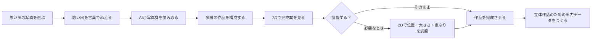
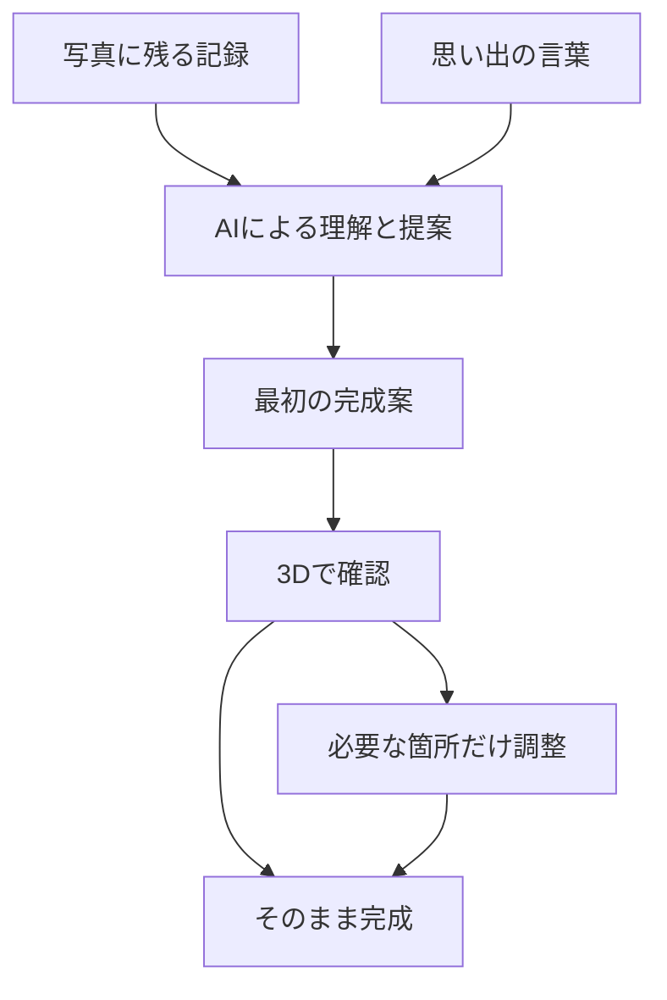
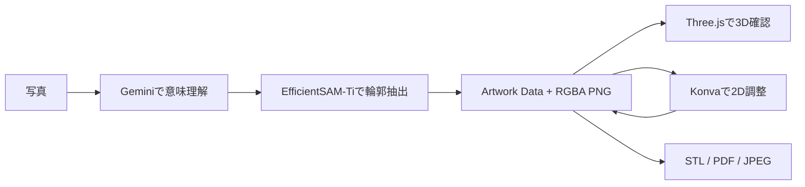

# omoi プロダクト仕様書

> **Tornado 2026** — 複数の写真から、一つの思い出を立体レイヤーアートとして残す。

omoiは、思い出の写真と任意の言葉をもとに、多層の作品をつくるプロダクトです。AIが写真に共通する人物・場所・物を選び、奥行きを持つ一つの作品として構成します。完成案は立体的に確認でき、必要な箇所だけを調整したうえで、飾るための出力データを作成できます。

## 目次

1. [プロダクトの流れ](#プロダクトの流れ)
2. [仕様書一覧](#仕様書一覧)
3. [提供機能](#提供機能)
4. [作品づくりの原則](#作品づくりの原則)
5. [技術アーキテクチャ](#技術アーキテクチャ)

## プロダクトの流れ

## 仕様書一覧

| 資料 | 内容 |
| --- | --- |
| [システム仕様書](specifications/system.md) | 全体構成、非同期処理、公開API、クラウド構成 |
| [Artwork Data仕様書](specifications/artwork-data.md) | JSONモデル、座標変換、奥行き、素材の仕様 |
| [フロントエンド仕様書](specifications/frontend.md) | React、Three.js、Konvaによる写真選択・3D確認・2D編集 |
| [バックエンド仕様書](specifications/backend.md) | FastAPI、ジョブ、素材配信、物理出力API |
| [AI・画像処理仕様書](specifications/ai-image-processing.md) | Gemini、EfficientSAM-Ti、マスク品質、構図生成 |
| [物理出力仕様書](specifications/physical-output.md) | STLメッシュ、2L印刷、製造データ検証 |
| [ギャラリー](showcase/gallery.md) | Tornado 2026で発表した作品とプロダクトイメージ |
| [開発ガイド](guides/development.md) | ローカルでのセットアップと共通ルール |
| [デプロイガイド](guides/deployment.md) | Firebase HostingとCloud Runへの公開手順 |

## 提供機能

| 段階 | 提供すること |
| --- | --- |
| 写真の取り込み | ドラッグ&ドロップまたは選択による写真追加、サムネイル確認、不要な写真の取り消し |
| 写真の準備 | JPEG・PNG・WebPの受け付け、HEIC／HEIF写真の利用しやすい形式への変換、送信時の画像最適化 |
| 作品生成 | 写真群と任意の思い出テキストからの、多層Artworkと透明素材の生成 |
| 生成中の案内 | 写真の読み取り、要素抽出、構成、仕上げの各段階に応じた案内 |
| 3D確認 | 回転・拡大縮小で、レイヤーの重なりと完成形を確認 |
| 2D微調整 | レイヤーの移動、拡大縮小、前後入れ替え、別カットへの差し替え |
| 完成・出力 | 3Dプリンター向けSTL一式、写真貼り付け用JPEG一式のダウンロード |

## 作品づくりの原則

### 一枚ではなく、一つの出来事を残す

omoiは、最もよく写った一枚を選ぶためのサービスではありません。写真に分散した人物、場所、景色、物を組み合わせ、出来事全体を思い起こせる作品にします。

### 元の記録に根ざす

写真に写っていないものを描き足すのではなく、選んだ写真にある要素を作品の材料にします。思い出テキストは、写真だけでは伝わりにくい大切さや文脈を補うために使います。

### 作品の主導権を残す

AIは完成案を示しますが、最終的な作品は利用者が決めます。完成案をそのまま使うことも、位置・大きさ・重なり・別カットを調整することもできます。

## 技術アーキテクチャ

omoiは、生成AIを一枚絵の生成器として使うのではなく、写真群の意味理解・切り抜き・構図・編集・物理出力を分けたパイプラインとして実装しています。

| 段階 | 主要技術 | 生成・処理するもの |
| --- | --- | --- |
| 写真入力 | React、TypeScript、heic2any、Canvas API | HEIC変換、画像縮小、`multipart/form-data` |
| 非同期生成 | FastAPI、Firestore、Cloud Tasks | `jobId`、生成状態、再試行可能なエラー |
| 意味理解 | Gemini Developer API、Structured Output | 要素候補、対象範囲、ラベル、構図計画 |
| セグメンテーション | EfficientSAM-Ti、ONNX Runtime | 2値マスク、RGBA PNGのレイヤー素材 |
| 表示・編集 | Three.js、React Three Fiber、Konva | 3D Plane、2D座標変換、`layerIndex`の再計算 |
| 物理出力 | Pillow、三角形メッシュ、STL | 2L判横のレイヤー部品、台座、PDF、JPEG |

詳しい通信契約・データモデル・変換式・品質確認は、各仕様書で個別に説明しています。
