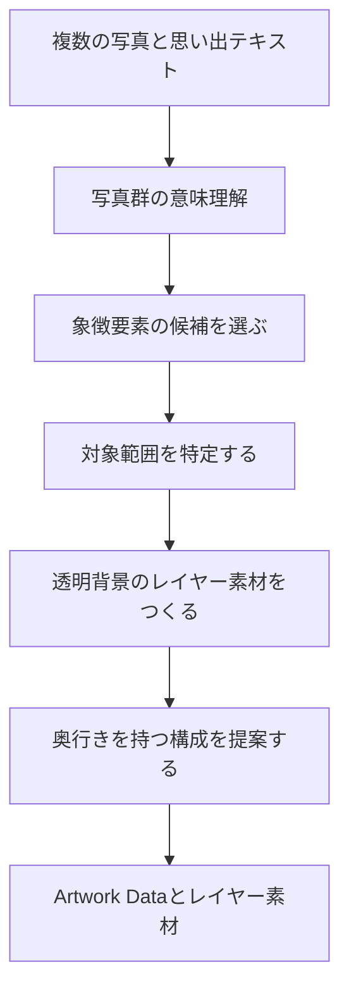
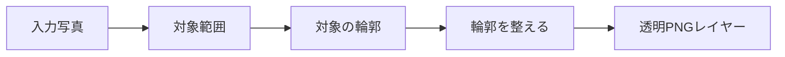
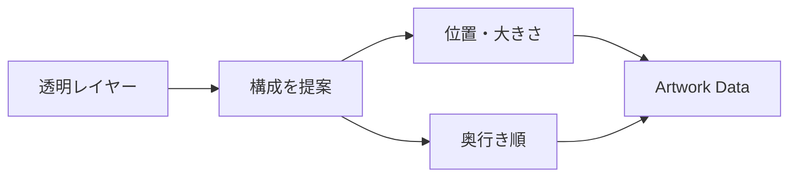
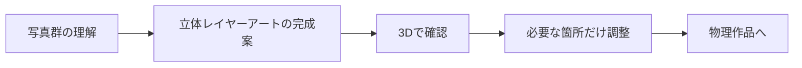
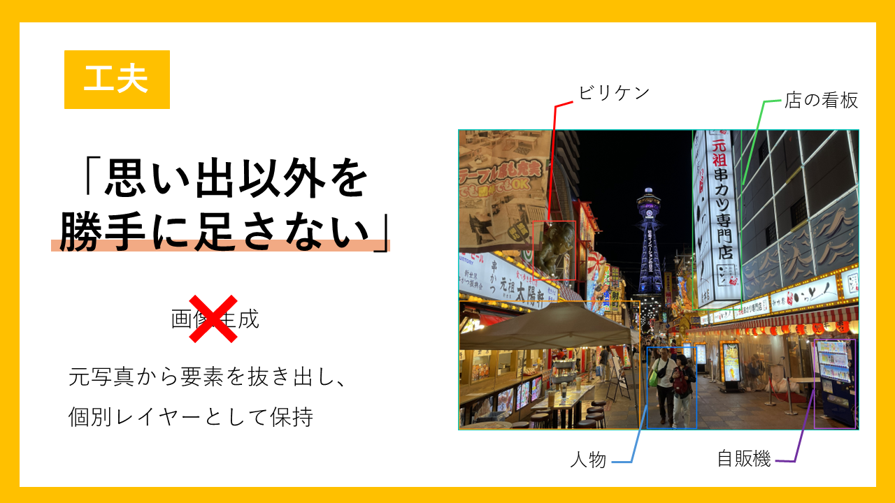
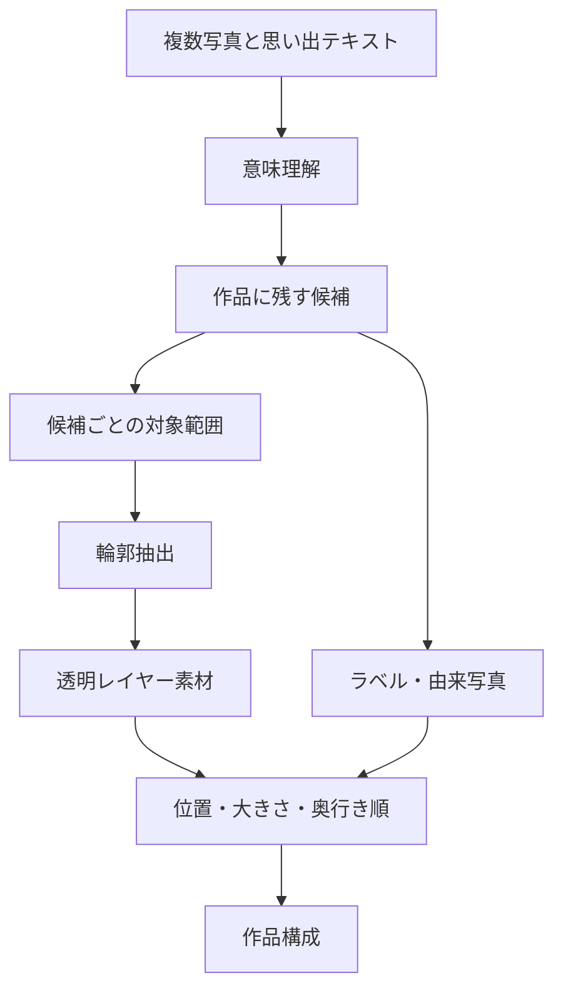
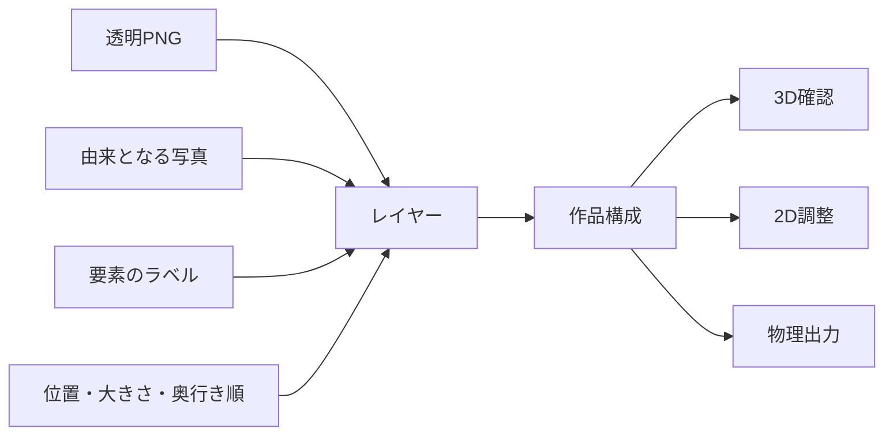
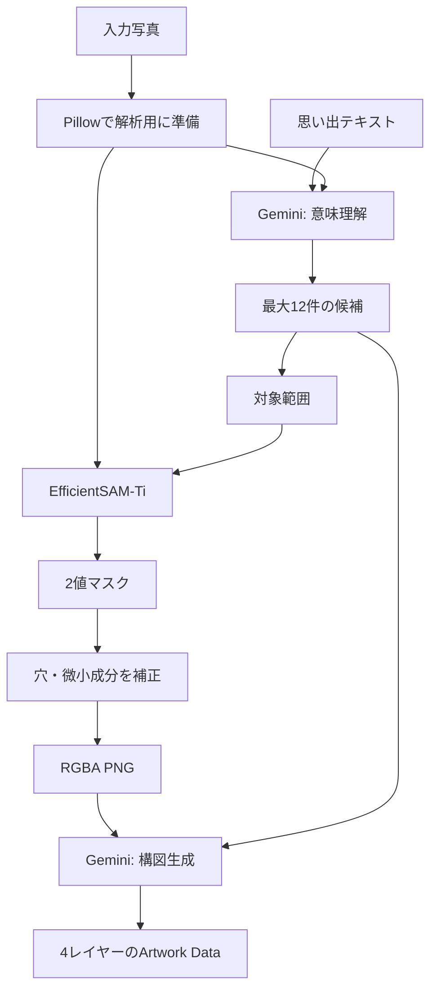
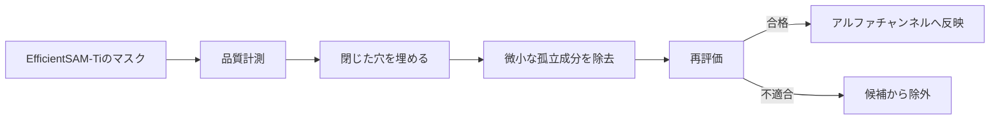

# AI・画像処理仕様書

## 目次

1. [目的](#1-目的)
2. [処理の流れ](#2-処理の流れ)
3. [写真群の理解](#3-写真群の理解)
4. [レイヤー素材の抽出](#4-レイヤー素材の抽出)
5. [構成の提案](#5-構成の提案)
6. [品質の考え方](#6-品質の考え方)
7. [利用者に見える結果](#7-利用者に見える結果)
8. [入力から出力まで](#8-入力から出力まで)
9. [意味理解と輪郭抽出の役割分担](#9-意味理解と輪郭抽出の役割分担)
10. [レイヤーを選ぶ基準](#10-レイヤーを選ぶ基準)
11. [作品構成への受け渡し](#11-作品構成への受け渡し)
12. [品質と利用者への配慮](#12-品質と利用者への配慮)
13. [AIパイプラインの実装](#13-aiパイプラインの実装)
14. [マスク品質の評価と補正](#14-マスク品質の評価と補正)
15. [構図生成と制約](#15-構図生成と制約)

## 1. 目的

AI・画像処理は、複数の写真を一枚ずつ加工するのではなく、写真群全体から「この思い出を表すために残すもの」を選びます。選ばれた人物・場所・物を透明なレイヤーとして取り出し、立体作品の最初の構成を提案します。

## 2. 処理の流れ



## 3. 写真群の理解

写真理解にはGeminiの構造化された応答を用います。自由な文章だけで判断せず、候補ごとに由来写真、対象範囲、重要度、ラベルを持つ情報として受け取ります。

思い出テキストは、写真の見た目だけでは分からない文脈を補います。たとえば、複数の写真に写る建物・人物・食べ物のうち、どれがその出来事を象徴するかを考える手がかりになります。

## 4. レイヤー素材の抽出

対象範囲の抽出にはEfficientSAM-Tiを用い、対象を囲む範囲を手がかりに透明背景の素材を作ります。素材はRGBA PNGで、人物や物の周囲を透過したまま、画面表示と物理出力の両方で使えます。



輪郭を整える処理では、閉じた領域の穴や小さな孤立部分を扱い、主要な対象を損なわないようにします。

## 5. 構成の提案

抽出したレイヤーを、奥から手前へ並べ、位置と大きさを決めます。構成は、写真にある要素の関係を保ちながら、立体作品として見やすいことを目指します。

| 構成要素 | 役割 |
| --- | --- |
| 位置 | レイヤーをキャンバス内のどこに置くか |
| 大きさ | 主役と周囲の要素の見え方を整える |
| 奥行き順 | 前後関係と立体感をつくる |
| 候補カット | 利用者が選び直せる別素材を用意する |



## 6. 品質の考え方

- 写真にない新しい要素を描き足しません。
- 一枚の完成画像を作ってから切り抜く方法は使いません。
- 同じ役割の要素を不必要に重複させず、思い出を象徴する候補を選びます。
- 素材の透明性、画像サイズ、レイヤーの奥行き順、作品構成の整合性を確認します。
- 生成に失敗した場合、別の作品を自動的に完成扱いにせず、利用者へ再試行を案内します。

## 7. 利用者に見える結果

AIの内部的な判断過程ではなく、利用者には次の形で結果を届けます。



## 8. 入力から出力まで

AI・画像処理は、写真の一枚ごとに同じ加工をかけるものではありません。写真群を見比べて意味を読み取り、作品に残す候補を選び、候補ごとの透明レイヤーと構成情報をつくります。

| 入力 | 処理 | 出力 |
| --- | --- | --- |
| 複数の写真 | 写真に写る人物・場所・物・景色を横断して理解 | 思い出を表す要素の候補 |
| 任意の思い出テキスト | 写真だけでは分からない出来事の文脈を補足 | 選定と構成の手がかり |
| 要素の候補 | 対象範囲をもとに輪郭を抽出 | 透過PNGのレイヤー素材 |
| レイヤー素材 | 位置・大きさ・前後関係を整える | 立体レイヤーアートの完成案 |

<div align="center">

</div>

## 9. 意味理解と輪郭抽出の役割分担

「何を残すか」と「どの画素を切り出すか」は性質の異なる仕事です。omoiでは、写真群の意味理解と、画像上の輪郭抽出を分けることで、思い出の文脈と見た目の精度の両方を扱います。



意味理解にはGeminiを用い、写真群から候補の役割や重要度、由来となる写真、対象範囲を構造化した情報として扱います。輪郭抽出にはEfficientSAM-TiとONNX Runtimeを用い、対象範囲を手がかりに透明素材をつくります。

## 10. レイヤーを選ぶ基準

一つの出来事をすべての要素で埋め尽くすのではなく、思い出を思い起こさせる要素を選びます。人物だけ、場所だけに偏らず、出来事らしさを支える組み合わせを考えます。

| 観点 | 例 |
| --- | --- |
| 人物 | 一緒に過ごした家族や友人、印象的な仕草 |
| 場所 | 旅先の景観、建物、会場など出来事を示す背景 |
| 物 | 食べ物、持ち物、記念品など、その場らしさを伝えるもの |
| 情景 | 時間帯、街並み、自然など全体の雰囲気を支える要素 |
| 関係性 | どの要素を前に出し、どれを背景として見せるか |

候補カットは、利用者が後から同じ役割の別素材を選べるようにするためのものです。最初の完成案だけで作品を固定せず、必要なときに思い出に近い見え方へ整えられます。

## 11. 作品構成への受け渡し

各レイヤーは、透明素材だけで完結しません。素材のサイズ、表示位置、大きさ、前後関係、由来となる写真を合わせて、編集・プレビュー・物理出力で共通に使える作品構成にします。



この構造により、画像を一枚に焼き込んでしまうことなく、レイヤーごとの見え方を確認・調整し、同じ構成を立体作品へつなげられます。

## 12. 品質と利用者への配慮

| 確認すること | 目的 |
| --- | --- |
| 対象の輪郭が主要部分を保っていること | 人物や物の印象を損なわない |
| 透明部分と素材サイズが正しいこと | 表示・編集・出力で同じ素材を使えるようにする |
| レイヤーの位置と前後関係が連続していること | 立体として不自然な重なりを避ける |
| 写真にない要素を追加しないこと | 記録に根ざした思い出として扱う |
| 完成できない場合に理由を伝えること | 別の作品を黙って表示せず、再試行につなげる |

omoiは、画像を新たに創作することよりも、実際に撮影された写真から、その出来事を代表する断片を丁寧に組み合わせることを重視します。

## 13. AIパイプラインの実装

AI・画像処理は、Geminiによる意味理解と、EfficientSAM-Tiによる画素単位の輪郭抽出を組み合わせます。大規模言語・視覚モデルに輪郭を直接描かせるのではなく、「何を残すか」と「どこを透明にするか」を別の処理として実装しています。

| 段階 | 使用技術 | 入力 | 出力 |
| --- | --- | --- | --- |
| 写真準備 | Pillow | 複数の入力画像 | 向きと解像度を整えた解析用画像 |
| 意味理解 | Gemini Developer API | 写真群、任意の思い出テキスト | 候補、ラベル、由来写真、対象範囲、重要度 |
| 輪郭抽出 | EfficientSAM-Ti、ONNX Runtime CPU | 元画像、対象範囲 | 2値マスク |
| 素材生成 | Pillow、NumPy | 元画像、マスク | RGBA PNG |
| 構図生成 | Gemini Developer API | 採用候補のメタデータ | `x`、`y`、`scale`、`layerIndex` |
| 検証 | Pydantic、JSON Schema、品質評価 | Artwork Data、素材メタデータ | 表示・編集・出力可能な作品構成 |



Geminiの呼び出しでは、応答MIMEタイプを`application/json`に指定し、JSON Schemaを応答形式として渡します。受け取った結果はPydanticモデルで再検証します。自由文を後から解析する方式に比べ、対象範囲や候補の必須項目が欠けた結果を早期に検出できます。

解析用の写真は長辺1,536 pxまで、セグメンテーション用の画像は長辺1,024 pxまでを基準に扱います。Geminiリクエストのタイムアウトは120秒です。これらの値は画像品質と処理時間のバランスを取るための設定値として管理します。

## 14. マスク品質の評価と補正

EfficientSAM-Tiが返すマスクは、そのままでは物理部品に向かない場合があります。たとえば、対象の内部に穴が残る、人物の周囲に小さな飛び地が残る、複数の離れた成分が混ざる、といった状態です。omoiはマスクをRGBA PNGへ変換する前に、連結成分と輪郭品質を確認します。



| 確認値 | 意味 | 使い方 |
| --- | --- | --- |
| 面積比 | マスクが画像内で占める割合 | 極端に小さい・大きい候補を把握 |
| 連結成分数 | 分離した塊の数 | 意図しない飛び地を検出 |
| 最大成分比 | 最も大きい塊が全体に占める割合 | 主対象が分断されていないかを確認 |
| バウンディングボックス被覆率 | AIが指定した対象範囲との整合 | 切り出し漏れ・過剰領域を確認 |
| 境界接触 | 画像端で対象が切れていないか | 端で切れた候補を検出 |

標準設定では、閉じた穴を埋め、全体面積の0.5%以下の微小な孤立成分を除去します。品質ゲートは計測結果を記録する観測モードから始め、適用する閾値を設定できる構造です。処理の都合で離れた大きな対象を無理に結合することはせず、不適切な候補は採用しません。

## 15. 構図生成と制約

透明素材が得られた後、Geminiは候補のラベル、画像寸法、由来写真、役割をもとに構図をJSONとして返します。標準プロファイルでは12件までの候補から4レイヤーを選び、2L判横の縦横比 `178 / 127` を持つ作品へ配置します。

```json
{
  "layers": [
    { "candidateId": "scene", "x": 0.50, "y": 0.50, "scale": 1.00, "layerIndex": 0 },
    { "candidateId": "subject", "x": 0.63, "y": 0.61, "scale": 0.34, "layerIndex": 3 }
  ]
}
```

構図の結果は、次の技術的な条件で確認します。

| 条件 | 内容 |
| --- | --- |
| 座標範囲 | `x` と `y` は0〜1の正規化座標 |
| サイズ | `scale` は正の値。素材の縦横比から高さを導出 |
| 奥行き | `layerIndex` は重複しない連番 |
| レイヤー数 | 標準は4。データモデル自体は可変長 |
| 素材形式 | すべてRGBA PNG |
| 記録性 | 各レイヤーは由来写真と候補を保持 |

この方式により、AI処理の結果を一枚の画像に固定せず、完成後の2D調整・3Dプレビュー・STL生成へ同じ構図を引き渡します。
