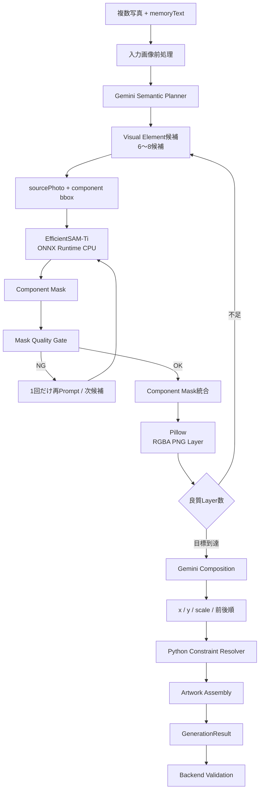

# AI・画像処理 Architecture

## P0 Architecture



## 責務

### Gemini

担当:
- 写真群全体の意味理解
- memoryTextとの関連付け
- Visual Element候補選定
- 各候補のsource photo特定
- componentへの意味分解
- bbox推定
- 最終的な作品構図提案

担当しない:
- 最終Mask境界決定
- RGBA PNG生成
- Contract保証
- Asset URL生成

### EfficientSAM

担当:
- bbox/pointで指示された対象のmask生成

担当しない:
- 何が思い出として重要か
- 複数写真の意味理解
- Artwork構図
- API/Contract

### Pillow/Python

担当:
- EXIF Orientation
- resize
- coordinate transform
- mask処理
- mask union
- crop
- alpha
- PNG encode
- Layout constraints
- ID生成
- Artwork dict assembly

## なぜこの分割か

```text
Gemini      = 何を残すか
EfficientSAM = どこまでが対象か
Python      = どうContractへ変換するか
```

## Depthを入れない理由

- 複数写真間のDepth値は比較できない
- 2.5D Layerは各Object内部のDepthを保持しない
- layerIndexは作品構図でありScene Reconstructionではない
- Model/Memory/Latency増加に対するP0価値が小さい
