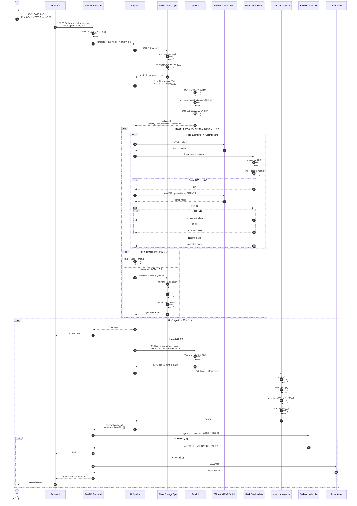

# AI処理 詳細Sequence



## Gemini Call構成

P0推奨:

```text
Call 1: Semantic Planning
写真群 → 候補選定 + bbox

Call 2: Composition
実際に採用できたLayer → x/y/scale/order
```

Segmentation失敗で採用要素が変わるため、最終構図は実Layer確定後に決める。
