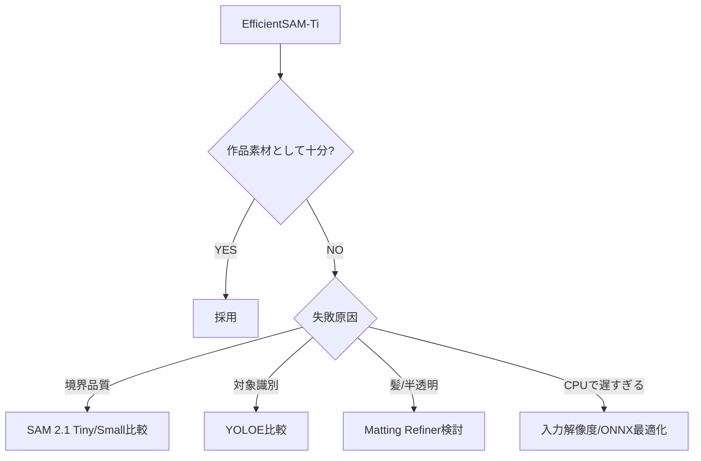

# Model Selection

## P0主経路【FIX】

### Semantic Understanding
Gemini Developer API。Semantic PlanningとCompositionのModel IDは `GEMINI_MODEL` で
環境変数化し、最終採用値はまだFIXしない。

### Segmentation
**EfficientSAM-Ti + ONNX Runtime CPU**。Geminiが返すbboxをBox PromptとしてMaskを得る。

## EfficientSAM-TiをP0主経路にする理由

omoiではGeminiが既に:
- 何を残すか
- どの写真か
- どの位置か

を判断する。

Segmentation Modelに必要なのは主に:

```text
bbox → 良質Mask
```

EfficientSAMはPoint Prompt / Box Prompt / Segment Everything / ONNXを扱えるPromptable Segmentation Model。
P0ではBox Promptだけを主経路として使う。

## SAM 2.1を最初にしない理由

SAM 2.1は有力な品質比較対象だが:
- RuntimeがPyTorch中心
- EfficientSAMよりCloud Run CPU構成が重くなりやすい
- omoiでは動画memory機構は不要
- 最小構成で必要品質を満たせるか先に確認したい

EfficientSAMの境界品質不足が確認された場合に比較する。

## YOLOEを最初にしない理由

YOLOEはopen-vocabulary + visual promptでomoiと相性が良い。
ただしGeminiが意味理解を担当するためP0では意味理解が重複する。

使う条件:
- bboxだけでは対象識別が足りない
- 隣接人物等でSAMが誤対象を取る
- Text PromptをSegmentation側にも持たせる価値が明確

## 通常YOLO Segmentationを最初にしない理由

標準YOLO Segmentationは既知class中心。
omoiでは工作物、お土産、特徴的な遊具、小物などLong-tailな要素が思い出として重要になりやすい。

「認識可能classだけを作品に使う」設計にしない。

## SAM 3を最初にしない理由

- Geminiと意味理解が重複
- 大きい
- GPU前提寄り
- P0 Cloud Run CPU条件に対して過剰

## Depthを使わない理由

DepthはSegmentation品質を直接解決しない。
複数写真のDepthは共通座標系でもない。
P0では採用しない。

## Escalation Rule



## モデル選定で最重視する評価

1. 狙ったVisual Elementを間違えない
2. Layer Assetとして自然
3. 背景混入が少ない
4. 人物の欠損が少ない
5. CPU上のLatency
6. Peak Memory
7. Model/Runtimeの複雑さ

学術的IoUだけで決めない。
