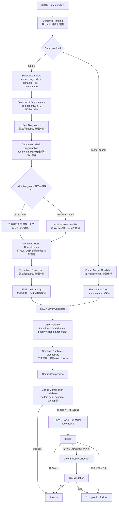
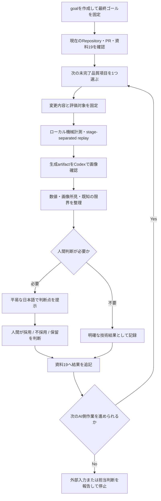
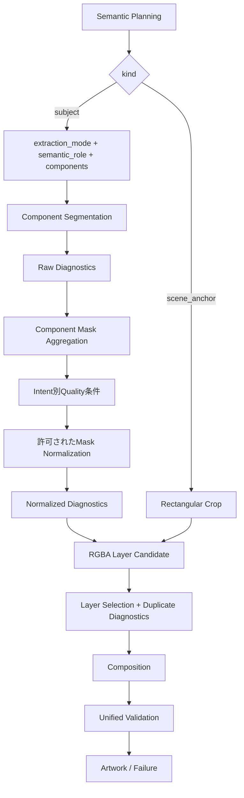

# AI品質改善 自走実行計画

最終確認: **2026-09-02**

本資料は、現在までに実装・PoCされたAI品質改善を、一括リファクタせずに独立評価し、
採用品だけを最終的な内部設計へ統合するための実行計画である。

Codexは本資料を開始点としてgoalを作成し、AI処理側だけで進められる作業を
可能な限り自律的に進める。各PoC・品質変更の実行結果は、現在の
`19_AI_EXECUTION_BACKLOG.md`と同程度の具体性で記録する。

---

## 1. この計画の最終ゴール

Codexは作業開始時に、次の内容をgoalへ設定する。

> **現在までのAI品質改善PoCを、ローカルでの機械計測、Codexによる生成画像・Mask・previewの画像確認、
> 人間の目視判断だけで一つずつ独立評価し、採用・不採用・保留を明確にする。
> 採用された変更だけを最終的なAI内部設計へ統合し、固定datasetと補助caseで品質ベースラインを確定する。
> 各実行では条件・数値・画像確認結果・既知の限界・次アクションを
> `19_AI_EXECUTION_BACKLOG.md`へ継続記録する。
> AI品質ベースラインが確定するまでは、速度を目的としたcandidate数、Semantic Prompt、
> Quality Gate、Segmentation条件の変更を行わない。
> **Gemini APIを呼び出す品質テスト・PoC・E2E・再構図・最終確認では、必ず
> `gemini-3.5-flash-lite`を使用する。他のGemini modelへの切替、fallback、自動選択、
> 代替modelでの継続は禁止する。`gemini-3.5-flash-lite`を使用できない場合は実行を止め、
> 理由を記録して人間へ報告する。**

このゴールは、単一のPRを作ることや、単一のPoCを成功させることではない。
**AI品質側の未完了項目を、根拠付きで閉じ、最終Profileの品質ベースラインを作ること**が完了条件である。


---

## 1.1 目指すゴールのAI処理設計

Codexは、各PoCや品質変更の個別実装を目的化せず、最終的に次の内部設計へ到達することを
本フェーズの設計ゴールとする。

この図は**最終チェックにも使う基準図**である。
各Phaseの終了時と本資料の完了判定時に、現在実装とこの図の差分を確認する。



### 設計上の固定原則

1. `kind`は最上位で`subject / scene_anchor`を区別する。
2. `scene_anchor`を`semantic_role`として二重管理しない。
3. `extraction_mode`はsubject側の抽出意図として扱う。
4. `semantic_role`はsubjectの意味上の役割として扱う。
5. `scene_anchor`はSegmentationせず、単一bboxの矩形Crop経路を維持する。
6. `single_form`と`coherent_group`の差を「Maskをunionするかどうか」だけで定義しない。
7. component Maskの集約とMask Normalizationを別責務として扱う。
8. `single_form`は最終的に一つの連続した対象として成立することを品質条件とする。
9. `coherent_group`はrequired componentの意味的保持を品質条件とする。
10. Mask補正処理は決定論的に保ち、適用条件を明示的なPolicy / 設定として記録する。
11. Raw DiagnosticsとNormalized Diagnosticsを分け、補正前の問題を消さない。
12. semantic duplicateは、意図的な複数時点を壊さないよう、まずdiagnosticとして扱う。
13. Compositionの違反はまとめて検証し、Geminiへのrecomposeは合計最大1回とする。
14. 安全な決定論補正が定義できない未解決の構図違反を、無理に成功扱いしない。
15. 各PoCを独立評価できる状態を維持し、採用品だけをこの設計へ統合する。
16. `single_form`と`coherent_group`のどちらもcomponent Maskを候補単位へ集約し得る。両者の違いは、
    集約の有無ではなく、集約後に確認する品質条件である。

### 最終設計チェック

本フェーズの最後に、Codexは少なくとも次を1項目ずつ確認し、資料19へ結果を残す。

- [ ] `subject`と`scene_anchor`の経路が明確に分離されている。
- [ ] `kind / semantic_role / extraction_mode`に意味の重複がない。
- [ ] 無効な組合せを、内部Semantic PlanのModel / validator / Structured Output schemaで表現または拒否できる。共有`contracts/`は変更しない。
- [ ] 旧Saved Planの互換またはversion扱いが明示されている。
- [ ] component Segmentation直後のRaw Diagnosticsを取得できる。
- [ ] component Mask Aggregationの結果を追跡できる。
- [ ] `single_form`の品質条件が明示されている。
- [ ] `coherent_group`のrequired component保持を追跡できる。
- [ ] 適用したNormalization処理と設定値をartifactへ記録できる。
- [ ] Normalized Diagnosticsを取得できる。
- [ ] scene anchorは最大2候補計画・最大1件選定という現行要件との整合を確認している。
- [ ] semantic duplicate diagnosticsの扱いが決まっている。
- [ ] Composition違反を統合して計測できる。
- [ ] Gemini recomposeは合計最大1回に制限されている。
- [ ] 安全に直せないComposition違反のfailure条件が明確。
- [ ] 採用品だけが通常Profileへ統合されている。
- [ ] Locked regression-6とSupplemental casesで最終Profileを確認済み。
- [ ] 最終品質判断が「ローカル機械計測 + Codex画像確認 + 人間目視」で完結している。
- [ ] Gemini APIを使った全品質テストのmodel記録が`gemini-3.5-flash-lite`で一致している。

---

## 1.2 Gemini APIテストモデルの絶対ルール

**2026-09-02の評価運用判断:** API料金を抑え、比較条件を揃えるため、本資料に基づく品質テストで
Gemini APIを呼ぶ場合の実効modelは`gemini-3.5-flash-lite`に仮固定する。この固定は品質テストの
実行条件であり、通常生成の`GEMINI_MODEL`を共有Contractや恒久的な製品仕様として変更するものではない。

> **最重要・変更禁止ルール**
>
> 本資料に基づく品質テスト、PoC、E2E、Semantic Planning、Composition、recompose、
> architecture比較、最終Profile確認などでGemini APIを呼ぶ場合、
> **必ず`gemini-3.5-flash-lite`を使用する。**
>
> **`gemini-3.7-flash`、その他のGemini model、別modelへのfallback、自動model選択は使用禁止。**
>
> `gemini-3.5-flash-lite`で実行できない場合は、
> **別modelへ切り替えて続行せず、そのrunを開始しない、または無効として停止する。**
> 理由・設定値・確認箇所を資料19へ記録し、人間へ報告する。

このルールは比較条件とAPI料金を揃えるための必須条件であり、Codexは推奨事項として扱ってはならない。

### 実行前チェック

Gemini APIを呼ぶ直前に必ず次を確認する。

- [ ] 実効modelが`gemini-3.5-flash-lite`である。
- [ ] `.env`、CLI引数、設定file、feature flag等で別modelへ上書きされていない。
- [ ] 実行artifact / logへ実効model名を残す。
- [ ] baseline / candidateの両方で`gemini-3.5-flash-lite`を使う。
- [ ] retry / recomposeでも同じ`gemini-3.5-flash-lite`を使う。
- [ ] modelを確認できないrunは品質証跡として使用しない。

### 違反runの扱い

`gemini-3.5-flash-lite`以外で実行されたrunは、

- 品質改善の採否根拠へ使わない。
- baseline / candidate比較へ混ぜない。
- 最終Profile確認へ混ぜない。
- 「参考結果」としても採用品の根拠へ昇格させない。
- 資料19へ**model条件違反のため無効**と記録する。

過去の`gemini-3.7-flash`等で得たPoC結果は履歴・問題発見の参考にはできるが、
**本フェーズの最終採否証拠にはしない。**

---

## 2. このフェーズの位置づけ

これは、AIパイプラインを一度に作り直すリファクタ計画ではない。

現在までに存在する以下の変更・PoCを、それぞれ独立した品質仮説として扱う。

- `physical_layer_v3_architecture`
- 一般subjectのmicro-island cleanup（PR #6）
- `fill_closed_mask_holes`（PR #7相当）
- `coherent_group`
- `close_narrow_mask_gaps`
- bbox内の背景混入対策
- semantic duplicate diagnostics
- Composition overlap / unified validation
- 将来の内部モデル整理
  - `kind`
  - `semantic_role`
  - `extraction_mode`
  - Raw / Normalized Diagnostics
  - Mask Aggregation / Normalization境界

各変更を先に評価し、採用品が揃ってから共通内部設計へ統合する。

---

## 3. 評価に使う3つの判断層

今後のAI品質評価は、次の3層だけで完結させる。

### 3.1 ローカル機械計測

コード、Mask、Artwork、diagnosticsから機械的に確認できる事実を記録する。

主な対象:

- code revision / branch / Profile
- input hash / memoryText hash
- Gemini model
- candidate数
- 4 Layer到達
- Contract validation
- failure stage
- Mask面積
- connected component数
- largest component ratio
- required component予定数 / 受理数
- required componentのexclusive寄与
- closed hole数
- cleanup前後の面積変化
- bbox coverage
- border touch
- Composition座標
- bottom gap
- `back_obscured_ratio`
- test / lint / format
- stage別performance log
- replay結果の再現性

機械値だけで「作品として良い」「意味的に正しい」と自動判定しない。

### 3.2 Codex画像確認

Codexは、生成済みprivate artifactを画像として確認する。

主な確認対象:

- 元写真
- bbox preview
- Raw component Mask
- aggregated Mask
- Normalized Mask
- RGBA Layer
- composition preview
- baseline / candidate比較画像

確認する内容:

- 必要対象の欠損
- 不要背景の混入
- 不自然な分裂
- 意味のないcomponent結合
- 閉鎖穴の残存または不自然な塗り潰し
- micro-islandの残存または必要部分の削除
- 同じ人物・建築等の不自然な重複
- scene anchorとforegroundの重複
- Layer間の過度な遮蔽
- 作品全体としての読みやすさ

Codexの画像確認は採否材料であり、単独で最終採用を確定しない。

### 3.3 人間の目視判断

Codexが機械証跡と画像確認結果を整理したあと、人間が最終的に次のいずれかを判断する。

- **採用**
- **不採用**
- **保留**
- **追加PoCが必要**

人間判断が必要な状態まではCodexが自走する。
人間が判断した後は、その判断を資料19へ記録し、次の作業へ進む。

---

## 4. 標準工程で行わない評価

**2026-09-02の評価運用判断:** 資料18の匿名A/B/Cを、このフェーズの必須工程にはしない。
代わりに、ローカル機械計測、Codex画像確認、人間目視を使う。これは資料18の評価観点、Locked
regression-6、failure stageの記録を捨てる判断ではない。正式な匿名A/B/Cを再開する場合は、
資料18をそのまま適用する。

次は標準工程へ含めない。

- 生成済みpreviewやMaskをGemini等の外部VLMへ再送信すること
- 外部VLMを品質判定者として追加すること
- 匿名A/B/Cを必須の正式評価として実施すること
- 固定36 runをすべての変更へ機械的に要求すること
- 少数の成功・失敗画像だけを見てPromptやthresholdを調整すること
- 機械指標だけで意味的品質を自動合格にすること

既存のLocked regression-6は捨てず、**固定入力dataset**として維持する。

---

## 5. run回数の決め方

run数は変更の性質で分ける。ただし、確率的な変更を都合のよい単発結果で終わらせないため、
最低run数と終了条件を先に固定する。

### 5.1 決定論的な変更

例:

- micro-island cleanup
- closed-hole fill
- narrow-gap closing
- deterministic diagnostics
- Mask aggregation後の計測

原則:

1. 保存済みPlan / bbox / Maskを使ってstage-separated replayを行う。
2. Geminiを再呼出ししない。
3. 同じ入力から同じ結果になることを確認する。
4. 対象カテゴリを変えて回帰を確認する。
5. Codex画像確認後、人間へ採否を提示する。

### 5.2 確率的な変更

例:

- Semantic Planning
- architecture v3
- Prompt
- Layer Selection
- Composition

原則:

1. 固定入力・固定Profileで実行し、Gemini APIを呼ぶ場合のmodelは**必ず`gemini-3.5-flash-lite`に固定する**。
   他modelへのfallback・自動選択は禁止する。
2. 実効model名をartifact / logへ保存し、`gemini-3.5-flash-lite`であることを確認できないrunは無効とする。
3. 比較するcase × Profile / variantごとに、最低3回のE2E runを行う。単発結果だけで採否を決めない。
4. 「一貫」は、事前に決めた観測項目について3 runすべての結果とfailure stageを記録した状態を指す。
   Semantic Planが同一であることは要求しない。
5. 3 run中の失敗・揺れ・不一致は残す。追加runは原因診断のためだけに行い、失敗runを置き換えない。
6. architecture v3 A/BはLocked regression-6のbaseline / candidate × 6 case × 各3回、計36 runを
   比較単位として維持する。他の変更へ36 runを機械的に要求しない。

---

## 6. Codexの自走ループ

Codexは各作業を次のループで進める。



1つの作業が途中でも、Codex側で安全に進められるstage-separated replay、diagnostics追加、
画像確認、docs追記が残っている場合は、それらを先に完了する。

---

## 7. Codexが人間へ止める条件

Codexは、単なる不確実さや軽微な実装判断では停止しない。
Repository、既存tests、資料15〜21、保存artifactから判断できる場合は自律的に進める。

次の場合だけ、人間へ判断を求める。

### 7.1 品質の意味判断

例:

- このLayerは思い出として自然か
- 同一人物の複数Layerは意図的か重複か
- scene anchorが作品として必要か
- 背景混入が許容範囲か
- Compositionが編集前提で利用可能か

### 7.2 製品方針

例:

- 何を必ず作品へ残すか
- 失敗をユーザーへどう見せるか
- 人間編集をどこまで前提にするか

### 7.3 AI担当外の変更

例:

- API Contract変更
- 非同期API
- Firestore
- Cloud Tasks
- GCS
- Frontend
- STL
- 支柱
- 土台
- 物理強度
- Cloud Runの本番設定変更

### 7.4 privateデータの新しい外部送信

例:

- 生成済みpreviewを新たな外部VLMへ送る
- private datasetを新しい外部Serviceへ送る

---

## 8. 外部入力が必要な場合の報告形式

AI側だけで先へ進められなくなった場合、Codexは長い技術説明ではなく次の形式で報告する。

```text
【必要な判断】
何を決めてほしいか

【ここまで確認済み】
・機械計測:
・Codex画像確認:
・再現条件:

【選択肢】
A:
B:
必要ならC:

【AI側の推奨】
理由を1〜3文で記載

【判断後に行うこと】
次の具体的作業
```

Backend/GCP担当等へ依頼が必要な場合も同様に、
「何を」「どの条件で」「何を返してほしいか」を平易に記載する。

---

## 9. 資料19への継続記録ルール

`19_AI_EXECUTION_BACKLOG.md`は、今後も**実際に行った作業と得られた証跡の実行ログ**として使う。

資料21は計画を定義し、資料19は実行結果を蓄積する。

### 9.1 追記するタイミング

次のいずれかが発生した時点で資料19へ追記する。

- 新しいPoCを実行した
- stage-separated replayを実行した
- diagnosticsを追加した
- Codex画像確認を行った
- 人間の採否判断を得た
- PRを作成・更新・merge・closeした
- branch / commit / main状態が変わった
- 既存仮説を棄却した
- 新しいfailure modeを確認した
- 次の作業順を変えるだけの証拠が得られた

### 9.2 記録する内容

資料19では、抽象的な「改善した」ではなく次を残す。

1. **目的**
2. **実行日**
3. **入力条件**
   - case
   - input hash
   - memoryText hash
   - Saved Plan / bbox有無
4. **実行条件**
   - code revision
   - Profile
   - model
   - **Gemini API使用時は`gemini-3.5-flash-lite`であること**
   - threshold / feature flag
5. **機械計測結果**
6. **Codex画像確認**
7. **人間判断**
   - 採用 / 不採用 / 保留 / 未判断
8. **既知の限界**
9. **この結果が証明しないこと**
10. **次アクション**

### 9.3 記録文体

現在の資料19と同様に、結果を時系列で具体的に記述する。

良い例:

> 同じSaved Planとbboxを使い、Geminiを再呼出しせずMask stage replayを実行した。
> required component 2件は両方受理され、exclusive寄与は人物91.82%、ボール8.18%だった。
> Codex上のpreviewでは人物とボールの双方が残った。一方、border touchは残るため、
> この結果だけで背景混入なしとは判定しない。

避ける例:

> 品質が改善した。
> 問題なさそう。
> テスト成功。

### 9.4 仮の結果を確定扱いしない

次の表現を使い分ける。

- `暫定pass`
- `暫定fail`
- `保留`
- `機械証跡のみ`
- `Codex画像確認済み`
- `人間判断待ち`
- `採用`
- `不採用`

---

## 10. artifact保存方針

### 10.1 常時残すもの

全run・全candidateで、可能な限り軽量なJSON / text diagnosticsを残す。

- candidate ID
- source photo ID
- bbox
- component情報
- required / optional
- Mask metrics
- normalization operations
- failure stage
- selection / rejection reason
- Composition metrics
- timing
- hash
- revision
- Gemini API使用時の実効model名（**`gemini-3.5-flash-lite`固定**）

### 10.2 原寸Mask・PNGを残す対象

すべての中間画像を無制限に保存しない。

原寸artifactを優先保存するのは次。

- 最終採用Layer
- rejected candidate
- normalizationでMaskが変化したcandidate
- baseline / candidate比較対象
- 新しいfailure
- 人間判断が必要なcandidate
- stage-separated replay対象

目視用thumbnail / previewは評価に必要な範囲で残す。

private画像、memoryText本文、secretはGitへcommitしない。

---

## 11. 実施順序

現在の進捗を踏まえ、次の順に進める。

### Phase A — 既存の品質変更を閉じる

#### A1. architecture v3の採否確認

目的:

`physical_layer_v3_architecture`が、
建築本体をSemantic Planningで適切に候補化し、Layer Selectionで保持する価値があるか確認する。

確認:

- v2とv3を混ぜない
- PR #6 / #7の変更を比較条件へ混ぜない
- 固定入力を使う
- Locked regression-6のbaseline / candidate × 6 case × 各3回、計36 runを比較単位にする
- **baseline / candidateともGemini API modelは必ず`gemini-3.5-flash-lite`に固定する**
- **`gemini-3.5-flash-lite`以外のrunは採否証跡へ使わない**
- architecture本体の候補化
- `architecture_primary`の選定
- 4 Layer到達
- non-architecture回帰
- bbox / Mask / Layer / Composition
- Geminiの揺れ

完了条件:

- 機械証跡がある
- Codex画像確認済み
- 人間が採用 / 不採用 / 保留を決めた
- 結果を資料19へ記録した

#### A2. PR #6 micro-island cleanup

目的:

小さい無関係な孤立成分だけを除去し、必要な主成分を壊さないことを確認する。

優先:

- Saved Mask replay
- removed area ratio
- component数
- 主成分保持
- 人物
- 小物 / 料理
- 建築
- 4 Layer E2Eの補助確認

完了条件はA1と同じ。

#### A3. PR #7 closed-hole fill

目的:

外側背景へ接続していない透明穴だけをforegroundへ変え、
外部gapや離れたcomponentを橋渡ししないことを確認する。

対象:

- 人物の腕
- 器
- 建築

このPhaseで評価するPR #7の範囲は、**subject componentのSegmentation直後に閉鎖穴を充填する処理だけ**である。
`coherent_group`のunion後、またはgap closing後に行う穴充填は別のlocal PoCであり、PR #7の採否へ混ぜない。
そのgroup-level処理はPhase Bで`coherent_group`を評価・採用する場合に、別の品質仮説として確認する。

確認:

- Raw hole count
- Filled hole count
- 面積変化
- 外側gap保持
- 再適用時に変化しないこと
- Codex画像確認

---

### Phase B — `coherent_group`を閉じる

#### B1. Planning

- primary
- required component
- relation
- bbox
- 寄せ集めでないこと

#### B2. Component Segmentation / Aggregation

- component別Mask
- required予定数 / 受理数
- exclusive寄与
- aggregate後Mask

`single_form`と`coherent_group`のいずれも、component Maskを候補単位へ集約し得る。
`single_form`では連続した対象形状として成立するかを、`coherent_group`ではrequired componentが
保持されたかを、それぞれ集約後に確認する。

#### B3. Intent別品質確認

`coherent_group`では、
単純にconnected component数だけで落とさず、
required componentが意味的に保持されているかを見る。

機械値だけで合格にしない。

#### B4. gap closing

必要性が確認できる場合だけ継続する。

- 通常値をカテゴリ横断で安易に固定しない
- required component間の小さいgap以外を橋渡ししない
- closed-hole fillと別の品質変更として扱う

---

### Phase C — 背景混入を独立PoCする

目的:

`coherent_group`等でrequired componentを保持できても、
bbox内の木・建築片・背景がLayerへ混ざる問題を分離して扱う。

順序:

1. 保存済みPlan / bbox / Maskで失敗を再現
2. 原因を分類
   - Semantic target
   - bbox
   - Segmentation
   - Quality diagnostics
3. 一度に1つの仮説だけ変える
4. stage-separated replay
5. Codex画像確認
6. 上流Prompt / bbox生成を変えた場合のみ固定入力E2E
   - Gemini APIを呼ぶ場合は**必ず`gemini-3.5-flash-lite`を使用する**
7. 人間判断

面積、border touch等だけで背景混入を自動rejectしない。

---

### Phase D — Layer Selection品質

#### D1. semantic duplicate diagnostics

対象:

- 同じ人物
- 同じ建築
- 同一主題の近似Layer
- scene anchor内の人物とforeground人物

最初は自動rejectしない。

Codexと人間が、

- 不要重複
- 意図的な複数時点
- 判断不能

を区別できる材料を記録する。

---

### Phase E — Composition品質

#### E1. Unified Composition Diagnostics

まとめて観測する。

- bottom gap
- canvas bounds
- excessive overlap
- `back_obscured_ratio`
- Layer order
- scale

#### E2. 最大1回のrecompose

複数のviolationがある場合、個別に何度もGeminiを呼ばず、
違反をまとめて最大1回だけrecomposeするPoCを行う。
初回Compositionとrecomposeの双方で、Gemini API modelは**必ず`gemini-3.5-flash-lite`**とする。

#### E3. 再構図後

- 安全な決定論補正が定義済みなら補正
- 安全に直せない違反は無理に成功扱いしない
- overlapの自動failure thresholdは証拠なしに固定しない

---

### Phase F — 採用済み機能を内部設計へ統合

Phase A〜Eで採用されたものだけを対象にする。

目標設計:



重要:

- `kind = subject / scene_anchor`を二重管理しない
- `scene_anchor`を`semantic_role`へ重複登録しない
- `extraction_mode`はsubject側の抽出意図として扱う
- `single_form` / `coherent_group`の違いを「unionの有無」だけにしない。どちらもcomponent Maskを集約し得るため、違いは集約後の品質条件として表す
- Mask operationは決定論的に保つ
- 適用条件は明示的なPolicy / 設定として記録する
- 旧Saved Planとの互換またはversion扱いを決める
- 一括リファクタでPoCの評価可能性を失わない

---

### Phase G — 最終Profile品質ベースライン

Locked regression-6は書き換えない。

新しいfailure modeはSupplemental casesへ追加する。

補助case候補:

- `coherent_group`
- bbox内背景混入
- scene anchor重複
- semantic duplicate
- Composition overlap
- closed-hole / narrow-gap

各caseで、

1. ローカル機械証跡
2. Codex画像確認
3. 人間目視
4. Gemini APIを呼んだ場合、**実効model=`gemini-3.5-flash-lite`の記録確認**

を完了する。

**最終Profileの品質ベースラインに`gemini-3.5-flash-lite`以外のGemini API runを混ぜてはならない。**

これをAI品質ベースラインとする。

---

### Phase H — 速度改善

品質ベースライン確定後だけ開始する。

優先順:

1. CPU 1 → CPU 2
2. RGBA Layer生成ばらつき
3. Semantic入力準備の内訳
4. rejected candidateの早期終了
5. candidate数削減

4・5は品質を変えるため、速度値だけでは採用しない。

---

## 12. 各品質項目のDefinition of Done

品質変更を「完了」と呼べるのは、次をすべて満たした場合。

### 共通

- [ ] 対象仮説が一つに限定されている
- [ ] baseline / candidateまたは処理前後が明確
- [ ] 固定入力またはSaved artifactで再現できる
- [ ] ローカル機械証跡が保存されている
- [ ] Codex画像確認が完了している
- [ ] 既知の限界が記録されている
- [ ] 「この結果が証明しないこと」が記録されている
- [ ] 人間の採否判断がある
- [ ] 資料19へ結果を追記した
- [ ] 採用する場合は独立したPR / main状態を追跡できる
- [ ] test / lint / format / Contract validationが必要範囲で通る
- [ ] Gemini APIを使用した場合、実効modelが**`gemini-3.5-flash-lite`**であることをartifact / logで確認できる
- [ ] `gemini-3.5-flash-lite`以外のrunを採否証拠へ混ぜていない

commitやpushだけでは完了としない。

---

## 13. PRの分離ルール

次を混ぜない。

- docs
- format
- quality
- performance
- API Contract
- Backend非同期化
- Frontend
- Physical Output

1つの品質PRには、一つの品質仮説だけを入れる。

PR本文へ残すもの:

- 目的
- baseline
- candidate
- code revision
- 対象case
- 実行条件
- **Gemini API使用時の実効model=`gemini-3.5-flash-lite`の証拠**
- 機械計測
- Codex画像確認
- 人間判断
- test / lint / format / Contract validation
- 既知の限界
- 採用しなかった代替案がある場合はその理由

---

## 14. 資料の役割

今後は次の役割で使い分ける。

| 資料 | 役割 |
| --- | --- |
| `16_LOCAL_WORK_STATUS_20260901.md` | 2026-09-01時点の引継ぎ・旧推奨順序 |
| `18_QUALITY_EVALUATION_PROTOCOL.md` | 既存の正式評価設計。2026-09-02の評価運用判断により、このフェーズでは匿名A/B/Cを必須にせず、評価観点・Locked regression・failure stageを再利用する |
| `19_AI_EXECUTION_BACKLOG.md` | **実際に行ったPoC・機械証跡・Codex画像確認・人間判断の継続ログ** |
| `20_AI_PROCESSING_SEQUENCE.md` | 現行実装・PoC・未採用品を含む処理シーケンス |
| `21_AI_AUTONOMOUS_EXECUTION_PLAN.md` | **本フェーズの自走方法・作業順・完了条件を定義する実行計画** |

評価運用について18と21が異なる箇所は、2026-09-02の評価運用判断に基づき、本フェーズでは21の
「ローカル機械計測 + Codex画像確認 + 人間目視」を実行方法として使う。この変更は匿名A/B/Cの
必須化だけを対象にし、18の評価観点、Locked regression、failure stageの記録を無効化しない。

Locked regression-6や既存の評価観点自体は再利用できる。

---

## 15. Codex開始時チェックリスト

Codexはgoalを作成後、最初に次を確認する。

- [ ] `origin/main`の最新SHA
- [ ] 現在branch / worktree
- [ ] open PR
- [ ] PR #6 / PR #7の状態
- [ ] architecture v3の現在SHA / Profile
- [ ] 資料19の最終記録
- [ ] private Saved Plan / replay artifactの利用可否
- [ ] Gemini APIを呼ぶ作業では、設定上の実効modelが**`gemini-3.5-flash-lite`**であること
- [ ] `.env`や設定fileに別Gemini modelが残っていないこと
- [ ] test / lint / formatの現状
- [ ] 未commit変更
- [ ] 次に独立評価できる最小の品質項目

確認後、AI側だけで進められる最上位の未完了項目を開始する。

---

## 16. 自走中に守ること

- 人間の返答待ちが不要な作業は止めずに進める。
- 既存資料に答えがあることを再質問しない。
- 失敗runを成功runで置き換えない。
- private artifactを公開場所へ移さない。
- 生成済みpreviewを外部VLMへ再送信しない。
- **Gemini APIを使う品質テストでは必ず`gemini-3.5-flash-lite`を使う。**
- **`gemini-3.5-flash-lite`以外へfallback・自動切替・一時的切替をしない。**
- **modelを確認できないrun、または別modelで実行したrunを品質証跡として採用しない。**
- **`gemini-3.5-flash-lite`を使えない場合は別modelで続行せず停止・記録・報告する。**
- Mock ArtworkでReal AI失敗を隠さない。
- category-specificな補正を証拠なしに追加しない。
- thresholdを少数画像へ合わせて調整しない。
- 品質改善中に速度目的の挙動変更を混ぜない。
- AI担当外のAPI / Frontend / Physical Outputを先回り実装しない。
- 採用前のPoCを通常Profileの確定挙動として記載しない。
- 実行結果を資料19へ記録してから次の大きな品質項目へ進む。

---

## 17. このフェーズの完了条件

次をすべて満たした時点で、資料21のゴールを完了とする。

1. architecture v3の採否が明確。
2. PR #6の採否が明確。
3. closed-hole fillの採否が明確。
4. `coherent_group`の採否または残課題が明確。
5. narrow-gap closingの採否または保留理由が明確。
6. 背景混入への扱いが決まっている。
7. semantic duplicateの扱いが決まっている。
8. Composition overlap / unified validationの扱いが決まっている。
9. 採用済み品質機能だけが内部設計へ統合されている。
10. Locked regression-6 + Supplemental casesで最終Profileを確認済み。
11. ローカル機械証跡、Codex画像確認、人間判断が資料19へ記録済み。
12. AI品質ベースラインが明文化されている。
13. 本資料「1.1 目指すゴールのAI処理設計」の最終設計チェックを全項目確認済み。
14. Gemini APIを使用した最終採否run・最終Profile確認runがすべて**`gemini-3.5-flash-lite`**で実行されている。
15. `gemini-3.5-flash-lite`以外のrunが最終採否証拠へ混入していない。
16. 速度改善へ進んでよい状態が明確になっている。

**Gemini API品質テストのmodel固定は例外なしの完了条件である。**
`gemini-3.5-flash-lite`以外のmodelを使った結果で代替して完了扱いにしてはならない。

この条件を満たすまでは、AI品質フェーズを完了扱いにしない。
