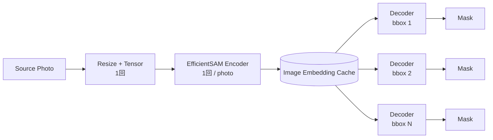
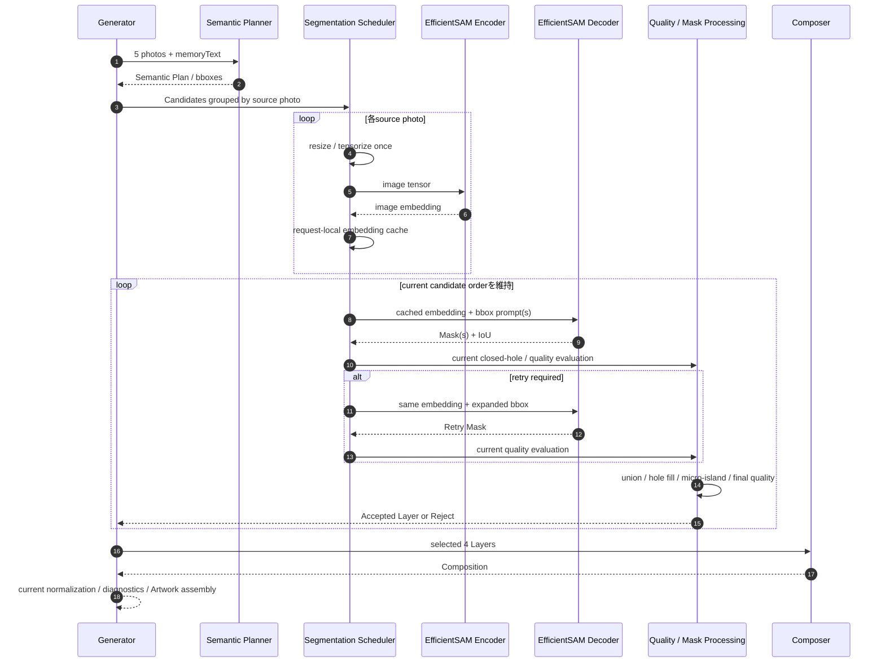

# AI生成速度改善 実行計画

最終確認: **2026-09-04**

本資料は、PR #8 `AI品質ベースライン確定（マージ保留）` の head
`4cc70570f99b582fdbb8d7cc652e590e13a01fc0` を品質ベースラインとして、
**現在のAI処理・品質を可能な限り変えずに、ローカル環境での生成時間を最大限短縮する**ための実行計画である。

速度改善はPR #8へ混ぜず、PR #8から分岐した独立branch / stacked PRとして扱う。
本資料で「品質を変えない」とした変更は、出力同値性を機械比較してから採用する。
候補数、Semantic Prompt、Quality Gate、Segmentation品質条件、Layer選定規則、Composition規則、
Segmentation modelそのものを変更する案は、速度だけを理由に本線へ混ぜない。

---

## 1. ゴール

### 1.1 最終ゴール

> PR #8の品質ベースラインを維持したまま、ユーザーのローカル環境における5写真→4 Layer生成時間を短縮する。
> まず最大ボトルネックであるEfficientSAM Segmentationを、計測・キャッシュ・encoder/decoder分離・prompt batching・
> ONNX Runtime最適化・ハードウェアアクセラレーションによって高速化する。
> 必要であれば、同一EfficientSAM処理を外部GPUへ移すAPI方式も比較する。
> 各変更は固定入力・固定bbox / Saved Planでbaselineとcandidateを比較し、品質同値性を確認できた変更だけを積み上げる。

### 1.2 成功条件

本フェーズでは、**ユーザーのローカル環境で5写真→4 Layer生成を2分以内へ短縮すること**を第一目標とする。
Cloud Run上の短縮は必須条件にしない。

比較条件は次で固定する。

- 同一PC・AC給電・sleep無効・同一入力・同一revision条件で比較する。
- 原則として各条件を**5回**実行し、中央値を主指標とする。
- p95、最小・最大、stage別時間も残し、1回だけの偶然値で採用しない。
- 速度改善候補が測定誤差より十分大きいことを確認する。
- full E2Eは統合確認として使うが、Geminiの確率的揺れをSegmentation改善量の根拠にしない。
- 5%程度の小改善は自動的に切り捨てない。より大きな改善案が残っている間は後回しにし、他に有効案がない段階で複雑性との釣り合いを見て採否する。

### 1.3 品質の成功条件

品質は「1 pixelでも違えば失敗」ではなく、**omoiで実現したい体験を損なわないこと**を最上位条件とする。
ただし差分のない改善を優先するため、採否を二段階に分ける。

- **Tier A — exact / practical parity:** binary Mask、Candidate採否、Layer、Artworkが同一、または浮動小数誤差だけ。人間確認を最小化して採用できる。
- **Tier B — quality-reviewed:** Mask等に差があるが、必須対象の欠損・背景混入・輪郭劣化・作品としての意味低下がない。固定比較artifactを画像確認し、人間が体験品質を承認した場合のみ採用できる。
- **Reject:** 必須対象が欠ける、背景混入が増える、4 Layer到達率が悪化する、Compositionに悪影響するなど、実現したい体験を損なう。速度が大きく改善しても採用しない。

### 1.4 目標時間

- 第一目標: **2分以内**
- 2分を達成した後も、品質・保守性・費用に無理がなければさらに短縮する。
- 2分へ届かない場合は、ローカルCPUだけに固執せず、外部GPU / 外部Segmentation API / 別モデルも品質比較付きで検討する。

---

## 1.5 人間判断で確定した実行方針（2026-09-04）

- ローカルPC情報は推測せず、PowerShellコマンドで採取する。
- ローカルGPUはない。
- 外部GPU、外部モデルAPI、第三者サービス、外部への画像送信は許容する。
- 費用上限は固定しないが、安価な方式を優先する。
- 品質差は一定範囲で許容する。ただしomoiの体験を損なう品質低下は許容しない。
- 速度目標は5写真→4 Layerで2分以内。
- benchmarkは各条件5回を基本とする。
- 5%程度の小改善は状況次第。大きい改善余地がある間は後回しにする。
- branch名は`codex/ai-speed-optimization`。PR #8 headから分岐する。
- PRは計画書だけでは作らず、最低1件の実速度改善を実装・計測してから作成する。
- 旧PR #3は履歴として残し、timing実装の有用部分だけをcurrent codeへ移植する。
- 評価datasetは特定ケース数に固定しない。速度を正しく比較できる固定入力をまず使い、最終的に必要十分なE2E確認を行う。

## 2. PR #8時点の固定ベースライン

### 2.1 通常Profile

PR #8 headでは次を固定baselineとして扱う。

- Semantic Profile: `physical_layer_v2`
- Gemini: `gemini-3.5-flash-lite`
- Segmentation: `EfficientSAM-Ti + ONNX Runtime`
- `candidate_count = 12`
- `target_layer_min = 4`
- `target_layer_max = 4`
- `segmentation_max_side = 1024`
- `gemini_analysis_max_side = 1536`
- closed-hole fill: enabled
- micro-island cleanup: enabled
- Composition overlap instruction: disabled
- foreground-bottom instruction: enabled
- Quality Gate: `observe`

### 2.2 既存計測

資料19 §8.66の成功26 run再集計では次の値を得ている。

| 指標 | 最小 | 中央値 | 最大 |
| --- | ---: | ---: | ---: |
| total elapsed | 3.1分 | **12.7分** | 69.5分 |
| Semantic Planning | 26.1秒 | 39.5秒 | 103.5秒 |
| Composition | 4.9秒 | 7.8秒 | 63.7秒 |
| EfficientSAM Segmentation合計 | 2.6分 | **11.8分** | 67.6分 |
| RGBA Layer build合計 | 0.8秒 | 10.6秒 | 21.4秒 |

PC sleep・給電状態が混在した可能性があるため絶対SLOには使わない。
ただし、中央値でもSegmentationが総時間の大半を占めるため、速度改善の第一対象はEfficientSAMとする。

### 2.3 移行時の品質証跡の扱い

`4cc7057`は、PR #8で採用済みの品質設定を含む**コード基準revision**である。一方、
前景Layer下寄せを既定有効化した後の固定3 case × 3回のReal E2Eは、Gemini endpointへのTCP未到達により
Semantic stageで9件とも停止している（資料19 §8.61、§8.64）。そのため、資料21の固定dataset条件を
この既定値で改めて満たした成功artifactは存在しない。資料19 §8.65の「16 / 16 = 100%」という進捗表記は、
資料19 §8.63の厳密な再監査（15.5 / 16 = **97%**）と整合しないため、以後は**97%・前景下寄せ既定値の
Real E2E再確認待ち**として扱う。

これはP0の決定論的Segmentation benchmarkを止める理由ではない。P0〜P6はGeminiを呼ばず、固定Saved Plan /
固定bboxでMask・LayerのTier A parityと速度を比較できる。Speed PRの最終統合確認では、Gemini接続が利用可能な環境で
current通常Profileのfull E2Eを実施し、4 Layer、Contract、採用済み品質規則、および
`foreground-bottom instruction=true`を再確認する。接続が使えない期間は、Speed PRを作成せず、決定論的な計測・
品質非変更最適化・Tier A比較までを継続記録する。

---

## 3. 現行Segmentation実装のボトルネック仮説

PR #8の`EfficientSamOnnxSegmenter.segment()`は、**bbox prompt 1回ごと**に次を実行している。

1. 元写真を`segmentation_max_side`へresize。
2. PIL Imageをfloat32 NumPy tensorへ変換。
3. CHWへtransposeし、0..1へnormalize。
4. `batched_images`とbox pointsをEfficientSAMの単一ONNXへ入力。
5. ONNX model全体を推論。
6. best maskを選択。
7. maskを元写真サイズへNEAREST resize。

同じsource photoから複数candidate / componentを切る場合も1〜5を繰り返す。
retry時も同じ写真に対して再度model全体を実行する。

一方、EfficientSAM公式ONNX例には**encoderとdecoderを分離した構成**があり、
`batched_images`から得た`image_embeddings`をdecoderへ渡してpromptごとのMaskを生成できる。
またprompt配列は`batch_size, num_queries, num_points, 2`の形を取れる。

したがって、最有力仮説は次である。

> **重いimage encoderをbboxごとに再実行していることが、現在の最大ボトルネックである。**
> source photoごとにencoderを1回だけ実行し、そのembeddingを再利用すれば、Maskの意味条件を変えずに大幅短縮できる可能性が高い。

---

## 4. 変更禁止ライン

### 4.1 最初の速度PRで変更しないもの

品質非変更trackでは、次を速度目的で変更しない。

- Gemini model
- Semantic Prompt
- Structured Output schemaの意味
- candidate数
- candidate importance / Layer Selection規則
- target Layer数
- Segmentation model family / weight
- `segmentation_max_side`
- bbox
- retry回数
- retry時bbox expand規則
- Mask score / area / component等の品質条件
- closed-hole fillの規則
- micro-island cleanupの規則と閾値
- Quality Gate
- Composition Prompt / normalize / recompose / clamp規則
- Artwork / Asset / API Contract

### 4.2 別trackに分離する案

以下は高速化し得るが、品質入力またはアルゴリズムを変えるため、品質非変更PRには入れない。

- candidate数を12→6〜8等へ削減
- `segmentation_max_side`を1024未満へ変更
- EfficientSAM以外のSAM / segmentation APIへ変更
- Semantic画像をPNG→JPEGへ変更
- Gemini model変更
- bboxを小さくするPrompt変更
- retry基準の緩和
- Quality Gateで早期candidate棄却
- 4 Layerが揃った時点で残候補を処理しないearly stop
- CompositionをGemini以外へ置換

これらを試す場合は、速度改善とは別に画像品質比較・人間判断を行う。

---

## 5. 実施順序

| Phase | 内容 | 品質リスク | 期待効果 | 採否 |
| --- | --- | --- | --- | --- |
| P0-0 | PR #8 headから速度改善branchを作成・基準revision固定 | なし | 直接短縮なし | 必須 |
| P0-A | PCスペック・実行環境のコマンド調査とfingerprint固定 | なし | 直接短縮なし | 必須 |
| P0-B | 詳細benchmark / timing追加 | なし | 直接短縮なし | 必須 |
| P1 | 写真resize・tensor前処理cache | 極小 | 小〜中 | Tier Aなら自動採用候補 |
| P2 | encoder / decoder分離 + embedding cache | 小 | **非常に大** | Tier A優先、差分時はTier B評価 |
| P3 | decoder prompt batching | 小 | 中〜大 | Tier A優先、差分時はTier B評価 |
| P4 | ONNX Runtime CPU thread / SessionOptions最適化 | 極小 | 中 | Tier A優先 |
| P5 | CPU / 利用可能accelerator Execution Provider比較 | 小〜中 | 中〜大 | Tier A/Bで評価 |
| P6 | bounded concurrency | 小 | 中 | oversubscriptionを避けて採用 |
| P7 | 同一モデル外部GPU / 別Segmentation API | 出力差・通信・費用 | 大〜非常に大 | Tier A/Bで評価 |
| P8 | Gemini / Composition等の二次最適化 | 方式依存 | 小〜中 | Segmentation後に判断 |

---

## 6. P0 — branch・PCスペック・計測条件を先に固定する

### 6.0 P0-0 — 速度改善branchを作成する

速度改善はPR #8の品質baselineを基準に行うため、最初にPR #8のhead revisionから専用branchを作成する。

- base: `codex/ai-quality-baseline-review`
- base revision: PR #8 head
- speed branch: `codex/ai-speed-optimization`
- 将来作成するSpeed PRのbase: `codex/ai-quality-baseline-review`
- Speed PRは、最低1件の実速度改善を実装・5回計測してから作成する。

理想のGit関係:

```text
main
└─ PR #8: codex/ai-quality-baseline-review
   └─ speed branch: codex/ai-speed-optimization
      └─ Speed PR（最初の実改善確認後に作成）
```

branch作成時には次を記録する。

- PR #8 head SHA
- speed branch作成直後のHEAD SHA
- `git status`
- `git branch --show-current`
- `git rev-parse HEAD`
- `git rev-parse origin/codex/ai-quality-baseline-review`
- 未commit変更の有無

作成コマンドの基準:

```bash
git fetch origin
git switch codex/ai-quality-baseline-review
git pull --ff-only
git switch -c codex/ai-speed-optimization
git push -u origin codex/ai-speed-optimization
```

GitHub連携からbranch作成できない場合は、ローカルで上記を実施する。
branch作成が完了するまで速度改善コードは別branchへ書かない。

### 6.1 P0-A — PCスペック・実行環境のコマンド調査

速度改善はユーザーのローカルPCで成功判定するため、**PCスペック調査そのものを速度改善フェーズの正式な作業に含める**。
型番やコア数を人間の記憶・申告だけで固定せず、Windows / Python / ONNX Runtimeから機械取得する。

調査対象:

- CPU正式名称
- physical core数
- logical processor数
- RAM容量
- GPU列挙結果（ユーザー申告ではGPUなし。OS上の表示も記録する）
- Windows edition / build
- AC / battery状態
- active power scheme
- Python version
- NumPy version
- Pillow version
- ONNX Runtime version
- `ort.get_available_providers()`
- EfficientSAM model file size / SHA-256
- Repository revision / branch
- benchmark時の日時
- benchmark中のCPU使用率・必要ならクロック / 温度等、OSから安全に取得できる値

この結果を`poc-output/performance-optimization-environment/`配下のprivate artifactへ保存し、
以後のbefore / after計測は同fingerprintを添付する。
CPU thread数やONNX Runtime設定は、この実測値を見てから探索範囲を決める。

### 6.1 P0-B — 既存PR #3の計測をcurrent codeへ移植

PR #3 `chore(ai): add detailed performance timing logs`には、現在必要な計測の原型がある。
ただしPR #3はPR #8より古い別branchをbaseとしているため、merge / cherry-pickでそのまま入れず、
PR #8 current codeへ必要部分だけ移植する。

計測対象:

- input decode / preprocess
- source asset build
- Semantic Gemini input prepare
- Semantic API
- candidate pipeline total
- component / retry単位
  - bbox変換
  - image resize
  - tensor preparation
  - ONNX inference
  - mask restore
  - Raw diagnostics
  - closed-hole fill
  - Normalized diagnostics
- candidate集約
  - union
  - post-union closed-hole fill
  - micro-island cleanup
  - final quality
  - RGBA PNG build
- Layer Selection
- Composition input prepare / API
- recompose
- normalize / clamp
- Artwork assembly
- total

### 6.2 ローカルhardware fingerprint

速度artifactへ最低限次を残す。

- OS / version
- Python version
- ONNX Runtime version
- available Execution Providers
- CPU model
- physical / logical core count
- RAM
- GPU model / VRAM
- 電源状態: AC / battery
- Windows power mode
- benchmark開始時刻
- code revision
- model file SHA-256
- model path / model typeはsecretでない範囲で記録

### 6.2.1 Windowsローカル情報採取コマンド

ユーザーPCの情報はAI実行環境から取得できないため、Repository rootで次のPowerShellを1回実行し、出力を速度artifactへ保存する。

```powershell
$cpu = Get-CimInstance Win32_Processor
$os = Get-CimInstance Win32_OperatingSystem
$cs = Get-CimInstance Win32_ComputerSystem
$gpu = Get-CimInstance Win32_VideoController
[pscustomobject]@{
  CpuName = ($cpu.Name -join "; ")
  PhysicalCores = ($cpu.NumberOfCores | Measure-Object -Sum).Sum
  LogicalProcessors = ($cpu.NumberOfLogicalProcessors | Measure-Object -Sum).Sum
  MaxClockMHz = ($cpu.MaxClockSpeed | Measure-Object -Maximum).Maximum
  RamGB = [math]::Round($cs.TotalPhysicalMemory / 1GB, 2)
  OS = $os.Caption
  OSVersion = $os.Version
  GPU = ($gpu.Name -join "; ")
}
powercfg /GETACTIVESCHEME
python --version
python -c "import onnxruntime as ort; print('onnxruntime', ort.__version__); print('providers', ort.get_available_providers())"
```

可能なら追加で次も採取する。

```powershell
Get-ComputerInfo | Select-Object CsSystemType, CsProcessors, BiosFirmwareType, WindowsProductName, WindowsVersion
```

この出力を受け取るまではCPU thread数を固定しない。P1/P2の構造改善はCPU型番に依存しないため先行可能である。

### 6.3 sleep混入対策

過去値にPC休止時間が入り得たため、性能測定runでは次を必須にする。

- AC給電
- benchmark中のsleepを無効
- benchmark中に蓋を閉じない
- 同時に重いアプリを動かさない
- baseline / candidateを同一セッション内で交互またはランダム順に実行

### 6.4 benchmarkを二層に分ける

#### A. 決定論的Segmentation benchmark

Geminiを呼ばない。
既存Saved Semantic Plan / bboxと同一写真を使い、Segmentation以降だけを繰り返す。

目的:

- AI APIの揺れを排除する。
- candidate集合を固定する。
- baselineとcandidateのMaskを直接比較する。
- 各最適化の速度効果を短時間で反復する。

#### B. Full E2E integration benchmark

Geminiを含める。

目的:

- 実際のフロント経路で壊れていないことを確認する。
- 全体時間に対してSegmentation短縮が反映されることを確認する。

E2EはGeminiの揺れがあるため、Mask最適化の厳密A/Bには使わない。

---

## 7. P1 — 同一写真の前処理を1回化

### 7.1 現状

同じsource photoでもpromptごとにresizeとtensor変換を行う。

### 7.2 改善案

source photo indexをkeyにしたrequest-local cacheを持つ。

```text
source image
  -> resize once
  -> np.asarray(float32) once
  -> transpose / normalize once
  -> PreparedImage cache
```

`PreparedImage`は次を持つ。

- resized image / size
- scale_x / scale_y
- float32 NCHW tensor
- original size

### 7.3 採否条件

- box座標変換がbaselineと完全一致。
- ONNX input tensorがbaselineとbitwise同一。
- final binary Maskが全promptで一致。
- scoreが同一または数値誤差内。
- Candidate accept / rejectが一致。

---

## 8. P2 — EfficientSAM encoderをsource photoごとに1回化

### 8.1 方式

公式のEfficientSAM-Ti encoder / decoder ONNXを使う。



現在は実質的に各bboxで`Encoder + Decoder`を繰り返している。
これを`Encoder × 写真数 + Decoder × prompt数`へ変える。

### 8.2 実装境界

Segmenter interfaceは可能な限り上位から隠蔽する。
候補loop / component loop / retry制御は最初は変えない。

第一段階では次の形を優先する。

```text
prepare(image) -> PreparedSegmentationImage
segment_prepared(prepared, box) -> SegmentationResult
```

またはSegmenter内部でimage identity / explicit source keyを使ってcacheする。
暗黙のobject identity cacheより、generation request単位の明示cacheを優先する。

### 8.3 retry

retryはbboxだけが変わり、画像は同じである。
したがってembeddingを再計算せず、expanded bboxでdecoderだけを再実行する。

### 8.4 parity gate

split modelを採用する前に、monolithic ONNXと同じ固定prompt群を比較する。

優先判定:

1. final binary Mask XOR pixels = 0
2. best mask index一致
3. score差が許容誤差内
4. closed-hole fill後Mask一致
5. cleanup後Mask一致
6. quality diagnostics一致
7. accept / reject一致
8. RGBA alpha hash一致

1〜8を満たすなら品質非変更として採用できる。
満たさない場合は勝手に許容せず、人間判断へ上げる。

---

## 9. P3 — decoder prompt batching

### 9.1 根拠

公式ONNX例のprompt shapeは`batch_size, num_queries, num_points, 2`である。
同一embeddingへ複数queryをまとめて渡せる可能性がある。

### 9.2 安全な導入順

#### P3-A: candidate内batch

同一candidateに複数componentがある場合だけ、first attemptをまとめる。
current control flowとのズレが小さい。

#### P3-B: source photo内batch

同じ写真の複数candidateのfirst attemptをまとめる。
最も効率がよい可能性がある。

ただしcurrent処理ではrequired component failureにより後続処理を省略する場合がある。
先にbatchすると、本来呼ばなかったdecoderを余分に計算する可能性がある。
**出力は変わらなくても速度が悪化する場合があるため、実測で決める。**

#### P3-C: retry wave batch

first attemptの品質判定後、retry対象bboxだけを集めて第二batchを実行する。

### 9.3 推奨アルゴリズム

```text
1. 全source photoをencodeしてembedding cache
2. first attemptはcandidate順序を維持
3. 必要ならcandidate単位でdecoder batch
4. 品質評価はcurrent順序・current条件のまま
5. retry対象だけを収集
6. expanded bboxでretry decoder
7. 以後のunion / normalization / qualityはcurrentのまま
```

まずencoder cacheだけで十分大きく短縮できるなら、過度なbatching複雑化は行わない。

---

## 10. P4 — ONNX Runtime CPU最適化

### 10.1 現状

current codeは`CPUExecutionProvider`だけを指定し、`SessionOptions`やthread数を明示していない。

### 10.2 比較する設定

品質を変えず、runtime scheduleだけを比較する。

- default
- `intra_op_num_threads`
  - 1
  - physical coresの1/2
  - physical cores
  - logical cores相当は必要時のみ
- `inter_op_num_threads`
- `execution_mode`
  - sequential
  - parallel
- graph optimization level
- memory arena / patternは必要時のみ

ONNX Runtimeは内部でmulti-threadするため、**Python側parallelismと同時に最大threadを使わせない**。

### 10.3 実験方法

`session_count × intra_op_threads × Python workers`の組合せを小さなfactorial experimentとして測る。

例:

| Session | intra threads | Python workers |
| ---: | ---: | ---: |
| 1 | default | 1 |
| 1 | P | 1 |
| 1 | P/2 | 1 |
| 2 | P/2 | 2 |
| N | 1 | N |

P = physical core count。

平均ではなくmedian / p95 / CPU utilizationを比較する。

---

## 11. P5 — ローカルaccelerator活用

**ユーザー申告ではローカルGPUなし。** したがってCUDA / DirectML GPUを本線には置かない。
CPU型番・コア数・Intel NPU等の有無はPowerShellで採取し、利用可能なacceleratorが見つかった場合だけ追加比較する。

### 11.1 NVIDIA GPUがある場合

第一候補: ONNX Runtime CUDA Execution Provider。
同じONNX graphをGPUで実行する。

確認事項:

- GPU model / VRAM
- CUDA / cuDNN compatibility
- `onnxruntime-gpu`導入可否
- CPU↔GPU転送時間
- encoder embeddingをGPU側へ保持できるか

### 11.2 Intel CPU / GPU / NPUがある場合

ONNX Runtime OpenVINO Execution Providerを比較する。
OpenVINO EPはIntel CPU / GPU / NPUを対象にできるため、Intel環境では有力候補とする。

### 11.3 WindowsのDX12 GPUを使う場合

DirectMLまたはWinML経路を比較候補にする。
DirectMLは幅広いDirectX 12 GPUを利用できる。

### 11.4 採否

Execution Provider変更は計算順序・浮動小数点差を生み得る。
よってP2と同じMask parity gateを通す。

- final binary Mask一致なら品質非変更として採用候補。
- Mask差が生じる場合、速度だけで採用しない。

---

## 12. P6 — bounded concurrency

### 12.1 並列化対象

候補:

- source photoごとのencoder
- 異なるsource photoのdecoder
- CPU後処理
  - diagnostics
  - closed-hole fill
  - micro-island cleanup
  - RGBA化

### 12.2 原則

単純に`asyncio.to_thread`を大量発行しない。
ONNX Runtime自体がmulti-threadするため、naive parallelismはCPU oversubscriptionで遅くなり得る。

### 12.3 推奨順

1. encoder cache単体を測る。
2. ORT thread設定を決める。
3. その後、写真単位で2 workers等のbounded concurrencyを測る。
4. CPU使用率・wall time・発熱を比較する。
5. 速くならなければ並列化を入れない。

---

## 13. P7 — 外部サービス / APIを使う場合

### 13.1 最優先方針

「別の高速Segmentation APIへ置き換える」より先に、
**現在と同じEfficientSAM-Ti encoder / decoder + 同じ前処理・後処理をGPU上へ配置する**。

これなら意味アルゴリズムを維持したまま、計算場所だけを変えられる。

### 13.2 API設計案

1 source photoにつき、画像を1回だけ送る。
同じ写真に対する全bboxをまとめて送る。

Request概念:

```json
{
  "image": "binary/multipart",
  "boxes": [
    [0, 0, 100, 100],
    [120, 80, 300, 400]
  ]
}
```

Server:

```text
image decode
 -> resize/tensor
 -> encoder once
 -> decoder batch
 -> masks
```

Responseはfull float logitsではなく、必要最小限のMaskを返す。

候補:

- compressed binary mask
- PNG alpha
- RLE

ネットワーク転送量を減らすためRLE等を比較する。

### 13.3 候補サービス

現時点の比較候補:

- Modal Serverless GPU
- Runpod Serverless GPU
- Hugging Face Inference Endpoints + custom container
- 必要ならGCP上のcustom GPU endpoint

選定基準:

- cold start
- GPU単価
- scale-to-zero
- custom container / ONNX Runtime対応
- data retention / privacy
-リージョン
- upload latency
- 同時実行性

### 13.4 API方式の採否条件

外部GPUがローカルCPUより推論自体は速くても、5枚画像upload + cold startで遅くなる可能性がある。
必ずend-to-endで比較する。

```text
remote total
= upload
+ cold/warm start
+ preprocess
+ encoder
+ decoder
+ mask download
```

### 13.5 別Segmentation API

外部モデルAPIの利用は**許容**する。画像・memoryText等の外部送信にも本フェーズ固有の制限を置かない。
費用上限は固定しないが、同等性能なら安価な方式を優先する。

モデルが変わるためTier Bの品質比較trackとして扱う。候補例:

- SAM 2系のbbox prompt API（例: fal.ai等）
- SAM 2 / promptable segmentationのdedicated endpoint（例: Roboflow等）
- Replicate等の公開Segmentation model API
- Hugging Face / Modal / Runpod上のcustom model endpoint
- 今後見つかる高速なbbox-prompt segmentation API

選定時はmodel名ではなく、**1 source photo + 複数bboxを1 requestで処理できるか、Maskそのものを取得できるか、5写真E2Eで2分へ寄与するか**を重視する。
別モデルへ切り替える場合は、現行EfficientSAM baselineと固定ケースでMask / Layer / Artworkを比較し、体験品質が低下しない場合だけ採用する。

---

## 14. P8 — Segmentation以外の二次最適化

Segmentationを短縮した後に再計測し、次のボトルネックを決める。

### 14.1 Semantic Planning

過去PoCではSemantic画像transportをJPEG化すると送信量と時間が大幅に下がった例があるが、
入力画像情報が変わるため品質非変更とはみなさない。
通常Profileへ入れる場合はSemantic Plan / bbox /最終作品の比較が必要。

品質を変えずに先に試せるもの:

- thumbnail / encodingの同一結果cache
- client / HTTP connection reuse確認
-不要copy削減

### 14.2 Composition

中央値はSegmentationより小さい。
Segmentation改善後に全体比率が大きくなった場合だけ優先度を上げる。

### 14.3 Mask後処理 / RGBA

- connected component / hole diagnosticsの重複scan削減
- NumPy vectorization
-同じMaskに対する複数diagnostic passの統合
- full-resolution処理が本当に必要なstageだけに限定
- PNG encodeの設定・copy削減

ただしMask変換規則そのものは変えない。

---

## 15. 品質同値性の判定

### 15.1 Level A — Exact parity

最優先。

- prompt bbox一致
- final binary Mask完全一致
- Raw / Normalized diagnostic一致
- cleanup action一致
- accept / reject一致
- Layer alpha hash一致
- Artwork構造一致

Level Aを満たし、中央値が短縮する変更は、人間の画像判断なしでも「品質非変更の実装最適化」として採用候補にできる。

### 15.2 Level B — Binary output parity

encoder split / GPU等でscoreの微小差があっても、

- best maskが同じ
- threshold後binary Maskが同じ
-以降の出力が同じ

なら実質的に品質非変更とみなせる可能性がある。
このLevelを許容するかは人間が先に決める。

### 15.3 Level C — Visual parity only

Mask pixel差があるが目視で同等、という変更は品質変更trackへ送る。
速度PRで自動採用しない。

---

## 16. 性能評価プロトコル

### 16.1 各PoC

1. baseline warm-up 1回
2. candidate warm-up 1回
3. baseline / candidateを各3〜5回
4. 実行順を交互化
5. medianを主値、min / max / p95相当も保存
6. Mask parityを全case確認

### 16.2 暫定採否閾値

人間確認前の暫定規則:

- `<5%`短縮: 誤差の可能性が高く保留
- `5〜10%`: 追加反復
- `>=10%`: 有意候補として採用検討
- `>=2x`: 高優先採用候補

これは統計的有意差を厳密に保証する閾値ではなく、ローカルPoCの実務上のnoise guardである。
ユーザーが「1秒でも改善なら成功」と定義する場合も、測定誤差と改善を区別するため数値記録は維持する。

### 16.3 最終統合確認

採用した最適化を全部有効にして、代表5写真caseでfull E2Eを複数回実行する。

確認:

- 4 Layer成功
- Contract validation
- runtime flags / providers
- total elapsed
- Segmentation total
- Semantic / Composition時間
- final preview

Geminiの揺れがあるため、full E2Eの作品内容がbaselineと一致することまでは要求しない。
速度非変更の根拠は固定Saved Plan benchmark側に置く。

---

## 17. 実装単位 / Commit / PR方針

### 17.1 branch

予定branch:

```text
codex/ai-speed-optimization
```

開始点:

```text
PR #8 head
4cc70570f99b582fdbb8d7cc652e590e13a01fc0
```

### 17.2 stacked PR

推奨:

```text
main
  └─ PR #8: codex/ai-quality-baseline-review
       └─ Speed PR: codex/ai-speed-optimization
```

Speed PRのbaseを`codex/ai-quality-baseline-review`にし、レビュー画面では速度差分だけを見せる。
PR #8をmergeしない現状でも独立レビューできる。

PR #8が先に更新された場合は、Speed branchを新しいPR #8 headへ追随させ、baseline SHAを資料22へ更新する。

### 17.3 commitの切り方

原則1仮説1commit。

例:

1. `perf(ai): add deterministic segmentation benchmark`
2. `perf(ai): add detailed segmentation stage timings`
3. `perf(ai): cache prepared source image tensors`
4. `perf(ai): cache EfficientSAM image embeddings`
5. `perf(ai): batch EfficientSAM decoder prompts`
6. `perf(ai): tune ONNX Runtime session options`
7. `perf(ai): add optional accelerated execution provider`

計測だけのcommitと出力挙動を変え得るcommitを混ぜない。

---

## 18. 最適化後の目標処理フロー



この構成では**意味判断・bbox・Mask品質条件は変えず、同じ写真特徴量の再計算だけを消す**ことを最優先にする。

---

## 19. 実行成果物

Gitへcommitしてよいもの:

- 本資料22
- benchmark / measurement script
- private値を含まないsummary schema
- performance implementation
- unit / parity tests

Gitへcommitしないもの:

- private写真
- memoryText本文
- Mask / Layer / previewのprivate binary artifact
- API Key
- external API secret
- hardware固有secret

private performance artifact例:

```text
poc-output/performance-optimization-YYYYMMDD/
  environment.json
  baseline/
    timings.json
    masks/
  candidate/
    timings.json
    masks/
  comparison.json
```

---

## 20. 速度改善候補の優先順位

現時点の推定順位:

### S — 最優先

1. **EfficientSAM encoder / decoder分離 + source photo embedding cache**
2. **現在の各stageの正確なtiming**
3. **source photo前処理cache**

### A — 高優先

4. decoder prompt batch
5. CPU thread / ORT SessionOptions tuning
6. CPU / 利用可能acceleratorに適したExecution Provider
7. bounded concurrency

### B — 条件付き

8. 同一EfficientSAMをserverless GPUへ配置
9. Mask diagnosticsの重複走査削減
10. RGBA / PNG生成最適化

### C — 品質比較が必要

11. Semantic画像JPEG化
12. candidate削減
13. segmentation解像度低下
14. early stop
15. 別Segmentation model / API
16. Prompt変更

---

## 21. 確定事項

### 21.1 人間回答で確定

- PCスペック・実行環境の調査は、速度改善計画の正式なP0タスクとしてコマンドで実施する。
- ローカルGPUなし。
- 速度目標は2分。
- benchmarkは各条件5回。
- 小改善は一律rejectせず、より大きい案が尽きた段階で複雑性との釣り合いを判断する。
- Mask等の差は一定範囲で許容するが、実現したい体験が損なわれる品質低下は不採用。
- 外部GPU / 外部モデルAPI / 第三者クラウド / private画像送信はすべて許容する。
- 費用上限は固定しないが、同等品質・同等速度なら安価な方式を優先する。
- 公式EfficientSAM-Ti encoder / decoder ONNXの追加取得を許可する。
- model weightはGitへcommitせず、local `.models/` 等へ配置する。Deploy時に必要ならimageへbundledする。
- benchmarkではCPU高負荷・ファン回転・発熱増加を許容し、速度を優先する。
- `onnxruntime-openvino`等の追加runtime package、CPU向けExecution Provider、推論runtimeの追加比較を許可する。
- 外部Segmentation APIや別モデルAPIを品質比較付きで試してよい。
- branch作成自体をP0-0の正式タスクとし、`codex/ai-speed-optimization`をPR #8 headから作成する。将来のSpeed PRはPR #8をbaseにしたstacked PRとする。
- PRは最低1件の実速度改善を実装・計測した後に作成する。
- 旧PR #3は履歴として保持し、必要timingだけcurrent codeへ移植する。
- benchmark datasetは固定数を先に決めず、正しく比較できるものを使う。

### 21.2 コマンド採取で確定する実測値

以下は方針上の未決定事項ではなく、**P0-Aで機械取得して記録する測定値**である。

- CPU型番
- physical / logical core数
- RAM
- Windows / power scheme
- Python / NumPy / Pillow / ONNX Runtime version
- ONNX Runtime available providers
- GPU列挙結果
- EfficientSAM model SHA-256
- benchmark時のAC / power状態

### 21.3 人間への事前確認

**現時点で速度改善開始を妨げる未回答事項はない。**
新たに品質・費用・製品体験へ影響する判断が発生した場合だけ、実験結果と選択肢を提示して人間判断を求める。

---

## 22. 直近アクション

現在の回答を前提に、次の順で実施する。

1. **P0-0としてPR #8 headから`codex/ai-speed-optimization`を作成し、基準revisionを記録する。**
2. 本資料22と`00_INDEX.md`をspeed branchへ追加する。
3. **P0-AとしてWindowsコマンドでPCスペック・runtime fingerprintを採取する。**
4. PR #3のtiming実装をcurrent codeへ移植する。
5. deterministic Segmentation benchmarkを作る。
6. ローカルbaselineを5回測る。
7. P1前処理cacheを実装しTier A parity / speedを5回測る。
8. 最低1件の実改善が確認できた時点でstacked PRを作る。
9. P2 split encoder / decoderを実装し、Tier Aを優先して5回比較する。
10. 差分が出る場合はTier B画像比較へ進め、体験品質の人間判断を得る。
11. 2分未達ならP3 batching、P4 CPU tuning、CPU向けExecution Provider、外部GPU / 外部モデルAPIを順次比較する。
12. 各結果を本資料へ数値・品質差・採否付きで追記する。
13. 最終的にfull E2Eで統合確認し、Speed PR本文へbefore / afterを記載する。

---

## 23. 完了条件

- [ ] PR #8 headを明示した独立速度branchがある。
- [ ] ローカルhardware / runtime fingerprintを記録できる。
- [ ] sleep等を除外した再現可能なbaselineがある。
- [ ] Segmentation stageをresize / tensor / encoder-or-inference / decoder / restore / postprocessへ分解できる。
- [ ] 最低1つ以上の品質非変更最適化で再現可能な短縮を確認した。
- [ ] 採用品は固定入力でTier A parity、またはTier Bの品質承認を確認した。
- [ ] full E2Eでも4 Layer / Contract / current品質規則を維持した。
- [ ] 外部APIを試した場合は、通信込みlatency・cost・privacy条件を記録した。
- [ ] Tier B変更を採る場合は品質差と人間判断をPRで明示し、未評価の品質変更を混ぜていない。
- [ ] before / afterの中央値とstage内訳をPRへ記載した。

---

## 24. 実行記録

### 24.1 P0-0 / P0-A — branchと環境fingerprint（2026-09-04）

- speed branch: `codex/ai-speed-optimization`
- branch作成時HEAD / PR #8 head / base revision:
  `4cc70570f99b582fdbb8d7cc652e590e13a01fc0`
- runtime: Python 3.13.13 / NumPy 2.5.2 / Pillow 12.3.0 / ONNX Runtime 1.29.0
- ONNX Runtime available providers: `AzureExecutionProvider`, `CPUExecutionProvider`
- CPU: 12th Gen Intel(R) Core(TM) i7-1260P（physical 12 cores / logical 16 processors）
- RAM: 15.68 GB
- OS: Microsoft Windows 11 Home 10.0.26200
- GPU列挙: Intel(R) Iris(R) Xe Graphics（速度baselineはCPU providerを維持する）
- active power scheme: パナソニックの電源管理
- EfficientSAM-Ti ONNX: 41,365,520 bytes / SHA-256
  `143c3198a7b2a15f23c21cdb723432fb3fbcdbabbdad3483cf3babd8b95c1397`
- private artifact: `poc-output/performance-optimization-environment/environment.json`

fingerprintには秘密情報・環境変数を含めない。WMIのbattery raw値は取得したが、AC接続・sleep無効・蓋を閉じない
ことをbaseline実行直前に満たす必要があるため、ここでは給電状態を合否へ読み替えない。P0-B以降は未実施であり、
Speed PRは未作成である。
