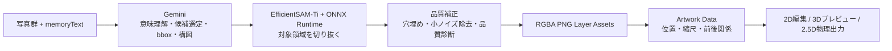
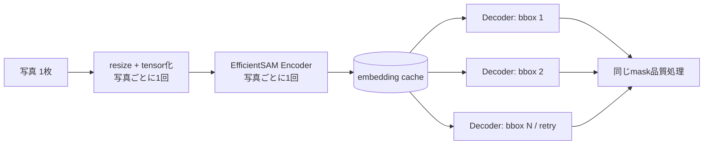

# omoi AI処理 — ハッカソン発表用ブリーフ

最終更新: **2026-09-04**
対象: AI・画像処理パートの発表者、デモ担当者

> この資料の主張は「AIを使った」ことではない。
> **複数の思い出写真から、残すべきものを選び、物理作品にもできるレイヤーへ、品質を保って短時間で変換した**ことにある。

## 1. まず伝える一文

**omoiは、複数の思い出写真と言葉から、AIが“何を残すか”を選び、切り抜いた要素を一つの立体的な作品へ編み直すサービスである。**

一般的な画像生成では一枚の新しい画像で終わる。一方omoiは、後から配置を編集でき、3Dプレビューと2.5Dの物理出力にもつながる、透明PNGの複数レイヤーを生成する。

## 2. 解決したい体験上の課題

| 写真編集だけでは難しいこと | omoiで目指すこと |
| --- | --- |
| 写真が増えるほど、どの思い出を作品に残すか迷う | 写真群とmemoryTextから象徴的な要素を提案する |
| 背景ごと切り抜かれたり、服の中に穴が開いたりすると作品に使えない | 被写体として自然な透過レイヤーをつくる |
| 一枚絵は後から構図を直しにくい | レイヤーごとに位置・大きさ・前後関係を編集できる |
| デジタル作品で終わる | 3Dプレビューと2.5D物理出力の共通データへつなぐ |

MVPの代表経路は、**写真5枚 + memoryText → 4層のLayer Artwork → 2L判Landscapeの作品**である。API契約自体は写真数・レイヤー数を固定していない。

## 3. AI処理の全体像

発表での要点は、AIを一つのブラックボックスにしないこと。

- **Gemini**は、写真群の文脈から「何を思い出として残すか」「どの位置を切り抜くか」「どう構成するか」を判断する。
- **EfficientSAM-Ti**は、Geminiが示したbboxを手掛かりに「どこまでが対象か」というピクセル単位の境界を切り抜く。
- **Python / Pillow / SciPyの後処理**は、作品として使える透明レイヤーへ整える。

Geminiに最終mask境界まで任せないため、意味理解と輪郭品質をそれぞれ得意な処理に分けている。

## 4. 技術的なこだわり

### 4.1 「何を残すか」と「どこまで切るか」を分離した

写真群の意味理解にはGemini Developer APIを使い、構造化出力で候補・bbox・構成を受け取る。最終的な輪郭はEfficientSAM-Ti + ONNX Runtime CPUで決める。自由文のAI回答をそのまま作品にせず、型検証可能なデータと画像処理へ接続する設計である。

### 4.2 一枚絵の再生成ではなく、編集可能なレイヤーを残した

出力はRGBA PNGと、位置 `x/y`・幅 `scale`・奥行き順 `layerIndex` を持つArtwork Dataである。この共通データを、Frontendの2D編集・3Dプレビュー・Physical Outputが共有する。作品の意味や配置を、担当ごとに別形式へ複製しない。

### 4.3 小さな切り抜きの破綻も作品品質として扱った

- **closed-hole fill**: 服や物体の内側に生じる、本来不要な穴を埋める。
- **micro-island cleanup**: 背景由来の小さな飛び地ノイズを取り除く。
- **coherent group / union処理**: 一つの思い出として残したい複数の部位を、必要に応じてまとめる。
- **Quality Gate**: 面積・連結成分・背景混入などの診断を残し、品質が不自然な候補を観測できるようにする。

これらは「見栄えを少し良くする」だけではなく、最終的にレイヤーを物理作品へ使えるかの前提条件である。

### 4.4 失敗を隠さない

Real AI処理に失敗しても、ユーザーに知らせずMock Artworkへ差し替えない。秘密情報・private画像・memoryText・PoC出力はGitに含めず、Gemini API KeyをFrontendへ出さない。

## 5. 速度改善 — 品質を変えずに速くした方法

### 問題の発見

旧実装では、同じ写真から複数候補を切り抜くたびに、画像resize・tensor化・EfficientSAMのencoder/decoder推論を繰り返していた。過去計測でもSegmentationが総時間の大半を占めていたため、候補数・Prompt・品質基準を削らず、ここを最初の改善対象にした。

### 実装した改善

- source photoごとの前処理を再利用する。
- EfficientSAMを公式のencoder / decoder構成へ分割する。
- 同一写真のembeddingをcacheし、候補やretryではdecoderだけを実行する。
- closed-hole fillとmicro-island cleanupの連結成分処理を、同じ8近傍接続性・同じ出力のSciPy実装へ置き換える。
- resize、tensor化、encoder、decoder、mask復元までstage別に計測し、推測で最適化しない。

品質を変えない最初の速度改善では、candidate数、Gemini Prompt、Quality Gate、Segmentation解像度・bbox・retry、closed-hole fill規則、micro-island cleanup規則、Composition、Contractを変えていない。

## 6. 実測で示せる成果

### 6.1 決定論的Segmentation比較

Geminiの応答の揺れを除くため、固定Saved Plan・固定5写真・固定10 bboxで比較した。各条件はwarm-up後に5回測定し、AC給電・sleep無効・蓋を閉じない・重い並列作業なしで実行した。

| 条件 | 中央値 | 結果 |
| --- | ---: | --- |
| 従来のmonolithic EfficientSAM ONNX | 17,170.49 ms | 基準 |
| encoder / decoder分離 + embedding cache | **9,408.28 ms** | **45.21%短縮** |

5回すべてで、固定bboxのfinal binary mask hash・bbox keyが基準と完全一致した。つまり、**約45%短縮しながら、比較対象の切り抜き結果は変えていない**。これはTier A（機械比較で同値）の品質確認を通した改善である。

参考となるstage中央値は、写真5枚のencoderが1,364.57 ms、bbox 10件のdecoderが129.45 msだった。ボトルネックを分解して見える化したことで、次に何を改善すべきかも判断できる。

### 6.2 Real E2Eの代表成功run

`gemini-3.5-flash-lite`、`physical_layer_v2`、split ONNX、SciPy後処理で、代表5写真を実際に最後まで処理した。

| 指標 | 実測値 |
| --- | ---: |
| 出力Layer数 | 4 |
| total | **65.82秒** |
| Semantic Planning | 28.33秒 |
| Composition | 7.96秒 |
| Contract validation | 成功 |

ローカルCPUでの第一目標「5写真→4 Layerを2分以内」を、代表ケースで達成した。なおReal E2EにはGemini通信の揺れがあるため、Segmentationの厳密な速度比較は前節の決定論的benchmarkで行っている。

### 6.3 後処理の高速化

private raw mask 7枚でのclosed-hole fill比較では、同一output hashを保ったまま、中央値 **136,833.68 ms → 1,576.60 ms**（86.79倍）まで短縮した。これはルールを緩めた結果ではなく、同じ処理をより効率的な実装にした結果である。

## 7. 品質の現在地と、正直に伝えるべきこと

- 品質フェーズ: **97%**
- 速度改善フェーズ: **100%**
- 品質の未確認残件: `foreground-bottom=true` の通常Profileで、Gemini到達可能環境における固定Real E2Eを改めて確認すること。

精度確認向けには、private datasetの3ケースを2回ずつ実行し、5件の成功artifactを保存している。これらにはcomposition preview、bbox、raw / normalized mask、RGBA layerが含まれる。6 run中1件は失敗として成功証跡に混ぜていない。

発表では、未確認事項を隠すよりも、**「品質の確認条件を固定し、成功・失敗を分けて記録している」**と説明する。ハッカソンでは、完成度だけでなく、短期間で検証可能な開発プロセスを持つことが信頼につながる。

## 8. デモで見せる順番

1. 写真5枚と短いmemoryTextを見せる。
2. 「AIが写真の意味を読み、残す候補を選ぶ」と説明する。
3. bbox付きの元写真、mask、穴埋め・ノイズ除去後のRGBA layerを一つだけ並べる。
4. 4層を重ねた作品を見せる。
5. 2D編集または3Dプレビューを見せ、「一枚絵ではなく編集・物理化できるデータ」と伝える。
6. 最後に `65.82秒` と `45.21%短縮・5/5同一mask` を提示する。

時間が短い場合、技術説明は次の三文で十分である。

> Geminiが、思い出として何を残すかを決めます。
> EfficientSAMが、その対象をピクセル単位で切り抜きます。
> 同じ切り抜き品質のまま、encoderの再計算をやめて45%高速化しました。

## 9. スライド構成案（5〜7枚）

| 枚 | 見出し | 伝えること | 推奨ビジュアル |
| ---: | --- | --- | --- |
| 1 | 思い出を、一枚の作品に | omoiの体験価値 | 完成作品 / 3Dプレビュー |
| 2 | 写真群から「残すべきもの」を選ぶ | 写真＋言葉からの意味理解 | 入力写真と選ばれた要素 |
| 3 | 意味理解と切り抜きは分業させる | Gemini + EfficientSAMの役割分担 | 処理フロー図 |
| 4 | 物理作品に耐える切り抜きへ | 穴埋め・ノイズ除去・Layer化 | before / after mask |
| 5 | 品質を変えずに45%高速化 | embedding cacheと5回同値比較 | 数値カードと小さな図 |
| 6 | 5写真から4 Layerを65.82秒で | E2Eの成果とデモ | 実際のレイヤー作品 |
| 7 | ここから物理の思い出へ | 3D / 2.5D出力へつながる将来性 | 作品→物理出力の図 |

## 10. 発表で避ける表現

- 「完全自動で常に完璧」とは言わない。写真・通信・被写体の難しさによる検証余地がある。
- 45.21%短縮を、Geminiを含む全ケース共通の短縮率とは言わない。これは固定Segmentation比較の結果である。
- 65.82秒を、すべての入力で保証されるSLAとは言わない。代表5写真のReal E2E実測値である。
- private写真、memoryText、API Key、private PoC artifactを発表資料・Git・共有リンクへ載せない。

## 11. 発表者向け根拠メモ（公開資料へは不要）

- 現行の速度改善計画: `docs/ai/22_AI_PERFORMANCE_OPTIMIZATION_PLAN.md`
- 実行記録・計測根拠: `docs/ai/19_AI_EXECUTION_BACKLOG.md` §8.68〜§8.76
- 実装: `backend/ai/gemini.py`、`backend/ai/segmentation.py`、`backend/ai/image_ops.py`
- 決定論的benchmark script: `scripts/run_deterministic_segmentation_benchmark.py`
- private速度artifact: `poc-output/performance-optimization-*/`
- private精度確認artifact: `poc-output/accuracy-validation-five-patterns-20260904/`

これらのartifactは発表の裏付けとしてローカルで確認するためのもの。外部配布するスライドには、private画像や入力本文を含めない。
