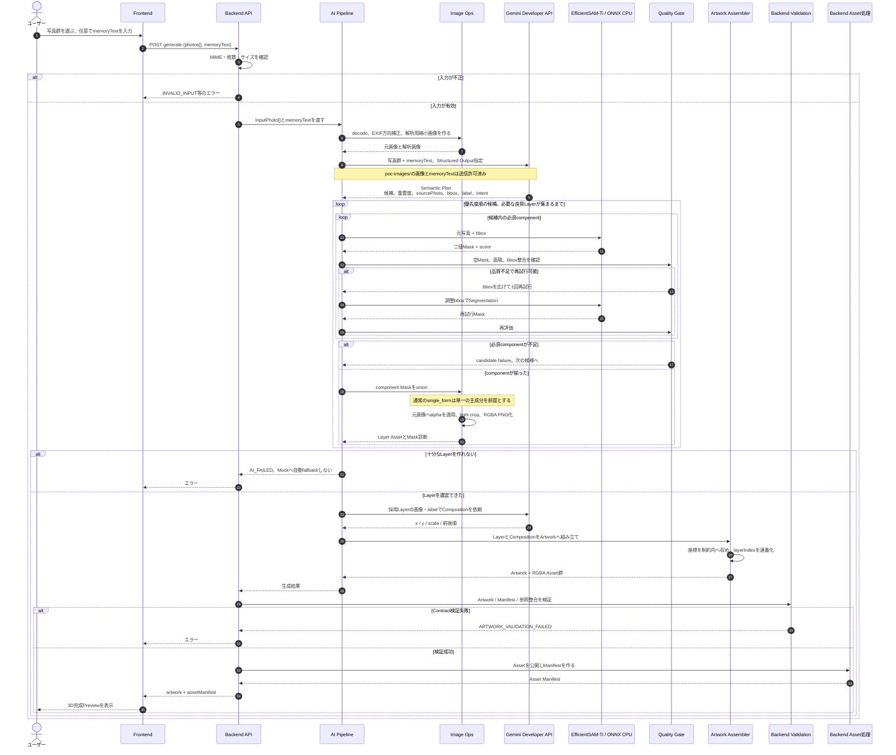
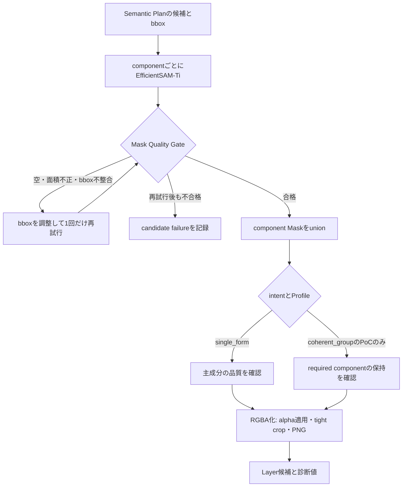
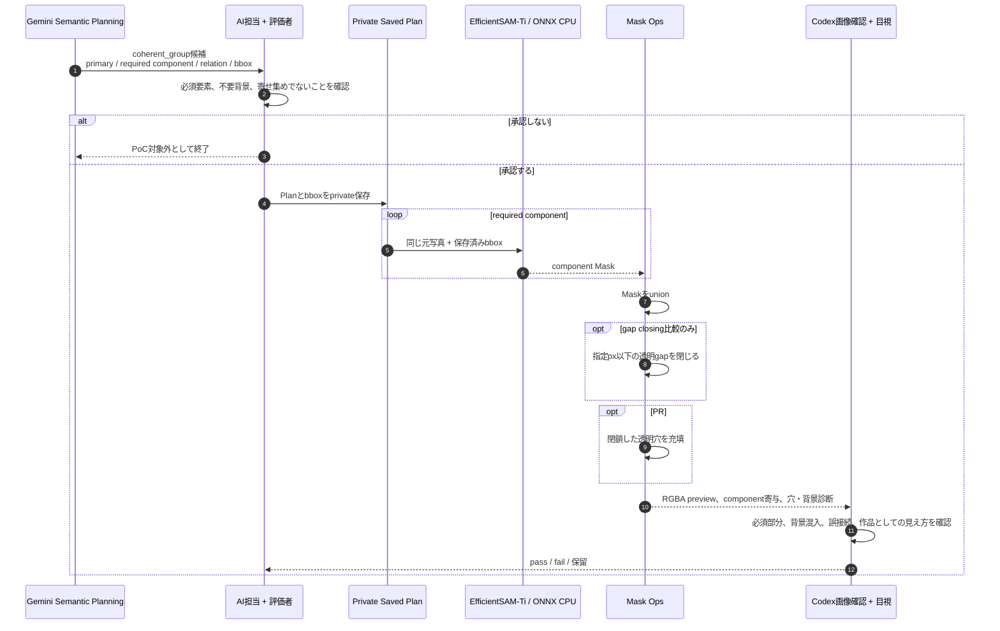
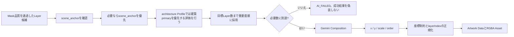
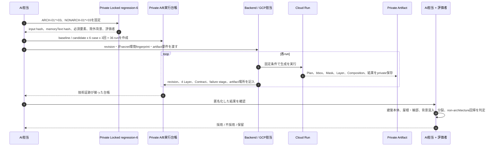

# AI処理 現行詳細シーケンス

最終確認: **2026-09-02**

この資料は、現在のAI処理が「どの順番で」「どの入力と出力を使い」「どこで失敗として止まるか」を示す。
設計時点の全体像は`03_SEQUENCE.md`に記録されていた。本資料は、現在の実装、private PoC、未採用の変更を分けて記録する。

## 1. 読み方と範囲

| 区分 | 状態 | 内容 |
| --- | --- | --- |
| 通常Profile | 実装済み | `physical_layer_v2`。写真群と`memoryText`からLayerを生成する標準経路。 |
| 建築Profile | 評価中 | `physical_layer_v3_architecture`。architecture A/B評価のcandidate。採用は未決定。 |
| `coherent_group` | private PoC | 複数componentを一つのLayerにする試作。通常Profileには未採用。 |
| 微小island cleanup | PR #6 | 小さい孤立成分を除く変更。PRレビュー中。 |
| 閉鎖穴充填 | PR #7 | 窓や腕など、外側とつながらない透明穴を埋める変更。PRレビュー中。 |
| 細いgap closing | private PoC | 細い透明な隙間を閉じる試作。通常Profileの既定値は`0`で、未採用。 |

`photos[]`と`layers[]`はContract上は可変長である。MVPの代表経路は「写真5枚 + `memoryText` → 4 Layer」だが、配列長そのものを固定していない。

AI担当は意味理解、bbox、Segmentation、Mask処理、Layer選定、Compositionを担当する。API、Asset公開、Contract validation、Cloud Runのデプロイ・実行はBackend担当、3D Previewと2D EditはFrontend担当である。

## 2. 通常の生成シーケンス

### Semantic Planで決めること、決めないこと

Geminiは、思い出として残す候補、元写真、bbox、重要度、component関係、構図を提案する。Geminiは最終的なMask境界を決めない。bboxをPromptとしてEfficientSAM-Tiへ渡し、Mask境界はSegmentation結果とQuality Gateで決める。

Compositionは、実際にMaskを通過して採用可能になったLayerだけを入力にしてから呼ぶ。先に構図を決めると、Segmentation失敗でLayerが減ったときに構図だけが残るためである。

## 3. MaskからRGBA Layerになるまで

現在のMask後処理には、次の状態差がある。

| 処理 | 目的 | 現在の扱い |
| --- | --- | --- |
| 微小island cleanup | 主成分から離れた小さい孤立片だけを除く | PR #6。料理と器などの大きな分離を無理に結合する用途ではない。 |
| `fill_closed_mask_holes` | 画像端の背景に到達できない透明穴をforegroundにする | PR #7。窓、器の内側、腕の穴を同じ規則で扱う。外側に開いた隙間は残す。 |
| `close_narrow_mask_gaps` | 細い透明gapを形態学的に閉じる | private PoC。太い橋や大きく離れた対象の結合には使わない。 |

PR #7がmainへ入るまでは、閉鎖穴充填を通常生成の確定挙動として扱わない。同様に、`coherent_group`とgap closingはprivate PoCの結果であり、通常Profileを変更していない。

## 4. `coherent_group` のprivate PoCシーケンス

これは「器 + 料理」「人物 + 手持ち物」「建築本体 + 付属物」のように、複数の必要部分を一つのLayerとして残すための共通設計案である。カテゴリ別の後処理ではない。

このPoCでは、保存済みPlanとbboxを再生するため、Mask unionの結果をGeminiの候補選定の揺れから分けて確認できる。`required component`の各Maskがunionへ追加した独自面積も記録する。ただし、独自面積の比率だけで自動合格にはしない。背景混入、意味上の欠損、最終previewは目視で確認する。

生成済みpreviewはGeminiへ再送信しない。Codex上の画像確認と評価者の目視を使う。

## 5. Layer選定とComposition

`scene_anchor`が無いことは、技術的には必ずしも失敗ではない。料理や工芸は背景なしでも一つの静物として成立する場合がある。一方、建築では背景なしによりLayerが散らばり、まとまりが弱くなる事例が確認されている。したがって、`background_missing`はprivate診断として記録し、最終previewで作品として確認する。

現在のComposition Promptは、Canvas内に収めること、座標の範囲、前後順、下端gapの診断を扱う。Layer間の過度な重なりを避けるルールはPoC中であり、同じ人を複数Layerにする作品表現まで一律に禁止するルールは未決定である。

## 6. failure stageと証跡

| stage | 失敗の例 | privateに残す主な証跡 | 次に見る場所 |
| --- | --- | --- | --- |
| Source | 誤った写真、decode不能、対象が写っていない | input hash、写真番号、decode情報 | 入力とSource選択 |
| Semantic | 必須要素を候補にしない、重複候補 | Semantic Plan、候補一覧 | memoryText、候補選定、intent |
| BBox | 目的物をbboxへ入れない、背景を広く入れる | bbox preview、source photo ID | bboxとcomponent関係 |
| Mask | 穴、背景片、必要部分欠損、分裂 | component Mask、union Mask、診断値 | Segmentation、Mask後処理 |
| Layer | RGBA crop不正、必要Layer不足 | RGBA preview、選定理由 | cleanup、Layer選定 |
| Composition | 重なり過多、浮遊、作品のまとまり不足 | composition preview、座標診断 | Composition Prompt、採用Layer |
| Contract | Artwork / Manifestの不整合 | validation結果 | Backendとの結合境界 |

AI失敗時にMock Artworkへ自動で差し替えない。Layer不足、Quality Gate不合格、Contract validation失敗は、対応するエラーとしてFrontendへ返す。

## 7. architecture A/B評価の実行シーケンス

architecture A/Bは通常のローカルPoCではなく、Locked regression-6を使う比較である。Cloud Runのデプロイと36回の実行はBackend/GCP担当の責務であり、AI担当は実行条件を変更しない。

比較条件はbaseline `cedb1a6804823871cd00449f79ff2d9ef7edec15` の`physical_layer_v2`と、candidate `43b0e4f` のarchitecture用`physical_layer_v3_architecture`である。non-architectureは両者とも`physical_layer_v2`を使う。想定Runtime条件は`gemini-3.5-flash-lite`、`efficient_sam_onnx`、CPU 1、memory 2 Gi、concurrency 1、timeout 600秒である。

**現在は36件中0件が実行記録済みであり、`technicalEvidenceReady=false`である。** これはAIの失敗結果ではなく、Backend/GCP担当による実行待ちを意味する。この証跡が揃うまで`43b0e4f`を採用しない。

## 8. 担当境界

| 領域 | AI担当が行うこと | AI担当が行わないこと |
| --- | --- | --- |
| 意味理解・Mask | Gemini Prompt、Semantic Plan、bbox、EfficientSAM、Mask品質、RGBA Layer | Gemini API Keyの公開、実AI失敗時のMock fallback |
| 作品構成 | Layer選定、Composition、AI内部診断 | Artwork Data / Asset Manifest / API Contractの変更 |
| 評価 | private manifest、PoC、failure stage、目視用artifactの整理 | Cloud Runのデプロイ・実行条件の変更 |
| 出力 | BackendへArtworkとAsset Blobを渡す | Asset公開、非同期Job、Firestore、Cloud Tasks、GCS |
| 物理出力 | AI上の見え方を診断する | STL、支柱、土台、実寸、強度、組立方法 |

## 9. 関連資料

以下はこの資料が作成された時点で参照していたAI資料である。現在のCheckoutには含まれていないため、リンクにはしていない。必要になった場合は、資料の所在を確認してから再追加する。

- `03_SEQUENCE.md`: 設計時点の全体Sequence
- `15_COMMON_LAYER_EXTRACTION_DESIGN.md`: `single_form` / `coherent_group` / `scene_anchor`設計
- `16_LOCAL_WORK_STATUS_20260901.md`: 現在の作業順序と状態
- `17_AI_IMPLEMENTATION_LOG.md`: 実装とPoCの記録
- `18_QUALITY_EVALUATION_PROTOCOL.md`: 品質評価の正本
- `19_AI_EXECUTION_BACKLOG.md`: 実行バックログとBackend/GCP依頼条件
