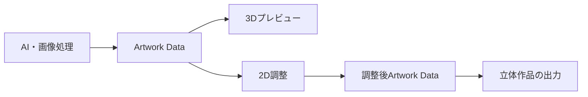
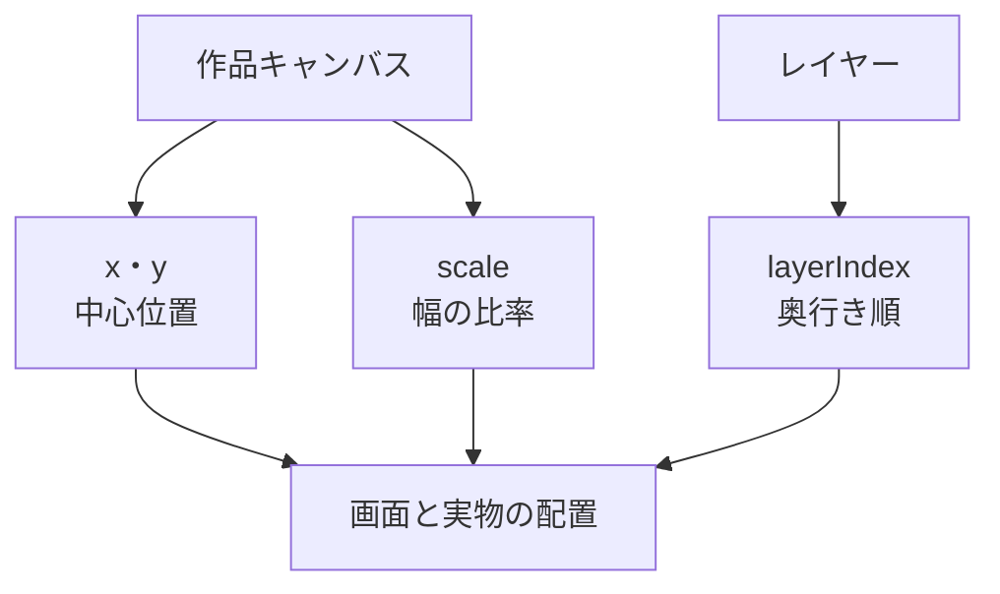
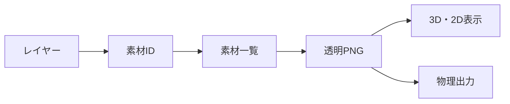
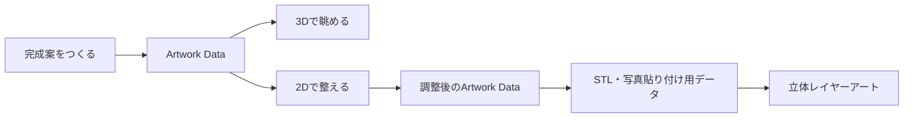
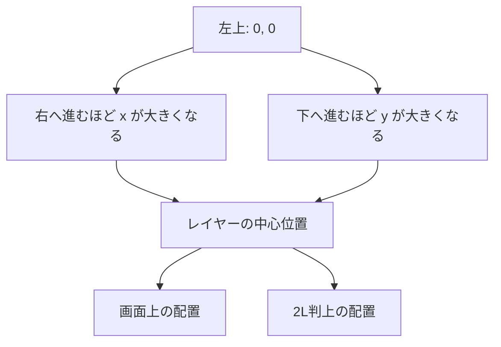
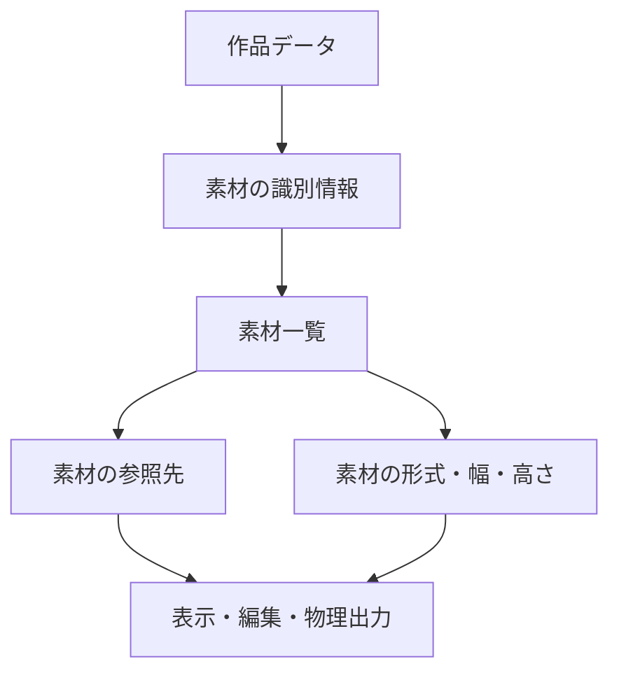

# Artwork Data仕様書

## 目次

1. [作品データの役割](#1-作品データの役割)
2. [データ構成](#2-データ構成)
3. [座標と奥行き](#3-座標と奥行き)
4. [素材の扱い](#4-素材の扱い)
5. [編集時の振る舞い](#5-編集時の振る舞い)
6. [物理作品への変換](#6-物理作品への変換)
7. [一つの設計図でつながる体験](#7-一つの設計図でつながる体験)
8. [座標の見方](#8-座標の見方)
9. [素材一覧の役割](#9-素材一覧の役割)
10. [編集したときに守ること](#10-編集したときに守ること)

## 1. 作品データの役割

Artwork Dataは、omoiの一作品を表す共通の設計図です。写真から何を選んだか、各レイヤーをどこに置くか、どの順で重ねるかを記録します。画面表示と物理出力は、同じ設計図を読むため、作品の構成がずれません。



## 2. データ構成

| 要素 | 内容 |
| --- | --- |
| 作品情報 | 作品ID、作品の縦横比 |
| 入力写真 | 作品づくりに使った写真の識別情報 |
| レイヤー | 作品を構成する透明素材、配置、大きさ、奥行き |
| 素材一覧 | レイヤー素材を取得するための情報 |
| 差し替え候補 | 同じ役割のレイヤーに使える別カット |

### レイヤーに含まれる情報

| 項目 | 意味 |
| --- | --- |
| ラベル | 利用者が内容を識別するための名称 |
| 素材 | 透明背景を持つ画像と、その縦横サイズ |
| 位置 | キャンバス内での中心位置 |
| 大きさ | キャンバス幅に対する表示幅の比率 |
| 奥行き | 背面から前面までの重なり順 |
| 差し替え候補 | 同じ位置と奥行きに置き換えられる別の素材 |

## 3. 座標と奥行き

位置と大きさは、端末の画面サイズや印刷寸法に依存しない0から1までの比率で表します。これにより、スマートフォン、PC、3D表示、物理出力で同じ構成を再現できます。



- `x` と `y` はレイヤー中心の位置です。左上を基準に、右・下へ進むほど値が大きくなります。
- `scale` はレイヤー幅をキャンバス幅で割った比率です。高さは素材画像の縦横比から決まります。
- `layerIndex` は奥行き順です。`0`が最も奥で、数字が大きいほど手前になります。
- 同じ作品内の奥行き番号は重複せず、奥から手前まで連続します。
- 回転は扱いません。写真から選んだ要素の向きと構図を保ちます。

## 4. 素材の扱い

各レイヤー素材は透明背景を持つPNGとして扱います。作品データには画像そのものを埋め込まず、作品で使う素材の識別情報とサイズを記録します。これにより、画面表示・編集・物理出力が同じ素材を確実に参照できます。



## 5. 編集時の振る舞い

| 操作 | 変わる情報 | 保たれる情報 |
| --- | --- | --- |
| 移動 | 位置 | 素材、大きさ、奥行き |
| 拡大縮小 | 大きさ | 素材、位置、奥行き |
| 前後変更 | 奥行き順 | 素材、位置、大きさ |
| 別カットへの変更 | 素材、由来、ラベル | 位置、大きさ、奥行き |

編集した作品はすぐに3Dプレビューへ反映されます。編集後にAIが再処理することはありません。

## 6. 物理作品への変換

物理出力では、作品の幅を決めると高さ・位置・レイヤーの表示寸法を同じ比率から算出します。

```text
作品の高さ = 作品の幅 ÷ 縦横比
レイヤーの横位置 = x × 作品の幅
レイヤーの縦位置 = y × 作品の高さ
レイヤーの幅 = scale × 作品の幅
```

この方式により、画面上の配置意図を保ったまま、立体レイヤーアートのための寸法へ変換できます。

## 7. 一つの設計図でつながる体験

Artwork Dataは、AIが作った完成案を固定するためだけの情報ではありません。利用者が確認し、必要な箇所を整え、実物にするまでをつなぐ設計図です。



一枚の完成画像だけを渡す方式では、後から特定の要素だけを動かす、前後関係を整える、実物用に正確な位置を導くことが難しくなります。レイヤーを分けて持つことで、作品の意味を保ったまま見え方を調整できます。

## 8. 座標の見方

座標は、画面のピクセル数や紙の寸法に左右されない比率です。左上を基準に、横方向を `x`、縦方向を `y` として表します。どちらも0から1の範囲で、レイヤーの中心位置を示します。



| 情報 | 例となる解釈 |
| --- | --- |
| `x = 0.5` | 作品の横方向の中央に置く |
| `y = 0.5` | 作品の縦方向の中央に置く |
| `scale = 0.4` | レイヤーの幅を作品幅の40%として見せる |
| `layerIndex = 0` | 最も奥に置く |
| 大きい `layerIndex` | より手前に置く |

高さは、素材画像が本来持つ縦横比から決まります。これにより、拡大縮小しても人物や物の形を不自然に伸ばしません。

## 9. 素材一覧の役割

作品データには、画像そのものを埋め込まず、素材を識別する情報を持たせます。対応する素材一覧から、透明PNGの形式、画像サイズ、利用する画像を解決します。



この構造により、作品構成を表示環境に依存させず、画面のプレビューと立体部品で同じ画像素材を使えます。

## 10. 編集したときに守ること

| 編集 | 作品として守ること |
| --- | --- |
| 位置を動かす | そのレイヤーの素材・大きさ・奥行き順 |
| 大きさを変える | 素材の縦横比、位置、奥行き順 |
| 前後順を変える | 位置、大きさ、使う素材 |
| 候補カットへ差し替える | レイヤーの位置、大きさ、奥行き順 |

編集のたびにAIで作り直すのではなく、作品データを直接更新します。そのため、利用者が意図した位置や前後関係をそのまま3D確認と物理出力へ反映できます。
