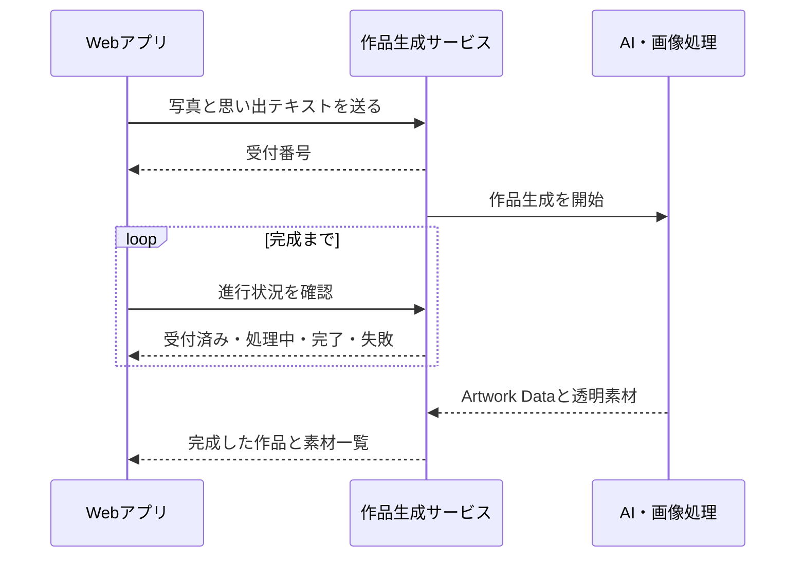
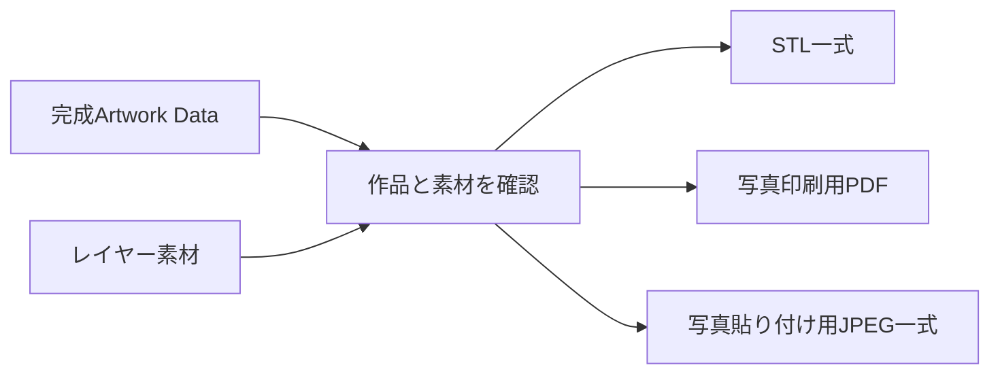
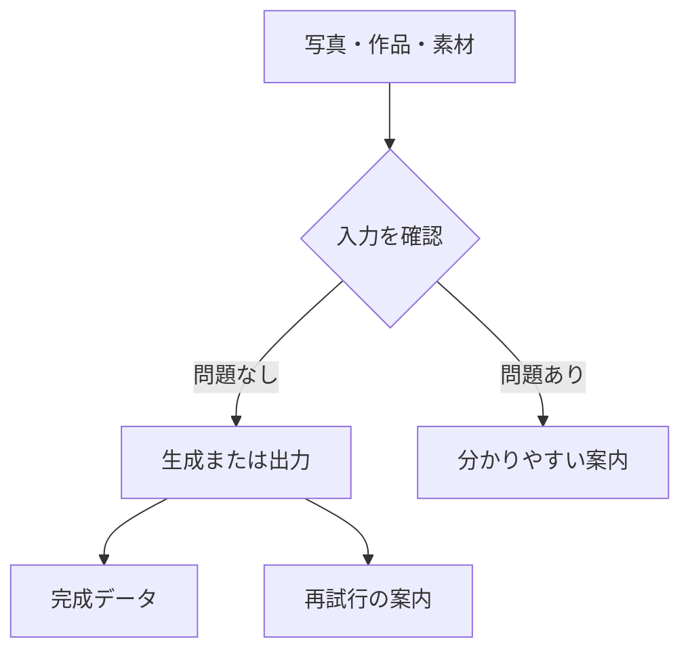
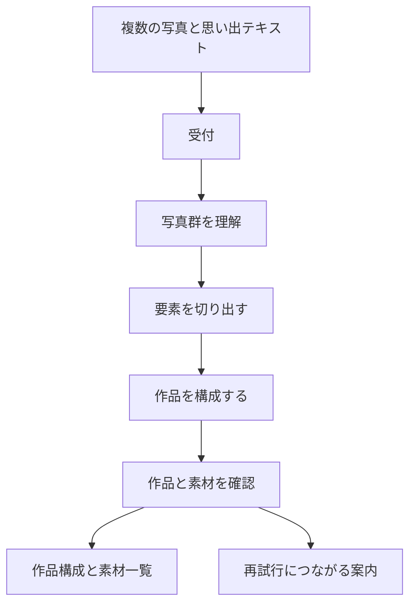
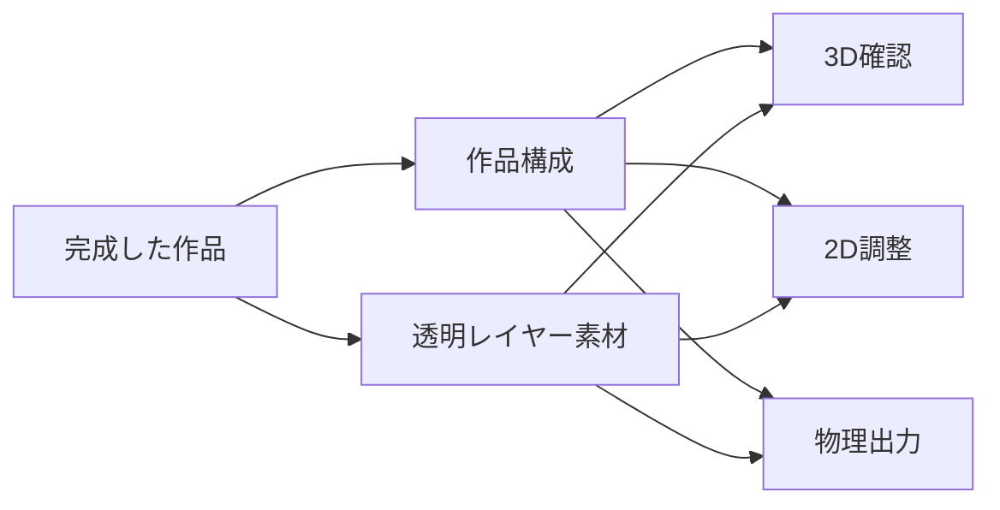
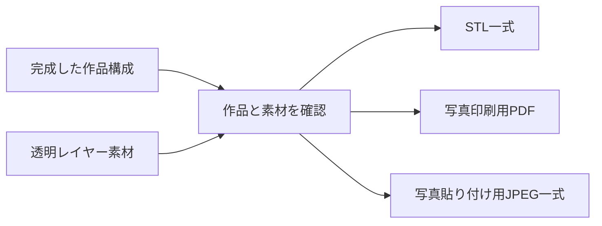
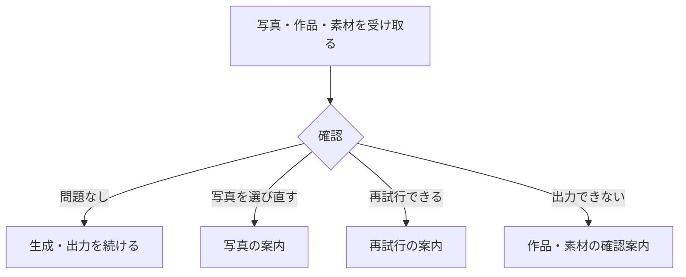

# バックエンド仕様書

## 目次

1. [概要](#1-概要)
2. [作品生成の受け渡し](#2-作品生成の受け渡し)
3. [進行状況](#3-進行状況)
4. [物理出力データの作成](#4-物理出力データの作成)
5. [入力の確認とエラー](#5-入力の確認とエラー)
6. [セキュリティ](#6-セキュリティ)
7. [写真から完成案を届けるまで](#7-写真から完成案を届けるまで)
8. [完成時に受け取るもの](#8-完成時に受け取るもの)
9. [物理出力の受け渡し](#9-物理出力の受け渡し)
10. [利用者に伝えるエラー](#10-利用者に伝えるエラー)

## 1. 概要

バックエンドは、写真から作品を生成する処理と、完成した作品を物理出力データへ変換する処理を担います。利用者が長時間待たされないよう、作品生成は受付後に進行状況を確認できる方式です。

## 2. 作品生成の受け渡し

### 生成の入力

| 項目 | 内容 |
| --- | --- |
| 写真 | 1枚以上のJPEG、PNG、WebP |
| 思い出テキスト | 任意。出来事の文脈や大切にしたいことを補足 |

### 生成の結果

完成時には、次の二つを返します。

| データ | 内容 |
| --- | --- |
| Artwork Data | 作品の縦横比、レイヤー、位置、大きさ、奥行き、候補カット |
| 素材一覧 | 各レイヤーの透明素材を取得するための情報 |

## 3. 進行状況

| 状態 | 意味 |
| --- | --- |
| 受付済み | 作品生成の依頼を受け付けた状態 |
| 処理中 | 写真理解、要素抽出、構成、仕上げを行っている状態 |
| 完了 | 作品と素材が利用可能な状態 |
| 失敗 | 生成を完了できなかった状態。再試行可否と案内を返す |

処理中は「写真を読み取る」「思い出を表すものを探す」「作品を組み立てる」「仕上げる」の段階を伝えます。

## 4. 物理出力データの作成

完成作品と、その作品で使うレイヤー素材を受け取り、用途に応じた出力データを作成します。

| 出力 | 内容 |
| --- | --- |
| STL一式 | 平面レイヤー部品、番号付きスロット台座、組み立てに必要な設定とレポートをまとめたZIP |
| 写真印刷用PDF | 2L判横向きで印刷できるレイアウト |
| 写真貼り付け用JPEG一式 | コンビニ等の2L写真プリントへ渡せる、背景を含む画像一式のZIP |

物理的な幅、厚み、レイヤー間隔などの製造条件は、作品の構成とは分けて扱います。そのため、物理出力の条件を変えても、画面上の作品配置は変わりません。

## 5. 入力の確認とエラー

サービスは、写真形式・写真数・容量・作品構成・素材の対応関係を確認します。問題がある場合は、写真の選び直しや再試行につながる案内を返します。

認証情報、内部の処理内容、素材の保管先などを利用者向けのエラー情報に含めません。

## 6. セキュリティ

- AIサービスの認証情報は、Webアプリから参照できない場所で扱います。
- Webアプリからの通信は、許可された送信元だけを受け付けます。
- 素材への参照情報は、作品データ本体と分けて扱います。
- 写真の内容や思い出テキストを、エラー画面や公開ログに表示しません。

## 7. 写真から完成案を届けるまで

作品生成は、写真を受け取ってすぐに一枚の画像を返す処理ではありません。写真群の意味理解、レイヤー素材の作成、構成の確認を経て、利用者が確認・調整できる完成案を届けます。

利用者は、受付後に進行状況を確認できます。処理が終わるまで画面を開いたまま待つことを前提にせず、現在の段階と完了結果を受け取れる方式です。

## 8. 完成時に受け取るもの

完成した作品は、作品構成と素材一覧を組み合わせて届けます。

| 受け取るもの | 利用者にとっての意味 |
| --- | --- |
| 作品構成 | どの要素が、どの位置・大きさ・奥行き順で作品をつくるか |
| 透明レイヤー素材 | 3D確認、2D調整、物理出力で使う画像 |
| 候補カット | 同じ役割の別素材へ差し替えるときの候補 |
| 進行状況 | 受付済み、処理中、完了、失敗という現在地 |
| 失敗時の案内 | 再試行できるか、写真を選び直す必要があるかの手がかり |

## 9. 物理出力の受け渡し

物理出力では、完成した作品構成と、その作品が使うレイヤー素材を確認したうえで、用途に応じたデータを生成します。作品の配置を製造時に作り直すのではなく、画面で確認した構成を実寸へ変換します。

| 形式 | 主な用途 | 受け取るもの |
| --- | --- | --- |
| STL一式 | 3Dプリンターで部品を造形する | レイヤー部品、番号付き台座、組み立て情報、製造条件 |
| 写真印刷用PDF | 写真紙に等倍印刷する | 2L判横の貼り付けレイアウト |
| 写真貼り付け用JPEG一式 | 写真プリントを利用する | 背景を含む2L判横の印刷用画像 |

## 10. 利用者に伝えるエラー

エラーは、利用者が次に何をすればよいか分かるように伝えます。認証情報、内部の保存先、AIサービスの応答などは表示しません。

| 状況 | 画面で伝えること |
| --- | --- |
| 写真を読み込めない | 利用できる写真形式を確認し、選び直せること |
| 写真が大きすぎる | 写真を小さくする、または選び直すこと |
| 生成に時間がかかった | 再試行できること |
| 生成を完了できなかった | 作品を完成扱いにせず、再試行の案内を出すこと |
| 作品や素材がそろわない | 出力前に確認が必要なこと |

