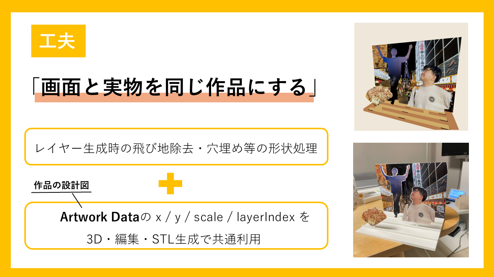
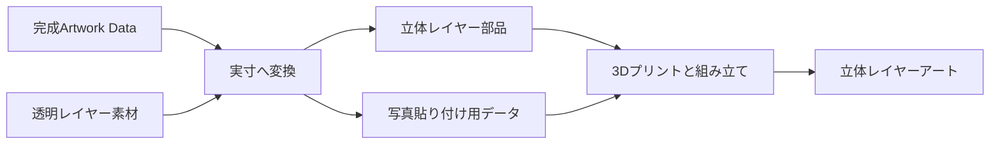
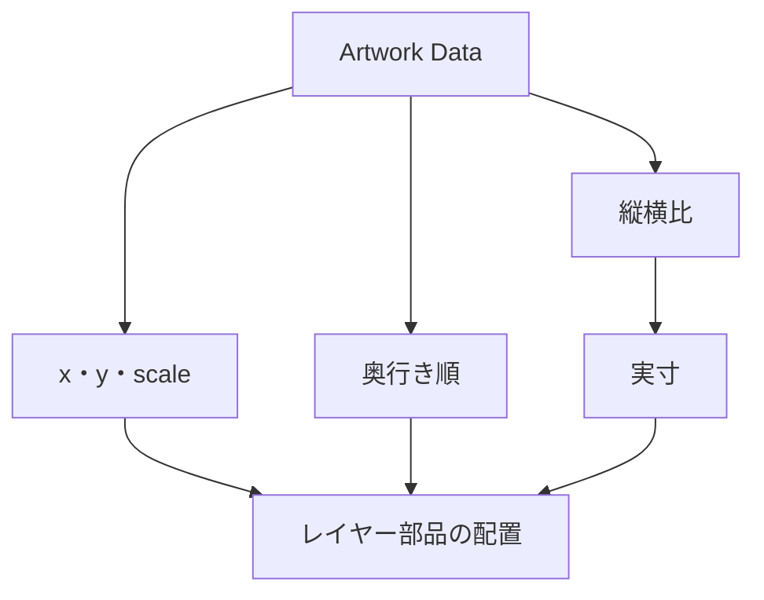
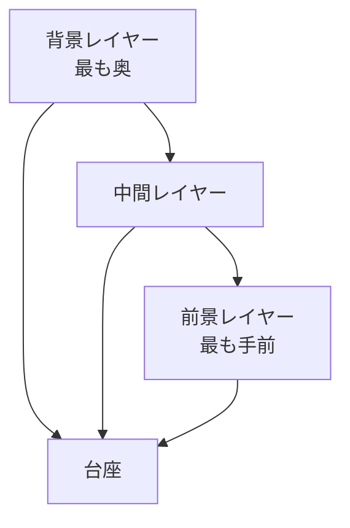
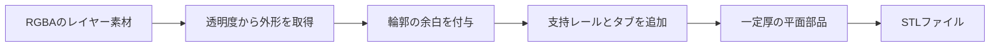
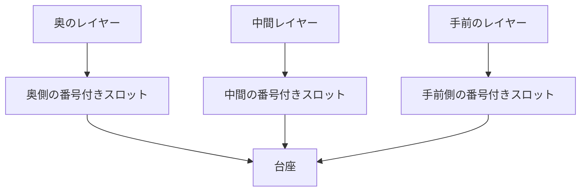
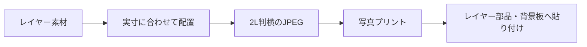
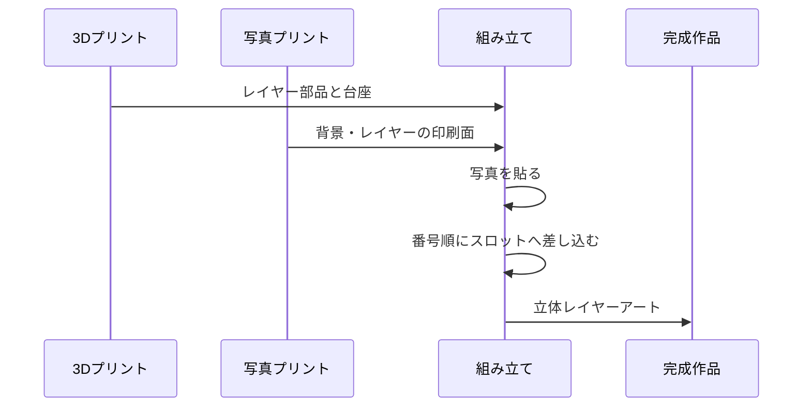
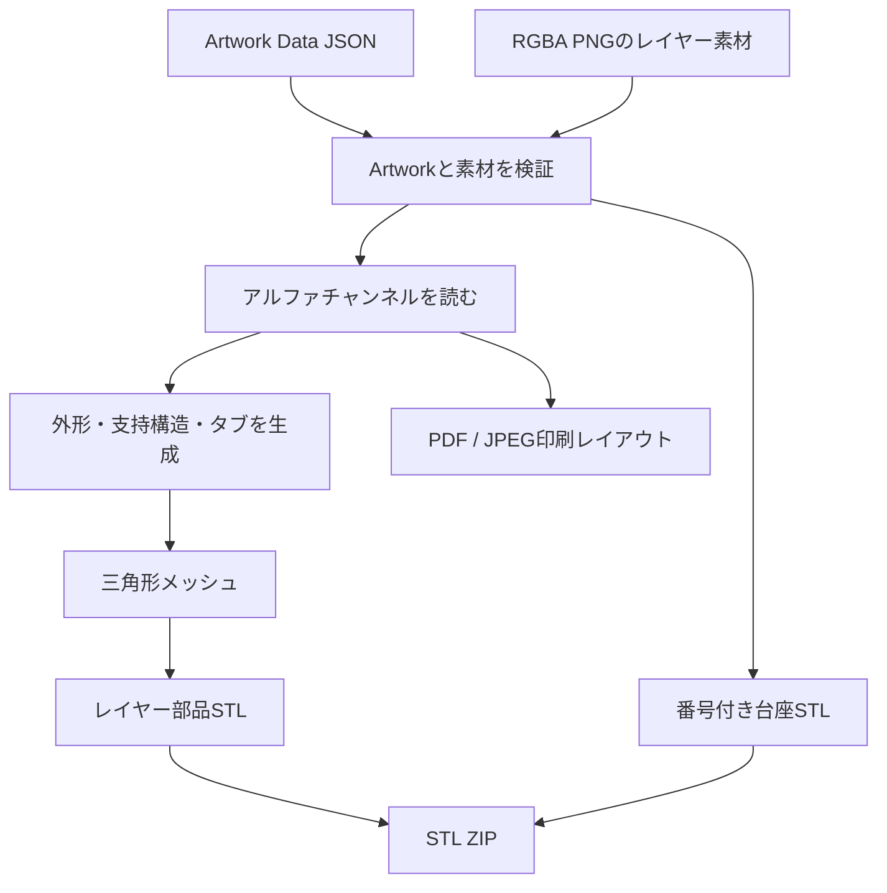
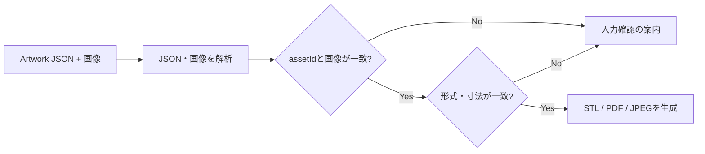

# 物理出力仕様書

## 1. 概要

omoiは、画面上で眺めるだけの作品ではなく、日常に飾れる立体レイヤーアートへつなげます。画面で確認・調整した作品構成と透明レイヤー素材を使い、3Dプリンター用データまたは写真貼り付け用データを作成します。

<div align="center">

</div>

## 2. 画面から実物まで



作品の位置、大きさ、奥行き順は、画面と実物で共通です。物理的な幅、厚み、レイヤー間隔、台座の形は、作品構成とは別の製造条件として扱います。

## 3. 実寸への変換

作品の目標幅を決めると、Artwork Dataの比率から実寸を導きます。

```text
作品の高さ = 作品の幅 ÷ 作品の縦横比
レイヤーの横位置 = x × 作品の幅
レイヤーの縦位置 = y × 作品の高さ
レイヤーの幅 = scale × 作品の幅
レイヤーの高さ = レイヤーの幅 × 素材画像の高さ ÷ 素材画像の幅
```



## 4. 出力形式

| 出力 | 利用目的 | 内容 |
| --- | --- | --- |
| STL一式 | 3Dプリンターで部品をつくる | レイヤー部品、番号付きスロット台座、組み立て用の設定・レポート |
| 写真印刷用PDF | 写真紙に等倍印刷する | 2L判横向きに対応した印刷レイアウト |
| 写真貼り付け用JPEG一式 | コンビニ等の写真プリントを利用する | 背景を含む、レイヤーごとの貼り付け用画像 |

写真貼り付け用のデータには、作品の背景にも使える全面画像を含めます。レイヤー素材だけではなく、完成作品の見え方を支える背景まで揃えます。

## 5. 立体レイヤーアートの構成



レイヤーの枚数は作品ごとに変わります。どのレイヤーが背景・前景になるかは固定せず、作品の奥行き順に従って配置します。

## 6. 利用者に届けるもの

完成した作品では、次の二つの方法を選べます。

1. STL一式を使い、3Dプリンターで台座とレイヤー部品を出力する。
2. 写真貼り付け用データを2L写真として印刷し、レイヤー部品や背景板へ貼り付ける。

どちらの方法でも、同じArtwork Dataと透明レイヤー素材を使うため、画面で確認した構成を保ったまま実物へつなげられます。

## 7. 安全な出力

- Webアプリが3Dプリンターを直接操作することはありません。
- 作品構成は、製造条件によって書き換えません。
- 出力前に、作品データとレイヤー素材の対応関係を確認します。
- 出力できない場合は、入力データを確認できる案内を返します。

## 8. 標準製造プロファイル

omoiの立体レイヤーアートは、写真プリントにも使いやすい **2L判横・178 × 127 mm** を標準サイズとします。以下は、部品を製造するための標準値です。作品を表す要素の位置や前後関係とは分けて扱います。

| 区分 | 項目 | 標準値 | 意図 |
| --- | --- | ---: | --- |
| 作品サイズ | 作品の幅 | 178 mm | 2L判横の幅 |
| 作品サイズ | 作品の高さ | 127 mm | 2L判横の高さ |
| レイヤー部品 | 部品の厚み | 1.6 mm | 平面部品としての強度と扱いやすさ |
| レイヤー部品 | 輪郭の余白 | 0.35 mm | 切り出し輪郭を安定させる余白 |
| レイヤー部品 | 形状の格子間隔 | 0.6 mm | 透過素材から部品形状を組み立てる単位 |
| 支持構造 | 支持方式 | レール | 部品を台座へ安定して取り付ける方式 |
| 支持構造 | レール本体の高さ | 4.0 mm | 支持部の高さ |
| 支持構造 | レール支持部の幅 | 10.0 mm | 支持部の幅 |
| 差し込み部 | タブの幅 × 高さ | 12.0 × 5.0 mm | 台座へ差し込む部品の標準サイズ |
| 差し込み部 | スロットのクリアランス | 0.35 mm | 3Dプリント後に差し込みやすくする余裕 |
| 台座 | 幅 × 奥行き × 高さ | 170 × 121 × 5 mm | 2L判横の作品を支える土台 |
| 台座 | レイヤー段数 | 4段 | 前後の奥行きを保持する段数 |
| 台座 | 1段あたりのスロット数 | 3 | 部品の配置候補 |
| 台座 | 段間隔 | 7.0 mm | レイヤー間の見え方をつくる奥行き |
| 材料 | 標準材料 | PLA | 部品出力に用いる標準材料 |

レイヤーの数は作品ごとに変わります。標準台座は4段・各3スロットを備え、部品には台座と対応する番号を刻印します。

## 9. レイヤー部品と台座

### 9.1 輪郭から部品へ

各レイヤー素材は透明部分を持つ画像です。透明度をもとに作品の外形を読み取り、外形に余白と支持構造を加えて、一定の厚みを持つSTL部品にします。写真の明暗を高さとして彫り込むのではなく、写真に写った要素の外形を立体的に配置する方式です。



輪郭の一部が細すぎる、または部品が複数に分かれる場合にも、支持ブリッジやレールを用いて台座へ取り付けられる形をつくります。部品のつながりに注意が必要な場合は、出力レポートへ警告を記録します。

### 9.2 台座と奥行き

台座は、作品の奥行き順を物理的に保つための番号付きスロットを持ちます。作品の奥行き順は、最も奥のレイヤーから最も手前のレイヤーへ連番で管理され、部品側の番号と台座側の番号を対応させます。



前後関係は作品ごとに決まるため、「何番目は必ず背景」といった固定の意味はありません。台座は、その作品で決まった前後関係を再現するための構造です。

## 10. 写真貼り付け用データ

立体部品には、同じレイヤー素材を写真として貼り付けられます。写真貼り付け用のデータは、背景を含む各レイヤーを2L判横の画像として出力します。

| 項目 | 仕様 |
| --- | --- |
| 用紙サイズ | 2L判横、178 × 127 mm |
| 画像形式 | JPEG |
| 解像度 | 300 dpi |
| 画像サイズ | 2102 × 1500 px |
| JPEG品質 | 95 |
| 配置 | 1ページにつき1つの貼り付け領域 |
| 背景 | 背景板へ貼るための全面画像を含む |



印刷時は、できる限り「2L判・横向き・拡大縮小なし」を選びます。PDF版は、同じ寸法の貼り付けレイアウトを印刷するための形式です。

## 11. 出力形式と同梱物

STL一式とJPEG一式には、次の情報を同梱します。

| 同梱物 | 内容 |
| --- | --- |
| `artwork.json` | 出力時点の作品構成 |
| `physical-output-config.json` | この出力で使用した製造寸法・材料・印刷条件 |
| `flat-photo-parts-report.json` | 部品寸法、スロット対応、出力ファイル、警告、組み立て情報 |
| `README.md` | 出力物の用途と組み立ての案内 |

STL一式には `stl/` にレイヤー部品と台座が、JPEG一式には `photo/` に印刷用画像が入ります。

## 12. 組み立て

1. すべてのレイヤー部品と番号付き台座を3Dプリントする。
2. 写真貼り付け用PDFまたはJPEGを、2L判横・拡大縮小なしで印刷する。
3. 各レイヤーの印刷面を対応する部品へ貼り付ける。背景板には背景用の全面画像を使う。
4. 部品に記された番号と、台座の番号付きスロットを対応させる。
5. 台座を正面から見て、前方左から後方右へ番号順に部品を差し込む。
6. 正面から作品全体を確認し、奥の背景から手前の要素までが重なる構成を確かめる。



## 13. 物理出力エンジン

物理出力はPythonで実装し、Artwork Dataと透明レイヤー素材から、STL・PDF・JPEGを同じ処理経路で生成します。ブラウザ上でSTLを組み立てるのではなく、APIが画像、寸法、スロット配置を検証してからバイナリ出力を返します。

| 処理 | 使用技術 | 実現すること |
| --- | --- | --- |
| 入力解析 | FastAPI、Pydantic、JSON | Artwork Dataと`multipart/form-data`の画像を読み取る |
| 画像処理 | Pillow、NumPy | アルファチャンネルから部品の外形と貼り付け画像を作る |
| 部品形状 | 三角形メッシュ生成 | 輪郭、支持レール、タブを一定厚のSTLへ変換 |
| 台座形状 | 三角形メッシュ生成 | 番号付きスロットを持つ台座のSTLを作る |
| 印刷レイアウト | Pillow | 2L判横のPDFとJPEGを300 dpiで生成 |
| 梱包 | ZIP | STL・設定JSON・レポート・組み立て案内を一つにまとめる |



### 13.1 部品形状の生成

レイヤー画像のアルファ値が16以上の領域を部品候補として扱います。形状は0.6 mmの格子を基準に生成し、0.35 mmの輪郭余白を加えます。支持レール、支持ブリッジ、台座へ差し込むタブを付加した後、上面・下面・側面を三角形へ分解してASCII STLとして出力します。

```text
入力: RGBA PNG
  → alpha >= 16 の領域を抽出
  → 輪郭に余白を付与
  → レール・タブを追加
  → Z = 0〜1.6 mm の一定厚へ押し出し
  → 上面・下面・側面を三角形メッシュ化
  → STL
```

これは画像の明るさを高さに変換するレリーフではありません。各写真要素のシルエットを独立した平面部品にし、台座上で前後へ重ねる2.5D方式です。

### 13.2 2L判の印刷データ

印刷レイアウトでは、ミリメートルからピクセルへ次の式で変換します。

```text
pxPerMm = 300 / 25.4
widthPx = round(178 × pxPerMm) = 2102
heightPx = round(127 × pxPerMm) = 1500
```

各レイヤーと背景は1つずつの貼り付け領域として描画されます。PNGの透明度を利用して部品形状に対応する写真面を作り、PDFまたはJPEGにします。

## 14. 製造データの検証

物理出力の前に、作品構成と画像素材を対応付けます。Artwork Dataに書かれたメタデータだけを信頼せず、受信した画像を読み込んで形式と寸法を照合します。

| 検証 | 確認すること |
| --- | --- |
| Artwork JSON | 必須の作品情報、レイヤー、座標、奥行き順が存在すること |
| 素材の対応 | すべての`assetId`に対応する画像が送られていること |
| MIMEタイプ | 宣言された形式とアップロード画像の形式が一致すること |
| ピクセル寸法 | `widthPx`・`heightPx`と実画像の寸法が一致すること |
| アップロード量 | 1画像30 MiB、合計90 MiB以内であること |
| 製造設定 | 寸法、支持方式、台座方式などの許容値を満たすこと |



出力後には、各部品の寸法、スロット番号、出力ファイル、警告をレポートJSONへ残します。輪郭が分離しているなど、組み立て時に注意が必要な部品は警告として残し、見落とさないようにします。
