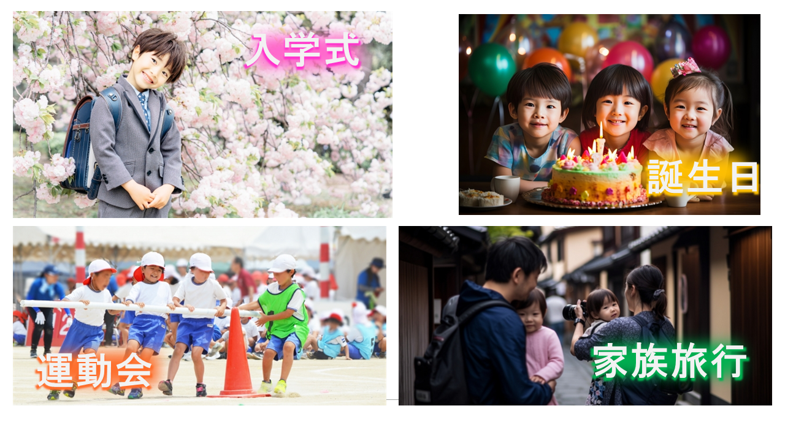

# omoi ギャラリー

Tornado 2026の発表資料から、omoiのプロダクト像と技術構成が分かる公開用画像を掲載します。

## 完成した立体レイヤーアート

画面上のレイヤー構成を、3Dプリントした台座と複数のLayerで物理作品として再現したものです。`x` / `y` / `scale` / `layerIndex` をArtwork Dataとして共有することで、画面と実物を同じ作品として扱います。

## プロダクトメッセージ

「一枚の写真ではなく、一つの思い出を飾る。」というコンセプトと、Our Memories, One Imageという名称の意味を表すスライドです。

## 写真に残る出来事の例

一つの出来事には複数の写真が残ることを示す例です。omoiは「一番良い一枚」を選ぶのではなく、出来事全体を一つの作品として残します。

## 入力から作品への変換

複数の入力写真と思い出テキストから、AIが作品構成を提案し、2.5Dの物理作品へつなぐ流れを示しています。
