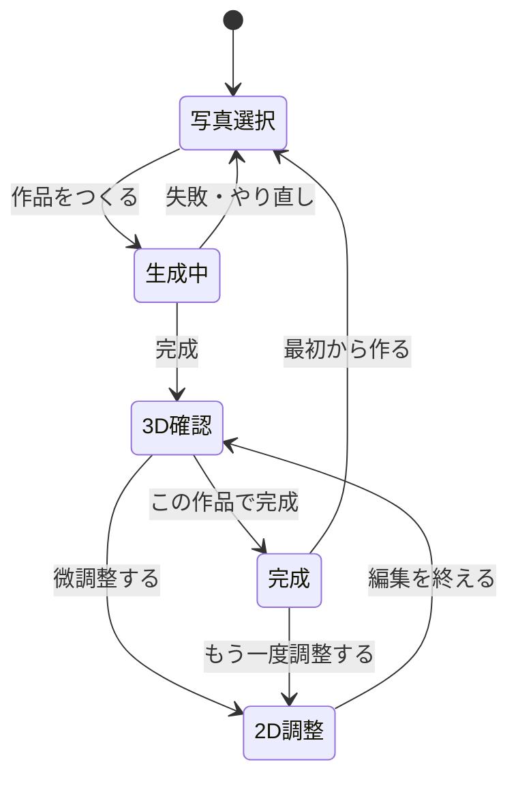
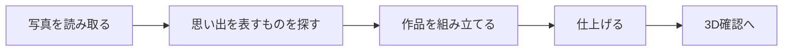
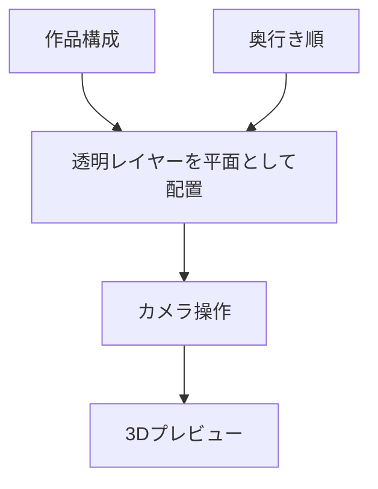
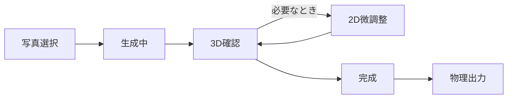
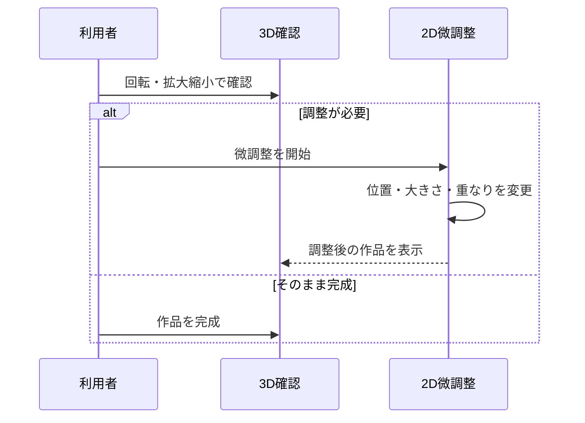
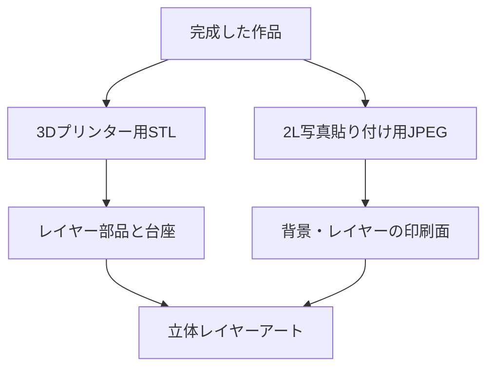
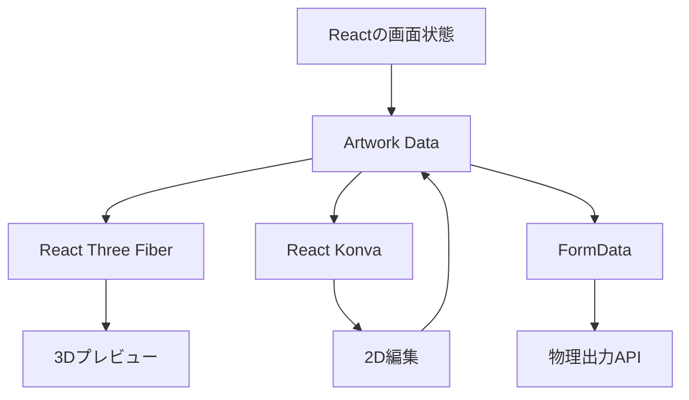
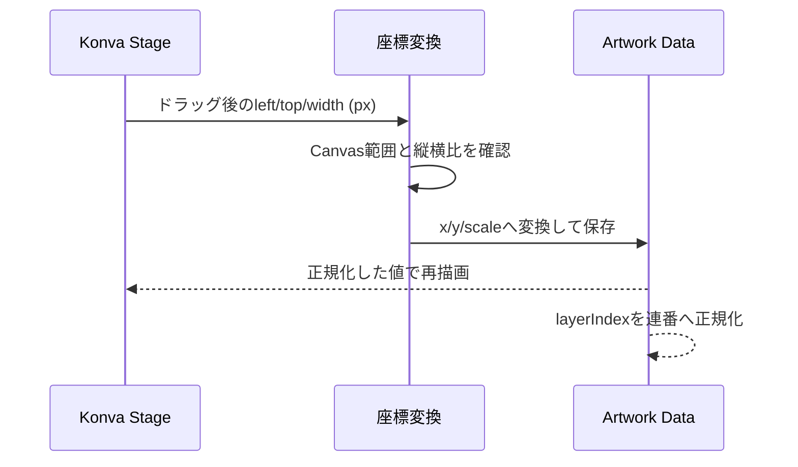
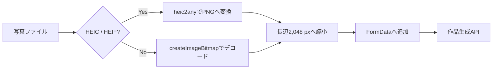

# フロントエンド仕様書

## 目次

1. [体験の全体像](#1-体験の全体像)
2. [写真選択](#2-写真選択)
3. [生成中の案内](#3-生成中の案内)
4. [3Dプレビュー](#4-3dプレビュー)
5. [2D微調整](#5-2d微調整)
6. [完成と出力](#6-完成と出力)
7. [画面の役割](#7-画面の役割)
8. [写真を選ぶときの体験](#8-写真を選ぶときの体験)
9. [3D確認と2D調整の関係](#9-3d確認と2d調整の関係)
10. [操作の境界](#10-操作の境界)
11. [完成時の出力](#11-完成時の出力)
12. [フロントエンド実装](#12-フロントエンド実装)
13. [画像前処理と通信](#13-画像前処理と通信)

## 1. 体験の全体像

Webアプリは、写真選択から作品完成までを一続きの体験として提供します。最初から細かな編集を求めず、まずAIの完成案を見せ、必要な場合だけ調整できる設計です。

## 2. 写真選択

| 項目 | 仕様 |
| --- | --- |
| 追加方法 | ファイル選択またはドラッグ&ドロップ |
| 確認方法 | サムネイルとファイル名を表示 |
| 取り消し | 写真ごとに取り消し可能 |
| 対応形式 | JPEG、PNG、WebP、HEIC、HEIF |
| HEIC／HEIF | ブラウザでPNGへ変換してから作品生成に使用 |
| 送信前の最適化 | 長辺が大きい写真は、表示品質を保ちながら送信向けに縮小 |
| 思い出テキスト | 任意入力。写真だけでは伝わらない文脈を補足 |

変換できない写真や画像として読み込めないファイルは、理由を表示して利用者に知らせます。

## 3. 生成中の案内

生成状況は、専門用語ではなく作品づくりの言葉で表示します。

生成完了まで数分かかる場合があるため、画面は処理状況を確認しながら待機します。

## 4. 3Dプレビュー

3Dプレビューは、生成された作品を編集せずに見せる画面です。各レイヤーは透明素材を持つ平面として、奥行き順に表示されます。

| 操作 | 内容 |
| --- | --- |
| 回転 | 作品を横・斜めから見て、レイヤーの重なりを確認 |
| 拡大縮小 | 細部や全体の奥行きを確認 |
| 正面確認 | 作品の正面構図へ戻る |
| 初期状態との比較 | 調整後に、最初に生成された構図と見比べる |

## 5. 2D微調整

2D微調整では、作品の意味を変えずに見え方を整えます。

| 操作 | 内容 |
| --- | --- |
| 移動 | レイヤーを作品枠内で動かす |
| 拡大縮小 | 縦横比を保ったまま大きさを変える |
| 前後変更 | ドラッグ、またはモバイルでは上下ボタンで重なり順を変える |
| 別カット | 用意された候補の中から、同じ役割の別素材へ差し替える |

位置と大きさは作品枠に収まるように保たれ、回転操作は提供しません。編集はただちに作品構成へ反映され、3Dプレビューで再確認できます。

## 6. 完成と出力

完成画面では、最終作品を確認し、次のデータを取得できます。

| 出力 | 用途 |
| --- | --- |
| 3Dプリンター用データ | レイヤー部品と台座を含むSTL一式 |
| 写真貼り付け用JPEG | 2L写真プリントへ渡すための背景を含む画像一式 |

出力に使うのは、利用者が調整して完成させた作品構成と、現在使用しているレイヤー素材です。

## 7. 画面の役割

| 画面 | 利用者が行うこと | 画面が支えること |
| --- | --- | --- |
| 写真選択 | 思い出に関係する写真を選び、必要なら言葉を添える | 写真の追加・確認・取り消しと、利用しやすい形式への準備 |
| 生成中 | 作品ができるのを待つ | 進行段階を作品づくりの言葉で案内 |
| 3D確認 | 立体感と重なりを眺める | 正面・斜め・横から完成形を見られる表示 |
| 2D微調整 | 気になる要素の見え方を整える | 位置・大きさ・重なり順・候補カットの編集 |
| 完成 | 作品を確定し、出力方法を選ぶ | 立体部品と写真貼り付け用データへの導線 |

## 8. 写真を選ぶときの体験

利用者は、同じ出来事に関係する複数の写真を選びます。人物、場所、食べ物、景色など、役割の異なる写真を合わせることで、出来事全体を表す手がかりになります。

| 場面 | 画面のふるまい |
| --- | --- |
| 写真を追加する | ファイル選択またはドラッグ&ドロップで追加する |
| 追加した写真を見直す | サムネイルとファイル名で確認する |
| 選び直す | 不要な写真を個別に取り消す |
| iPhoneの写真を使う | HEIC／HEIFをブラウザ内でPNGへ変換して利用する |
| 大きな写真を送る | 表示品質を保ちながら、送信に適したサイズへ整える |
| 思い出を補足する | 任意のテキストで、その出来事らしさを添える |

写真を画像として扱えない場合や変換に失敗した場合は、選び直せるよう理由を表示します。

## 9. 3D確認と2D調整の関係

3D確認は、完成した作品を立体として眺めるための画面です。ここで位置や重なりを変えることはありません。調整が必要なときだけ2D微調整へ進み、編集した結果をあらためて3Dで確認します。

作品を調整した後、AIに再度写真を送って作り直すことはありません。調整後の構成をもとに、表示と物理出力を更新します。

## 10. 操作の境界

omoiは、専門的な画像編集ソフトの代わりではありません。思い出の完成案を利用者の感覚に近づけるために必要な操作へ絞っています。

| できること | 目的 |
| --- | --- |
| 位置を動かす | 要素どうしの見え方を整える |
| 縦横比を保って大きさを変える | 主役と背景のバランスを整える |
| 前後順を変える | 立体感と重なりを調整する |
| 候補カットへ差し替える | 同じ役割の別の写真を選ぶ |
| 回転を使わない | 写真に残る見え方と作品の一貫性を保つ |

大きさの変更は縦横比を保ち、位置は作品枠の中で扱います。前後順を変えた場合は、すべてのレイヤーの奥行き順を連続した順番へ整えます。

## 11. 完成時の出力

完成画面から、3Dプリンターで造形するためのSTL一式と、写真貼り付けのためのJPEG一式を取得できます。いずれも、利用者が完成させた作品構成をもとにします。

写真貼り付け用JPEGは、背景を含む2L判横の画像一式です。物理出力の詳しい寸法と組み立ては、[物理出力仕様書](physical-output.md)を参照してください。

## 12. フロントエンド実装

WebクライアントはTypeScript、React 19、Viteで構成します。画面ごとの状態をReactで管理し、編集結果は正規化されたArtwork Dataとして保持します。画面のピクセル座標やThree.js固有の座標を、作品データとして保存することはありません。

| 領域 | 使用技術 | 実装方法 |
| --- | --- | --- |
| アプリケーション | React 19、TypeScript、Vite | 写真選択、生成、プレビュー、編集、完成の画面状態を管理 |
| 3Dプレビュー | Three.js、React Three Fiber、Drei | `Canvas` 内にレイヤーごとのPlaneを置き、`OrbitControls` で操作 |
| 2D編集 | Konva、React Konva | `Stage`、`Image`、`Transformer` によりドラッグ・拡大縮小を実装 |
| HEIC変換 | heic2any | ブラウザ内でHEIC／HEIFをPNGへ変換 |
| 出力ダウンロード | Fetch API、Blob、FormData | Artwork Dataとレイヤー画像を送信し、ZIPまたはPDFを保存 |

### 12.1 3Dプレビュー

レイヤー画像は `useTexture` でGPUテクスチャとして読み込みます。各レイヤーは、Artwork Dataから変換した `x3d`、`y3d`、`z`、幅、高さを持つPlaneです。透明PNGのアルファを `alphaTest = 0.5` で評価し、透明な背景部分を描画しません。カメラ位置は、最も手前のレイヤーのZ値に一定距離を足して求めるため、レイヤー数や奥行きが変わっても全体を確認できます。

立体感を見せるため、表示上の薄いシートをレイヤーごとに重ねます。これは3Dプレビューの見え方のための値であり、出力するSTLの部品厚や台座間隔とは別に扱います。

### 12.2 2D編集

Konvaの`Transformer`は縦横比を固定したままサイズ変更を受け取り、編集結果を `x`、`y`、`scale` に戻します。ドラッグ中もレイヤーの四辺をキャンバス範囲で判定し、位置を制限します。前後順の変更では配列の並びに意味を持たせず、`layerIndex` を再計算して `0..N-1` の連番に正規化します。

## 13. 画像前処理と通信

### 13.1 写真の準備

ブラウザで写真を選ぶと、HEIC／HEIFはPNGへ変換します。それ以外の写真は `createImageBitmap` とCanvasを使い、長辺が2,048 pxを超える場合だけ縦横比を保って縮小します。送信時のJPEG品質は0.85です。これにより、モバイル写真をそのまま送る場合の通信量とAI処理時の画像サイズを抑えます。

### 13.2 非同期生成の通信

作品生成は、`POST /api/v1/artworks/generate` で開始し、返された`jobId`を用いて `GET /api/v1/jobs/{jobId}` を2秒間隔で取得します。ポーリングは最大600秒で打ち切り、通信の中断や失敗は再試行可能性を持つエラーとして画面に渡します。

| 項目 | 値 |
| --- | --- |
| 写真送信 | `multipart/form-data` の `photos` と任意の `memoryText` |
| 受付応答 | HTTP 202 と `jobId` |
| 状態取得 | HTTP GET、2秒間隔 |
| 状態 | `pending` / `processing` / `completed` / `failed` |
| 進行段階 | `analyzing` / `extracting` / `composing` / `finalizing` |
| 待機上限 | 600秒 |

### 13.3 物理出力の通信

確定後は、使用中レイヤーの画像を`assetId`ごとに取得し、Artwork Dataと一緒に物理出力APIへ送ります。送信画像が大きい場合は、透明度と縦横比を保ったまま縮小し、作品データ中の幅・高さも送信する画像の実寸へ合わせます。これにより、API側で行う画像寸法の整合性検証と、画面で見た構図の両方を保ちます。
