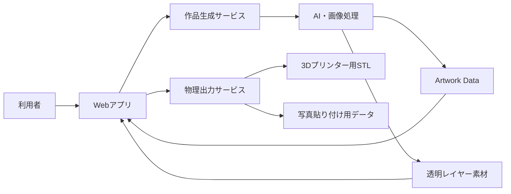
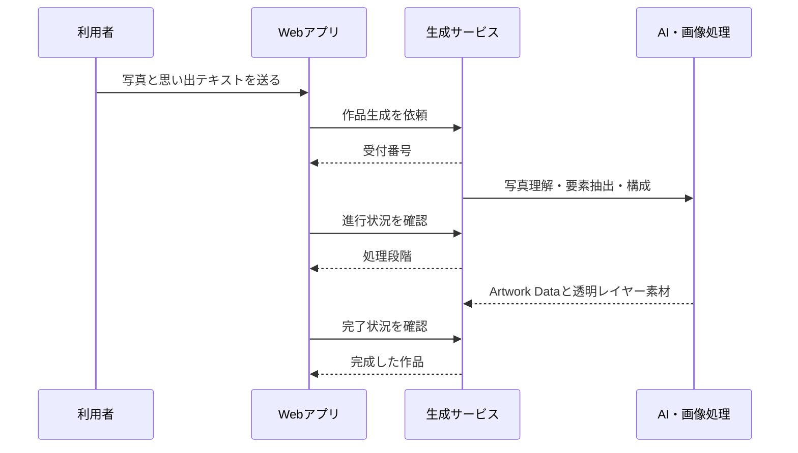
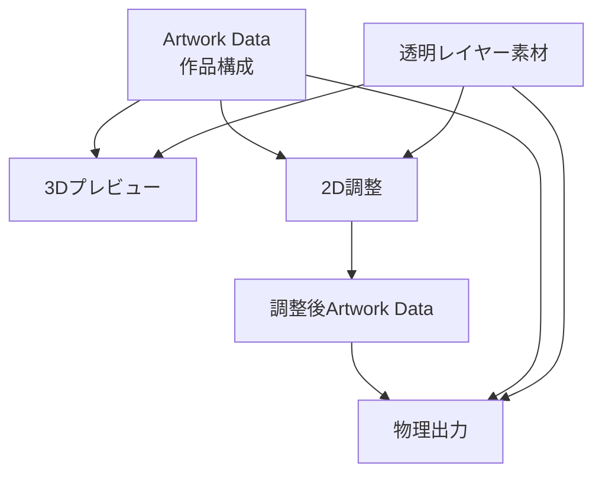
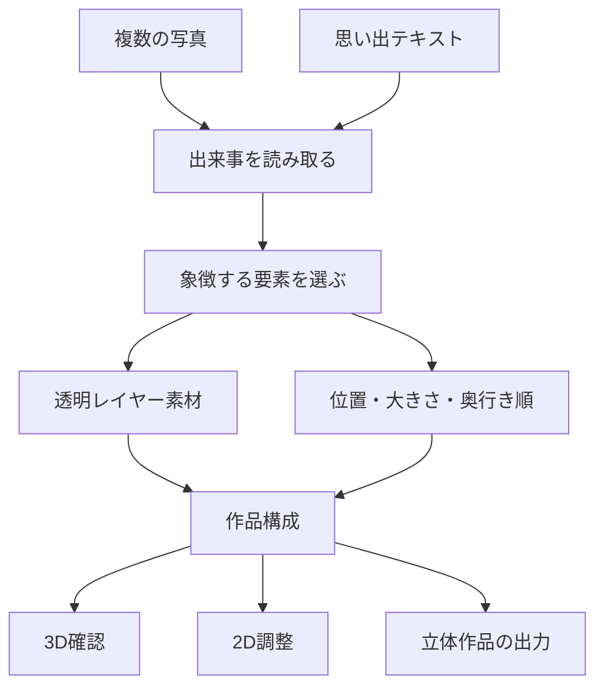
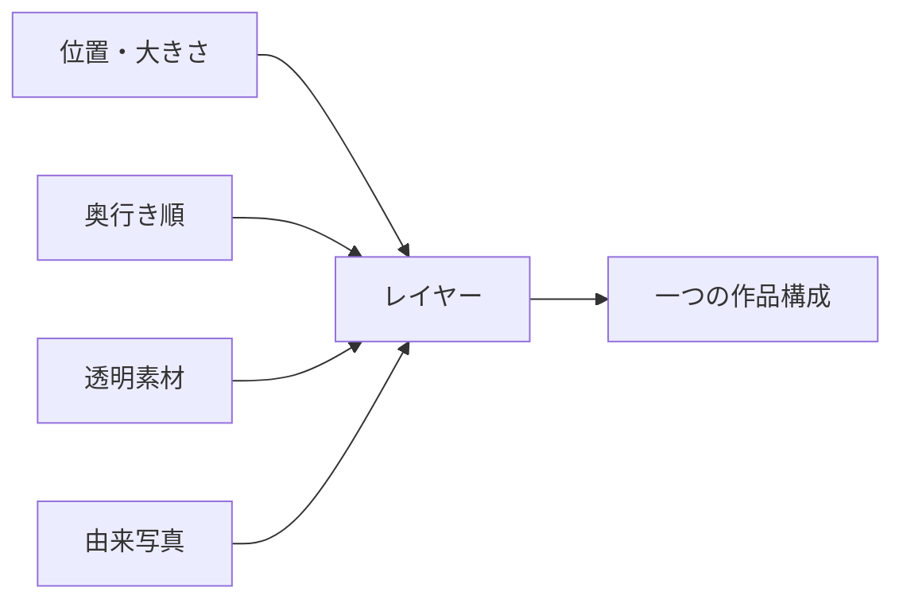
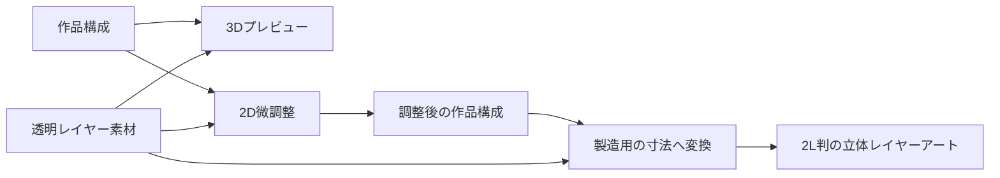

# omoi システム仕様書

## 目次

1. [概要](#1-概要)
2. [全体構成](#2-全体構成)
3. [作品生成](#3-作品生成)
4. [作品を一貫して扱う仕組み](#4-作品を一貫して扱う仕組み)
5. [セキュリティと利用者への配慮](#5-セキュリティと利用者への配慮)
6. [対応する作品体験](#6-対応する作品体験)
7. [写真から作品になるまで](#7-写真から作品になるまで)
8. [作品を表す情報](#8-作品を表す情報)
9. [生成中の案内](#9-生成中の案内)
10. [デジタルと実物の対応](#10-デジタルと実物の対応)
11. [利用者の写真を扱うための配慮](#11-利用者の写真を扱うための配慮)

## 1. 概要

omoiは、複数の写真を「一つの出来事」として読み取り、重なり合う透明レイヤーの作品へ変換します。作品は画面上で立体的に確認・調整でき、同じ構成情報を使って立体作品のためのデータへ出力できます。

## 2. 全体構成

| 構成 | 役割 | 主な技術 |
| --- | --- | --- |
| Webアプリ | 写真選択、生成状況の表示、3D確認、2D調整、出力データの取得 | React、TypeScript、Three.js、Konva |
| 作品生成サービス | 入力写真の受付、生成状況の管理、作品データと素材の提供 | FastAPI、Pydantic |
| AI・画像処理 | 写真群の意味理解、象徴要素の選定、輪郭抽出、作品構成 | Gemini、EfficientSAM-Ti、ONNX Runtime |
| 物理出力サービス | 作品構成をもとにしたSTL、写真印刷用PDF・JPEGの生成 | Python、画像処理、STL生成 |

## 3. 作品生成

作品生成は時間のかかる処理のため、受付後に進行状況を確認できる仕組みです。利用者には「写真を読み取る」「思い出を表すものを探す」「作品を組み立てる」「仕上げる」という分かりやすい段階で案内します。

## 4. 作品を一貫して扱う仕組み

一つのArtwork Dataが、生成結果、3D表示、2D調整、物理出力をつなぎます。座標・大きさ・奥行きは表示方式ごとに作り直さず、共通の作品構成から導きます。

## 5. セキュリティと利用者への配慮

- 写真と作品生成に必要な情報だけを扱います。
- AIサービスの認証情報はブラウザへ渡しません。
- エラー時は、内部構成や認証情報を表示せず、再試行の可否が分かる案内を返します。
- 作品の調整は、生成後にAIを再実行せず、作品構成を直接更新して反映します。

## 6. 対応する作品体験

| 項目 | 仕様 |
| --- | --- |
| 入力 | 複数の写真と任意の思い出テキスト |
| 写真形式 | JPEG、PNG、WebP。HEIC／HEIFは取り込み時に変換して利用可能 |
| 表現 | 透明素材を奥行き順に並べた多層レイヤーアート |
| 確認 | 3Dプレビューで回転・拡大縮小・正面確認 |
| 調整 | 位置、大きさ、重なり順、候補カットの差し替え |
| 出力 | 3Dプリンター向けSTL一式、写真貼り付け用PDFまたはJPEG一式 |

## 7. 写真から作品になるまで

omoiは、一枚の写真を加工して終わる仕組みではありません。複数の写真と任意の思い出テキストを合わせて扱い、写真に分散している人物、場所、物、景色を一つの出来事として組み立てます。

作品の構成は、要素ごとに分かれています。そのため、完成案を確認した後も、見え方を調整してから同じ構成を物理出力へ渡せます。

## 8. 作品を表す情報

一つの作品は、キャンバスの縦横比と、複数のレイヤーで構成されます。各レイヤーは、表示する透明素材、作品内の位置、大きさ、奥行き順、由来となる写真を持ちます。

| 情報 | 意味 |
| --- | --- |
| キャンバスの縦横比 | 作品全体の形を決める比率 |
| 位置 | 作品の横・縦方向のどこに置くか |
| 大きさ | 作品の幅に対してどの程度の大きさで見せるか |
| 奥行き順 | 最も奥から最も手前までの重なり順 |
| レイヤー素材 | 透明背景を持つ画像素材 |
| 由来写真 | その要素のもとになった写真 |

位置と大きさは作品全体に対する比率として扱うため、スマートフォン、PC、3Dプレビュー、2L判の物理作品で、同じ構図を保てます。

## 9. 生成中の案内

作品生成には写真の理解、輪郭の抽出、作品構成の作成が必要です。利用者を専門用語で待たせず、進行を次の段階で案内します。

| 表示する段階 | 行っていること |
| --- | --- |
| 写真を読み取る | 複数の写真と任意の言葉を受け取り、出来事の手がかりを集める |
| 思い出を表すものを探す | 作品に残す人物・場所・物を選ぶ |
| 作品を組み立てる | 透明レイヤーを作り、位置と奥行き順を整える |
| 仕上げる | 作品構成とレイヤー素材を確認して完成案を届ける |

生成が完了すると、作品構成と対応するレイヤー素材をまとめて表示します。生成できない場合は、別の作品を表示するのではなく、利用者が再試行できる案内を返します。

## 10. デジタルと実物の対応

3Dプレビューで表示するレイヤー間の距離は、立体感を確かめるための表示です。物理作品では、作品構成を保ったまま、部品の厚み、支持構造、台座、印刷サイズを用いて実物にします。

物理出力の標準サイズは2L判横の178 × 127 mmです。レイヤー部品と台座の詳細は、[物理出力仕様書](physical-output-specification-tornado2026.md)に記載しています。

## 11. 利用者の写真を扱うための配慮

- 写真と思い出テキストは、作品を生成するために使います。
- AIサービスの認証情報はブラウザへ渡しません。
- エラー時に、認証情報、内部の処理内容、利用者の写真そのものを画面へ表示しません。
- 作品の編集では、写真を再度AIへ送らず、確定した作品構成とレイヤー素材を使います。
- 物理出力では、作品構成と必要なレイヤー素材を使い、製造条件によって思い出の構図を書き換えません。
